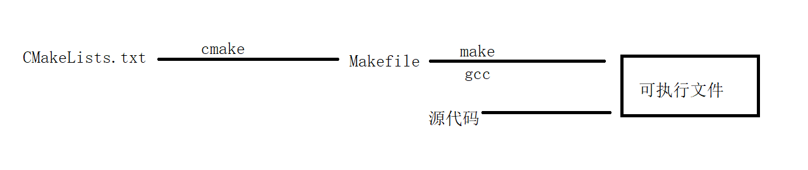
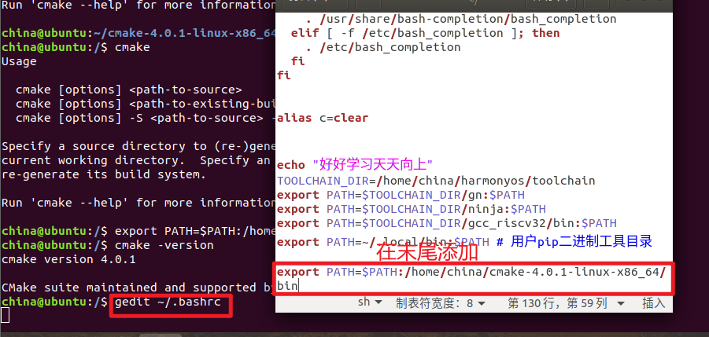
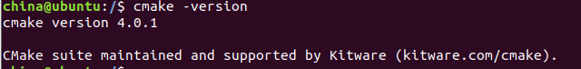
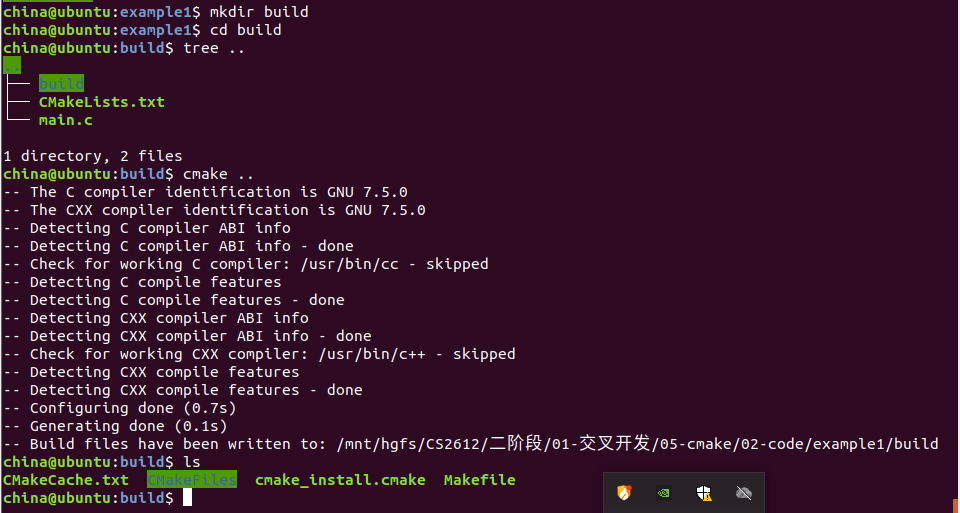
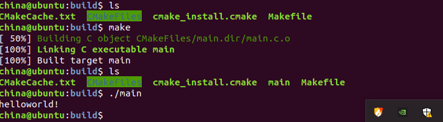
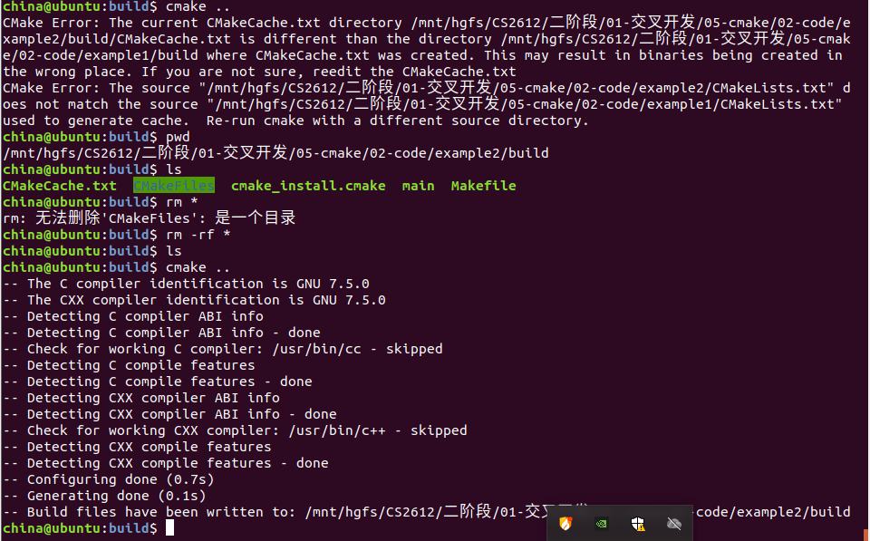

# 1.cmake是什么？

cmake是一款跨平台的免费的开源软件工具，用于使用与编译器无关的方法来管理软件的构建的过程，LInux环境下有大量的项目的时候，都使用cmake来管理

cmake最重要的作用就是协助我们自动生成项目所需的Makefile,以便工程管理器make可以指导编译器的工作



# 2.安装cmake

1.在线安装

ubuntu有网的情况下下载cmake

```
sudo snap install cmake --classic 
```

如果失败请更新源(请参考linux基本命令章节)

2.离线安装

(1)在cmake官网[Download CMake](https://cmake.org/download/)下载cmake

(2)将下载的压缩包放入到ubuntu的共享文件夹

(3)将压缩包解压到 家目录

```
tar zxvf cmake-4.0.1-linux-x86_64.tar.gz -C ~/
```

(4)配置环境变量

打开家目录下的.bashrc文件，在末尾添加如下语句

```
export PATH=$PATH:/home/china/cmake-4.0.1-linux-x86_64/bin
```



重启配置文件

```c
source ~/.bashrc
```

检查：在shell终端输入cmake -version，得到版本信息，说明cmake安装完成



# 3.cmake的构建

编译一个简单的helloworld的程序

1.新建文件夹example1

```
mkdir example1
cd example1
```

2.新建两个文件main.c 和 CMakeLists.txt

```
touch main.c CMakeLists.txt
```

文件结构如下

```
example1
├── CMakeLists.txt
└── main.c
```

main.c

```
#include <stdio.h>

int main()
{
	printf("helloworld!\n");
	return 0;
}
```

CMakeLists.txt

```
#cmake 最低版本号的要求
cmake_minimum_required(VERSION 3.10)

#项目名称 可以是任意的名字
project(demo1)

#指定生成目标
add_executable(main main.c)
```

3.执行 cmake命令

注意：一般不会直接在当前的目录执行cmake,因为生成的文件跟源文件放在一起，若要删除要单独找出来再删除

一般做法

```
mkdir build	//在当前的目录下创建build目录
cd build //进入build目录
cmake ..	//编译上一层的CMakeLists.txt文件
```



**执行make命令**

```
make 		//编译Makefile文件，得到可执行程序main
./main		//运行可执行文件
```



**重新编译：**

当cmake执行后，生成的makefile文件会固定当前工程的绝对路径。所以当源文件的路径发生修改(如工程目录被复制或者移动，环境变量发送变化)，需要删除build目录下所有cmake缓存的文件，然后重新执行cmake指令生成新的makefile文件



但如果仅仅只是源代码的内容发生变化，则无需删除build文件夹下的缓存文件，直接用make clean清除中间文件，再用make编译即可

## 设定cmake的最低版本号

> 语法：
>
> cmake_minimum_required(VERSION x.x)
>

## 设定项目名称

> 语法：
>
> project(PRO_NAME)
>

## 多文件编译

> 语法：
>
> ```
> add_executable(可执行文件名 源文件1 源文件2 ...)
> ```
>

文件结构如下

```c
example3
├── add.c
├── add.h
├── CMakeLists.txt
├── main.c
├── sub.c
└── sub.h
```


## 查找源文件保存到变量中

> 语法：
>
> aux_source_directory(dir variable)
>
> dir:表示指定要查找的目录
>
> variable：表示变量名
>
> 功能：把dir目录中查找到的源文件的名字保存到变量variable

## 指定头文件路径

> 语法：
>
> include_directories(头文件所在的路径)

## 指定库路径和链接指定的库文件

> 语法：
>
> link_directories(库所在的路径)
>
> target_link_libraries(可执行文件名 库名1 库名2 ...)

## 添加工程子目录和编译库文件

> 语法：
>
> add_subdirectory(子目录名称)
>
> add_library(库名 [库的类型] 源文件1 源文件2)  //编译库
>
> 库类型：SHARED动态库 STATIC静态库
>
> 
>
> 公开头文件目录(提供给外部使用)
>
> target_include_directories(库名 PULIC 头文件所在的路径名)
>
> 

## 设置变量和调用shell命令

> 语法：
>
> set(变量名称 变量值）
>

## 指定工具链

> 语法：
>
> set(CMAKE_C_COMPILER "C编译器名字")
>
> set(CMAKE_CXX_COMPILER "C++编译器名字")

