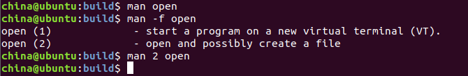
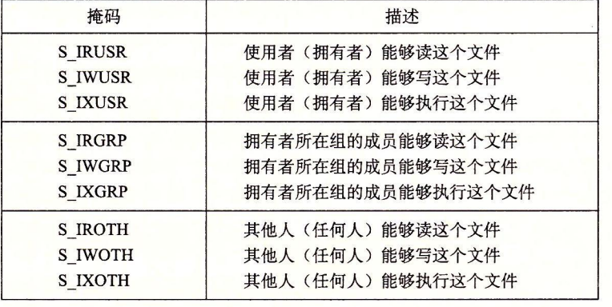
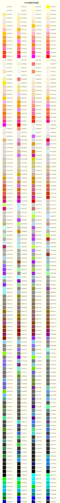
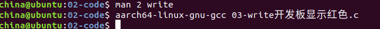
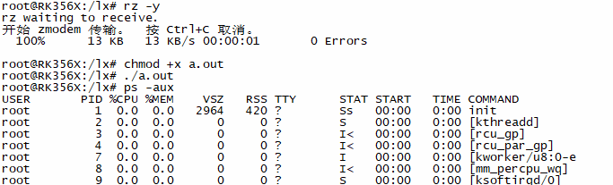
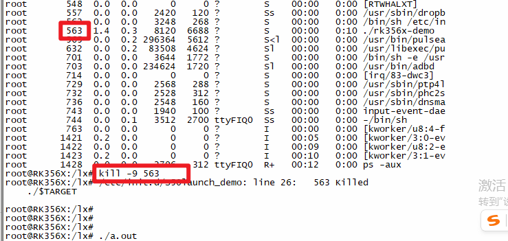

输入/输出(I/O)：在主存和外部设备(磁盘、终端、网络、键盘...)之间进行复制数据的过程

```
应用层						->软件	
操作系统					->软件
处理器 + 主存 + IO设备			-> 硬件
```

不带操作系统和带操作系统的区别

```
不带操作系统  简单的，应用直接操作硬件
			应用开发的人必须要了解硬件的实现细节
			不能同时运行多个程序(无并发)
带操作系统	应用开发的人只要集中精力实现应用的开发逻辑
			不需要关心硬件的实现细节
			同时运行多个程序(无并发)
```

操作系统的功能：

```
提供很多的API接口
提供并发
管理和分配资源的系统软件
```

linux I/O

```c
文件：
1)文件属性
	文件名 文件大小 文件类型 ...
	inode 唯一标识文件存在与否
2)文件内容

物理inode存在于磁盘中
当把u盘插入到电脑的那一刻，就会在系统中生成对应的逻辑inode
操作系统识别到一个文件(物理inode)，就会在操作系统中创建一个struct inode逻辑inode来描述文件的物理信息
	一个物理inode 对应 一个struct inode
	struct inode
	{
		文件名 文件大小 文件类型 ...
	}
```

```c
linux下一切皆文件
系统中所有的输入输出都是通过系统IO函数调用来实现文件的读写，使得输入和输出操作得到同一
- 打开文件
	内核会返回一个非负整数(文件描述符fd)
	后续对这个文件的读写操作都需要通过拿到的文件描述符
	进程自动打开三个文件，标准输入文件(0) 标准输出文件(1) 标准出错文件(2)
- 关闭文件

- 读写文件
	eg:
		读取文件3个字节 abc
		读取文件3个字节 def
		
		"abcdefghadgddsdf"
- 光标的跳转
	lseek
```

内核打开文件的过程

```
内核用三个相关的结构体来描述打开的文件
- 文件描述符表(进程文件表项)	数组
	每个进程都会有一个进程文件表项
- 文件表(file table)
	用来描述一个打开的文件
	struct file
	{
		文件状态标记   可读/可写
		文件偏移量(光标)
		记录指向当前文件表的描述符的个数
		.....
		struct inode *   //指向逻辑上inode指针
	}
- 逻辑inode表
	struct inode
	{
		文件名 文件大小 文件类型 ...
	}	
	硬链接
	1物理inode -> 多个逻辑inode
```


# 1.linux文件操作的接口

man 2 函数名



## 1.open

```c
#include <sys/types.h>
#include <sys/stat.h>
#include <fcntl.h>

int open(const char *pathname, int flags);//打开一个已经存在的文件
int open(const char *pathname, int flags, mode_t mode);//创建一个新的文件并打开
参数：
	pathname：要打开的文件或创建文件的路径(绝对路径或相对路径)
	flags：打开文件标记
		O_RDONLY只读  0
		O_WRONLY只写	1
		O_RDWR可读可写	2
		注意：上面的三个状态标记只能选择其中的一个
		O_CREAT文件如果不存在，则创建一个文件
		O_TRUNC文件已经存在，则进行截短(变成空的文件)
		O_APPEND追加，设置文件的偏移量会在文件末尾(写)
		O_NONBLOCK以非阻塞的方式打开文件，默认是阻塞
	eg:以只读的方式打开已经存在的文件1.txt
		int fd = open("1.txt",O_RDONLY);
	多个状态标记需要用到位或连接 |
    eg:打开一个已经存在的文件1.txt，并且以读写的方式打开，在文件的末尾写入数据
    	int fd = open("1.txt",O_RDWR|O_APPEND);
	mode:指定创建文件的权限，当第二个参数有O_CREAT才会有第三个参数
		创建新的文件的权限 = mode & ~mask
		有两种指定权限的方式
		方式1：八进制
			0777 
		方式2：宏
        	
返回值：
	成功：返回一个打开文件的文件描述符 >2
	失败：-1，同时设置错误码
```

mode为宏



perror

```c
#include <stdio.h>

void perror(const char *s);
功能：打印s字符串并再在后面加上错误的原因，会自动换行
eg：
	perror("");//这句话在打开失败的时候打印错误原因，并且会自动换行
```

练习：打开上一层目录的1.txt文件，如果失败请用perror打印错误信息，并且解决错误，直到成功为止，如果成功，打印ok

```c
#include <stdio.h>
#include <sys/types.h>
#include <sys/stat.h>
#include <fcntl.h>
int main()
{
    //打开
    int fd = open("../1.txt",2);
    if(fd == -1)//失败
    {
        perror("open failed");
    }
    else
    {
        printf("ok\n");
    }
}
```

**umask**

```c
#include <sys/types.h>
#include <sys/stat.h>

mode_t umask(mode_t mask);
mask:指定文件的掩码
返回值：返回上一次的掩码

注意：
	在共享目录下去设置umask,最后的新文件的权限可能会与预期不符
	需要把运行的文件放到linux文件夹下运行 /home/china
```

```c
#include <stdio.h>
#include <sys/types.h>
#include <sys/stat.h>
#include <fcntl.h>
int main()
{
    // 求上一次的umask
    // int pre_umask_value = umask(0); // 2
    // printf("pre_umask_value:%o\n", pre_umask_value);

    // 创建一个新的文件
    int fd = open("./2.txt", 2 | O_CREAT, 0666);
    if (fd == -1)
    {
        perror("open fail");
        return 0;
    }

    printf("ok\n");

}
```

## 2.write

```c
#include <unistd.h>

ssize_t  write(int fd, const void *buf, size_t count);
功能：把buf所指向的空间中count个字节 写入到fd所代表的文件中
参数：
	fd:写入的那个文件的描述符
	buf:指针，指向的空间用来保存写入到文件中的数据
	count:你想要写入多少个字节到文件中
返回值：
	成功：返回值实际要写入的字节数(<=count)
	失败：-1，errno被设置
```

往"1.txt"写入“abcd”

```c
//1.打开1.txt
int fd = open("1.txt",....);
//2.写入
write(fd,"abcd",4);

char *buf = "abcdasdadasdhsdhashdad";
write(fd,buf,strlen(buf));

char buf[100] = "abcd";
int ret = write(fd,buf,strlen(buf));
prtintf("成功写入%d个字节\n",ret);
```

练习：使用开发板，把开发板显示成红色

```c
1.打开屏幕	"/dev/fb0"
2.显示红色
	rk3568:1024*600
	6818:800*480
	
	三基色：红 绿 蓝
	一个颜色的描述(透明度 红 绿 蓝)，每个分量占1个字节(unsigned char)
	红		绿		蓝
	0xff	0x00	 0x00		深红色0xff0000
	
	unsigned int color = 0xff0000;
	write(fd,&color,4);//循环1024*600次
3.关闭屏幕
	close(fd);

怎么关开发板界面启动程序
1.连接开发板
2.ps -aux 查看后台运行的程序
	找到./rx356x-demo 看对应的pid是多少
3.结束程序
	kill -9 pid	#这个pid替换成上面./rx356x-demo的pid
```



参考代码：

```c
#include <stdio.h>
#include <sys/types.h>
#include <sys/stat.h>
#include <fcntl.h>
#include <unistd.h>

int main()
{
    //打开屏幕
    int lcd_fd = open("/dev/fb0",2);
    if(lcd_fd == -1)
    {
        perror("open lcd fail");
        return 0;
    }

    //写入
    unsigned int color = 0xff0000;//红色
    for(int i = 0;i<600;i++)//行
    {
        for(int j = 0;j<1024;j++)//列
        {
             write(lcd_fd,&color,4);
        }
    }
   
    //关闭屏幕
    close(lcd_fd);
}

```







## 3.read

```c
#include <unistd.h>

ssize_t read(int fd, void *buf, size_t count);
功能：从fd所代表的文件中读取count个字节数据放到buf所指向的空间中
参数：
	fd:读取的那个文件的描述符
	buf:指针，指向的空间用来保存从文件中读取到的数据
	count:你想要读取多少个字节放到buf所指向的空间中
返回值：
	成功，返回实际读取到的字节数(<=count)
	返回0：已经读到文件的末尾EOF(end if file)
	失败：-1，error被设置
```

eg:读取1.txt文件的内容

```
//1.打开

//2.读取
char buf[100] = {0};//保存从文件中读取到的数据的
int ret = read(fd,buf,sizeof(buf)-1);
printf("读到了%d个字节，读取到的数据为%s\n",ret,buf);
```

eg:完整读取一份文件的内容

```c
//1.打开

//2.每次读取100个字节
while(1)
{
    char buf[100] = {0};//保存从文件中读取到的数据的
    int ret = read(fd,buf,sizeof(buf)-1);
    if(ret == 0)//读取结束
		break;
	printf("%s",buf);
}
```

练习：先打开文件2.txt，接着往文件中写入数据，去把写入的数据读取出来

## 4.lseek

```c
#include <sys/types.h>
#include <unistd.h>

off_t lseek(int fd, off_t  offset,  int  whence);
功能：重新定位文件偏移量(光标)
参数
	fd:要进行重新定位光标的那个文件的fd
	offset:偏移量，数字，具体的含义要结合第三个参数
	whence：定位的方式，从哪个位置开始偏移
		SEEK_SET:文件开头
		SEEK_END:文件末尾
		SEEK_CUR:当前光标的位置
返回值
	成功：返回新光标距离文件开头的字节数
	失败：-1，error被设置
eg:
	//移动光标到文件开头
    lseek(fd,0,SEEK_SET);
eg:
	//获取文件的大小
	int file_size = lseek(fd,0,SEEK_END);
```

## 5.close

```c
#include <unistd.h>

int close(int fd);
```

# 2.获取进程当前的工作目录

```c
#include <unistd.h>

char *getcwd(char *buf, size_t size);
buf:指向的空间保存获取到的字符串
size:指向buf指向的空间，最多可以拷贝多少个字节
	目录字符串的长度 > size-1  
    直接返回错误码，就不会出现数组越界的访问
返回值：
	成功：返回获取的目录字符串的地址
	失败：NULL，设置错误码

#char *getwd(char *buf);
buf:指向的空间保存获取到的字符串
返回值：
	成功：返回获取的目录字符串的地址
	失败：NULL，设置错误码
	
char *get_current_dir_name(void);//要把声明加到你的源文件
//内部用malloc开辟空间保存当前的路径
//调用完毕，记得free
```

参考代码：

```c
#include <stdio.h>
#include <unistd.h>
int main()
{
    #if 0
    char buf[10] = {0};
    char *p = getcwd(buf,sizeof(buf)-1);
    if(p == NULL)
    {
        perror("getcwd fail");
        return -1;
    }
    printf("buf:%s\n",buf);
    printf("p:%s\n",p);
    #endif

    #if 0
    char buf[10] = {0};
    char *p = getwd(buf);
    if(p == NULL)
    {
        perror("getwd fail");
        return -1;
    }
    printf("buf:%s\n",buf);
    printf("p:%s\n",p);
    #endif

    #if 1
    char *get_current_dir_name(void);//一定要加声明
    char *p = get_current_dir_name();
    if(p == NULL)
    {
        perror("get_current_dir_name fail");
        return -1;
    }
    printf("p:%s\n",p);
    free(p);//释放空间
    #endif
}
```

# 3.改变当前进程的工作路径

```c
#include <unistd.h>

int chdir(const char *path);
path:要改变的工作路径
返回值：
	成功 0
	失败 -1
eg:
	chdir("/mnt/hgfs/share");
	
int fchdir(int fd);
fd:需要使用open函数打开要改变的工作路径(打开目录应该需要只读权限)
返回值：
	成功 0
	失败 -1
eg:
	int fd = open("/mnt/hgfs/share",O_RDONLY);
	fchdir(fd);
```

练习：

```
改变工作路径为/home/china
接着去调用getcwd打印当前的工作路径
```

```c
#include <stdio.h>
#include <unistd.h>
#include <sys/types.h>
#include <sys/stat.h>
#include <fcntl.h>
#include <stdlib.h>

int main()
{
    //改变工作路径为/home/china
    #if 0
    int ret = chdir("/home/china");
    if(ret == -1)
    {
        perror("chdir failed");
        return -1;
    }
    #endif 

    #if 1
    int fd = open("/home/china",O_RDONLY);//打开路径 一定为只读
    int ret = fchdir(fd);//切换路径
    if(ret == -1)
    {
        perror("fchdir failed");
        return -1;
    }
    #endif 

    //打印当前的工作路径
    char buf[100] = {0};
    char *p = getcwd(buf,sizeof(buf)-1);
    if(p == NULL)
    {
        perror("getcwd fail");
        return -1;
    }
    printf("buf:%s\n",buf);
    printf("p:%s\n",p);
    system("./a.out");
}
```

# 4.文件的截短

```
#include <unistd.h>
#include <sys/types.h>

int truncate(const char *path, off_t length);
path:文件名
length:截短的长度
	legth < 原来的长度
		截短
	legth > 原来的长度
		后面会给你补相应的字符(\0 nul)
		"扩展留下空洞"
返回值：
	成功 0
	失败 -1
int ftruncate(int fd, off_t length);
```

# 5.删除文件

```c
unlink 删除一个文件(除了目录外的其他文件)
rmdir  删除一个空目录

remove 用来删除一个普通文件或空目录
		->如果删除的是普通文件调用unlink
		->如果删除的是空目录调用rmdir

#include <unistd.h>

int unlink(const char *pathname);
int rmdir(const char *pathname);

#include <stdio.h>

int remove(const char *pathname);
```

# 6.获取文件属性

```c
#include <sys/types.h>
#include <sys/stat.h>
#include <unistd.h>

int stat(const char *pathname, struct stat *statbuf);
int fstat(int fd, struct stat *statbuf);
int lstat(const char *pathname, struct stat *statbuf);
pathname:带路径的文件名，用来指定要获取状态信息的哪个文件
statbuf:结构体指针，指向了一个struct stat类型的结构体空间，用来存放获取到的文件的属性信息的
fd:文件描述符，需要把文件用open打开
返回值：
	成功 0
	失败 -1 error被设置
eg:
	struct stat statbuf;
	stat("1.txt",&statbuf);//获取属性保存到statbuf
```

注意stat和lstat的区别

```
文件的类型
	文件
	目录
	块设备文件
	套接字文件
	管道文件
	链接文件
	字符设备文件
	
stat和fstat什么类型文件都可以使用这两个函数，lstat只能获取链接文件的属性
```

man 2 stat

```c
struct stat {
    dev_t     st_dev;         /* ID of device containing file */
    //设备id
    ino_t     st_ino;         /* Inode number */
    //文件inode的结点编号
    mode_t    st_mode;        /* File type and mode */
    //文件的类型或权限，就可以用来判断文件是什么样的类型，具有哪种操作权限
    nlink_t   st_nlink;       /* Number of hard links */
    //硬链接数量
    uid_t     st_uid;         /* User ID of owner */
    //文件所有者的用户id
    gid_t     st_gid;         /* Group ID of owner */
    //文件所有者的组用户id
    dev_t     st_rdev;        /* Device ID (if special file) */
    //设备id
    off_t     st_size;        /* Total size, in bytes */
    //文件大小
    blksize_t st_blksize;     /* Block size for filesystem I/O */
    //块的大小(取决于文件系统) 512
    blkcnt_t  st_blocks;      /* Number of 512B blocks allocated */
    //块的数量

    /* Since Linux 2.6, the kernel supports nanosecond
                  precision for the following timestamp fields.
                  For the details before Linux 2.6, see NOTES. */

    struct timespec st_atim;  /* Time of last access */
    //最后一次访问的时间
    struct timespec st_mtim;  /* Time of last modification */
    //最后一次修改的时间
    struct timespec st_ctim;  /* Time of last status change */
    //最后一次修改文件状态的时间

    #define st_atime st_atim.tv_sec      /* Backward compatibility */
    #define st_mtime st_mtim.tv_sec
    #define st_ctime st_ctim.tv_sec
};
```

判断文件类型st_mode

man 2 stat 或 man 7 inode找到示例

```c
方式1：
    S_IFMT     0170000   bit mask for the file type bit field

    S_IFSOCK   0140000   socket
    S_IFLNK    0120000   symbolic link
    S_IFREG    0100000   regular file
    S_IFBLK    0060000   block device
    S_IFDIR    0040000   directory
    S_IFCHR    0020000   character device
    S_IFIFO    0010000   FIFO
    
    eg:
    	struct stat sb;//保存属性
        stat(pathname, &sb);
        if ((sb.st_mode & S_IFMT) == S_IFREG) {
        	printf("普通文件\n");
        }
        else if ((sb.st_mode & S_IFMT) == S_IFDIR) {
        	printf("目录\n");
        }
方式2：
    S_ISREG(m)  is it a regular file?
    S_ISDIR(m)  directory?
    S_ISCHR(m)  character device?
    S_ISBLK(m)  block device?
    S_ISFIFO(m) FIFO (named pipe)?
    S_ISLNK(m)  symbolic link?  (Not in POSIX.1-1996.)
    S_ISSOCK(m) socket?  (Not in POSIX.1-1996.)
    eg:
    	struct stat sb;//保存属性
        stat(pathname, &sb);
        if (S_ISREG(sb.st_mode)) {
        	printf("普通文件\n");
        }
        else if (S_ISDIR(sb.st_mode)) {
        	printf("目录\n");
        }	
```

练习：判断一个文件的类型，文件名的名字从命令行传入

```c
//编译：gcc xxx.c     -> a.out
//运行：./a.out 1.c
/*
	argc是命令行传入字符串的个数，argc = 2
	argv是指针数组
		char *argv[] = {"./a.out","1.c"};
		=>argv[0]:"./a.out"
		=>argv[1]:"1.c"
*/
#include <sys/stat.h>
#include <stdio.h>
#include <sys/types.h>
#include <sys/stat.h>
#include <unistd.h>
int main(int argc,char **argv)
{
    //获取属性
    struct stat sb;//保存属性
    stat(argv[1], &sb);
    //判断类型

#if 0
    if ((sb.st_mode & S_IFMT) == S_IFREG) {
        printf("普通文件\n");
    }
    else if ((sb.st_mode & S_IFMT) == S_IFDIR) {
        printf("目录\n");
    }    
    else if ((sb.st_mode & S_IFMT) == S_IFCHR) {
        printf("字符设备文件\n");
    }  
    else if ((sb.st_mode & S_IFMT) == S_IFIFO) {
        printf("管道文件\n");
    }  
    else if ((sb.st_mode & S_IFMT) == S_IFBLK) {
        printf("块设备文件\n");
    }  
    else if ((sb.st_mode & S_IFMT) == S_IFSOCK) {
        printf("套接字文件\n");
    }  
    else if ((sb.st_mode & S_IFMT) == S_IFLNK) {
        printf("链接文件\n");
    }  
#else
    if (S_ISREG(sb.st_mode)) {
        printf("普通文件\n");
    }
    else if (S_ISDIR(sb.st_mode)) {
        printf("目录\n");
    }    
    else if (S_ISCHR(sb.st_mode)) {
        printf("字符设备文件\n");
    }  
    else if (S_ISFIFO(sb.st_mode)) {
        printf("管道文件\n");
    }  
    else if (S_ISBLK(sb.st_mode)) {
        printf("块设备文件\n");
    }  
    else if (S_ISSOCK(sb.st_mode)) {
        printf("套接字文件\n");
    }  
    else if (S_ISLNK(sb.st_mode)) {
        printf("链接文件\n");
    } 
#endif
}
```

作业：

(1)因为用write进行显示颜色，显示较慢，请参考01-图片显示笔记，使用mmap映射的方式进行显示颜色到开发板上

(2)请参考01-图片显示笔记，请在ubunu中获取bmp图片的宽高色深，并进行打印

(3)找到笔记中lvgl资料里面的lvgl工程搭建，请参考里面的视频和笔记，完成lvgl工程的搭建

# 7.读取目录的内容

打开目录opendir

```c
#include <sys/types.h>
#include <dirent.h>

DIR *opendir(const char *name);
name:打开目录的路径
返回值：
	成功：返回一个DIR*指针，用来表示一个被打开的目录
	失败：NULL，errno被设置
DIR *fdopendir(int fd);

eg:
	DIR *dir = opendir("/home/china");
	if(dir == NULL)//失败
	{
		
	}
eg:
	int fd = open("/home/china",0);
	DIR *dir = fdopendir(fd);
	if(dir == NULL)//失败
	{
		
	}
```

读取目录readdir

```
#include <dirent.h>

struct dirent *readdir(DIR *dirp);
dirp:一个打开的目录的指针
返回值：
	成功：指向下一个目录项的指针
	失败：没有更多的目录或出错 NULL
eg:循环读取一个目录中的所有文件
	struct dirent *p = NULL;
	while(1)
	{
		p = readdir(dir);
		if(p == NULL)
			break;
		printf("%s\n",p->d_name);//打印当前目录下的所有文件的名字
	}

eg:
    //  在这个路径下/mnt/hgfs/share/运行  a.out
    int main()
    {
        //1 打开 /home/china   -> 1.c  2.c

        //2 读取目录项的内容 1.c   p->d_name

        //3 拼接 /home/china/1.c
        char pathname[100] = {0};//保存完整路径文件名
        sprintf(pathname,"%s/%s","/home/china",p->d_name);

        //4 获取文件的属性 stat(pathname,&sb);

        //5 判断文件的类型

    }
```

每一个目录项由一个结构体struct dirent来描述的，存储的就是一个个的struct dirent的结构体的数据

```c
struct dirent {
    ino_t          d_ino;       /* Inode number */
    //目录文件inode编号
    off_t          d_off;       /* Not an offset; see below */
    //目录项的偏移量
    unsigned short d_reclen;    /* Length of this record */
    //目录项的大小
    unsigned char  d_type;      /* Type of file; not supported by all filesystem types */
    //目录项类型
    char           d_name[256]; /* Null-terminated filename */
    //目录项的名字 不带任何路径
};
```

关闭目录closedir

```c
#include <sys/types.h>
#include <dirent.h>

int closedir(DIR *dirp);
eg:
	closedir(dir);
```

练习1：把一个目录下面所有的文件名(普通文件或目录)都打印出来(打印路径:包括路径+名字)

```c
#include <stdio.h>
#include <sys/types.h>
#include <dirent.h>
#include <unistd.h>

//./a.out  /home/china
int main(int argc,char **argv)
{
    if(argc < 2)
    {
        printf("Usage:%s <pathname>\n",argv[0]);
        return -1;
    }

    //改变当前的工作路径
    chdir(argv[1]);
    //获取当前的工作路径
    char buf[512] = {0};
    getcwd(buf,sizeof(buf)-1);
    printf("当前工作路径为:%s\n",buf);

    //打开目录
    DIR *dir = opendir(argv[1]);
    if(dir == NULL)
    {
        perror("open dir fail");
        return -1;
    }
    //循环读取目录
    while(1)
    {
        //读取目录中的一个文件
        struct dirent *p = readdir(dir);
        if(p == NULL)
            break;

        //拼接
        char pathname[1024] = {0};//保存完整路径
        sprintf(pathname,"%s/%s",buf,p->d_name);

        //打印这个文件的完整路径
        printf("%s\n",pathname);
    }
    //关闭目录
    closedir(dir);
}
```

练习2：计算给定目录下面，有多少普通文件和目录文件

```c
#include <stdio.h>
#include <sys/types.h>
#include <dirent.h>
#include <unistd.h>
#include <sys/types.h>
#include <sys/stat.h>
#include <unistd.h>
//./a.out  /home/china
int main(int argc,char **argv)
{
    if(argc < 2)
    {
        printf("Usage:%s <pathname>\n",argv[0]);
        return -1;
    }

    //改变当前的工作路径
    chdir(argv[1]);
    //获取当前的工作路径
    char buf[512] = {0};
    getcwd(buf,sizeof(buf)-1);
    printf("当前工作路径为:%s\n",buf);

    //定义两个变量，保存普通文件和目录的个数
    int dir_count = 0;
    int file_count = 0;

    //打开目录
    DIR *dir = opendir(argv[1]);
    if(dir == NULL)
    {
        perror("open dir fail");
        return -1;
    }
    //循环读取目录
    while(1)
    {
        //读取目录中的一个文件
        struct dirent *p = readdir(dir);
        if(p == NULL)
            break;

        //拼接
        char pathname[1024] = {0};//保存完整路径
        sprintf(pathname,"%s/%s",buf,p->d_name);

        //打印这个文件的完整路径
        printf("%s\n",pathname);

        //获取属性
        struct stat st;
        stat(pathname,&st);

        //判断文件的类型
        if (S_ISREG(st.st_mode)) {
        	file_count++;
        }
        else if (S_ISDIR(st.st_mode)) {
        	dir_count++;
        }	
    }

    //打印结束
    printf("普通文件%d个 目录%d个\n",file_count,dir_count);
    //关闭目录
    closedir(dir);
}
```

练习3：假设一个目录的大小为：该目录下面及目录的目录下面...的所有普通文件的大小之和，写一个函数，求一个目录的大小(递归)

练习4：写一个双向循环链表，把一个目录下面所有的.c文件(包含其子目录下面的.c)的路径作为是一个结点的数据，最后打印出来这条链表

