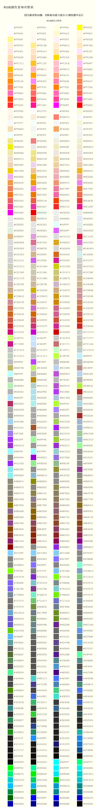
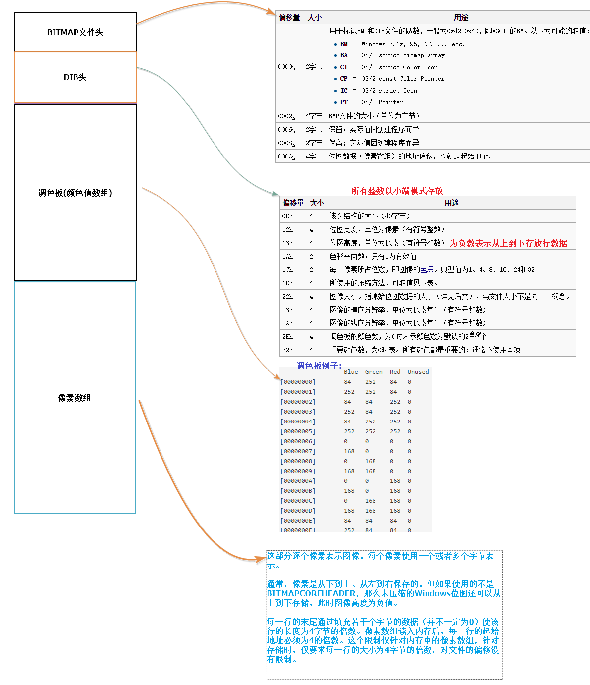
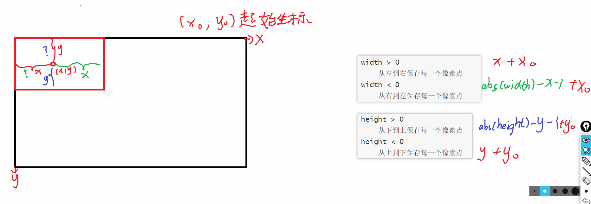

1.颜色的显示

开发板的分辨率：1024*600

```
每一行有1024个像素点(可以显示颜色的点)，一共有600行
从0开始数
```

三基色：红  绿 蓝（每一个分量都是一个字节)

```
r		g		b
0xff	0x00	0x00	深红色0xff0000
0x00	0xff	0x00	深绿色0xff00
```

颜色用四个字节表示(a透明度rgb)unsigned int



颜色显示的步骤

1.打开屏幕 "/dev/fb0"（开发板的路径）

```
int lcd_fd = open();
```

2.映射

```c
y=2*x+3;
把x当成是一块缓冲区(内存)，间接改变y的值,把y当成是设备
建立了映射关系，操作缓冲区就像操作设备一样的

mmap映射
#include <sys/mman.h>

void *mmap(void *addr, size_t length, int prot, int flags,
int fd, off_t offset);
addr:一般填NULL，想让系统给我们分配映射的地址，而不是自己指定
length:映射的内存空间需要多大
	1024*600*4
prot：映射过后的权限 PROT_EXEC|PROT_READ|PROT_WRITE
       PROT_EXEC  可执行
       PROT_READ  可读
       PROT_WRITE 可写
flags：映射过后的属性
	MAP_SHARED：共享属性，对内存的操作，立即再设备上显示
fd:内存要跟哪个文件建立映射关系
	lcd_fd
offset:偏移量
	0
返回值：
	成功：返回与设备建立映射关系的内存地址
	失败：NULL
```

3.显示颜色

```
给第一个点赋值红色
*plcd = 0xff0000;
给第二个点赋值红色
*(plcd+1) = 0xff0000;
给任意一个(x,y)赋值红色 x:列 y:行
*(plcd+1024*y+x) = 0xff0000;

/*
	画点子函数
	i:x轴
	j:y轴
*/
void lcd_draw_point(int i,int j,unsigned int color)
{
	if(i>=0&&i<1024 && j>=0&&j<600)
		*(plcd+1024*j+i) = color;
}

for(int i = 0;i<600;i++)//行 y轴
{
	for(int j = 0;j<1024;j++)//列 x轴
	{
		//画点函数
		lcd_draw_point(j,i,0xff0000);
	}
}
```

4.解除映射

```
int munmap(void *addr, size_t length);
参数：
	addr:释放刚才映射的地址
		plcd
	length:要释放刚才映射空间的大小
		1024*600*4
```

5.关闭屏幕

```
close(lcd_fd);
```

练习：

```c
1.把上面的第一步和第二步封装成一个函数lcd_open
	函数里面的lcd_fd和plcd记得定义成全局变量
2.把上面的第四步和第五步封装一个函数lcd_close
	
把整个屏幕显示颜色
int main()
{
	lcd_open();
	//全部显示红色
	lcd_close();
}
写完了之后最好自己写一个lcd.c lcd.h
```

# 2.bmp图片显示

bmp:位图文件，是一种无压缩的图片文件格式

怎么去获取一张bmp图片？

1.用画图软件打开，修改一下宽高

2.另存为bmp图片(24位图)

**1.打开图片**

```
int bmp_fd = open("1.bmp",O_RDWR);
```

**2.读取图片**



1）BITMAP文件头 14个字节

2）DIB头 40个字节

获取图片的宽 高 色深

```
int width = 0;
lseek(bmp_fd,0x12,SEEK_SET);
read(bmp_fd,&width,4);
读到的width可能是一个负数
	width > 0
		从左到右保存每一个像素点
	width < 0
		从右到左保存每一个像素点
int height = 0;
lseek(bmp_fd,0x16,SEEK_SET);
read(bmp_fd,&height,4);
读到的height可能是一个负数
	height > 0
		从下到上保存每一个像素点
	height < 0
		从上到下保存每一个像素点
int depth = 0;
lseek(bmp_fd,0x1C,SEEK_SET);
read(bmp_fd,&depth,2);
depth == 24
	rgb
depth == 32
	argb
```

3) 调色板

```
对于24位图和32位图没有调色板
```

4)像素数组

计算像素数组的大小total_bytes

```c
一行像素点的个数
	abs(width)	//abs取绝对值
每个像素点占多少个字节
	depth/8
一行有多少个字节
	int line_bytes = abs(width)*depth/8
为了保证每一行字节数都是4的倍数，就需要在末尾添加几个空白的字节
	"癞子"
每一行需要的癞子数量
	int laizi = 0;
	if(line_bytes%4)
	{
		laizi = 4-line_bytes%4;
	}
一行的总的的字节数
	line_bytes += laizi;
整个像素数组的大小
	int total_bytes = line_bytes * abs(height);
```

```c
char pix[total_bytes] = {0};//用来保存读到的像素数组的数据
lseek(bmp_fd,54,SEEK_SET);//跳转光标到像素数组的位置 54
read(bmp_fd,pix，total_bytes);//读取数据放到pix中
```

**3.解析像素数组数据**

```
unsigned char a,r,g,b;
unsigned int color;
int x0 = 0,y0 = 0;//显示图片起始位置坐标
int i = 0;
for(int y = 0;y<abs(height);y++)//行  
{
	for(int x = 0;x<abs(width);x++)//列
	{
		b = pix[i++];
		g = pix[i++];
		r = pix[i++];
		if(depth == 32)
			a = pix[i++];
		else if(depth == 24)
			a = 0;
		//组装一个颜色
		color = a<<24|r<<16|g<<8|b;
		//画点
		lcd_draw_point(width>0?x+x0:abs(width)-x-1+x0,height>0?abs(height)-y-1+y0?y+y0,color);//x(列) y(行) 颜色
	}
	//跳过癞子
	i+=laizi;
}
```



4）关闭图片


练习：把显示图片的代码进行封装

```
/*
	bmp图片显示
	x0,y0:你要显示图片的起始位置 x0列 y0行
	bmp_path：你要显示的图片名字
*/
void bmp_display(int x0,int y0,char *bmp_path)
{
	//1.打开图片
	
	//2.获取图片的宽高色深
	
	//3.获取像素数组的大小
	
	//4.跳转光标到像素数组的位置
	
	//5.读取像素数组的数据
	
	//6.解析像素数组的数据
	
	//7.关闭图片
}

int main()
{
	//lcd_open
	
	//bmp_display(0,0,"1.bmp");
	
	//lcd_close
}
```

