# 一、LVGL介绍

LVGL就是一种：轻便且多功能的图形库，主要用于进行GUI设计（嵌入式界面设计），小型GUI工具

LVGL是轻量化框架，代码全部都是C语言组成，所以在单片机上显示界面，使用LVGL较为方便。

# 二、LVGL工程搭建

参考下面资料

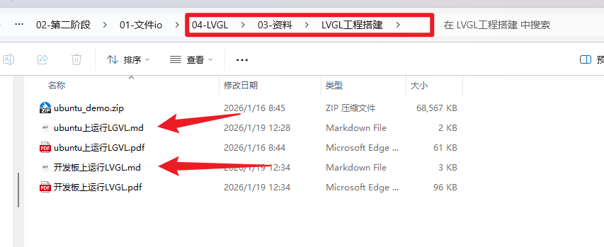

# 三、LVGL使用

面向对象

所有的控件(widgets)与界面基于了lv_obj_t的结构体

lvgl本质上是一个死循环的事件队列

```
lv_init();//初始化lvgl内核文件和配置文件

lv_linux_fbdev_create：创建屏幕

lv_evdev_create：设置触摸屏对对应的路径
```

循环检测事件队列

```c
while(1) {
    lv_timer_handler();
    usleep(5000);
}
```

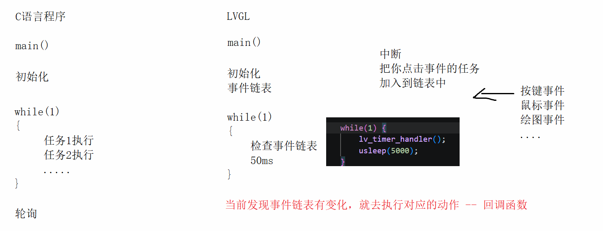

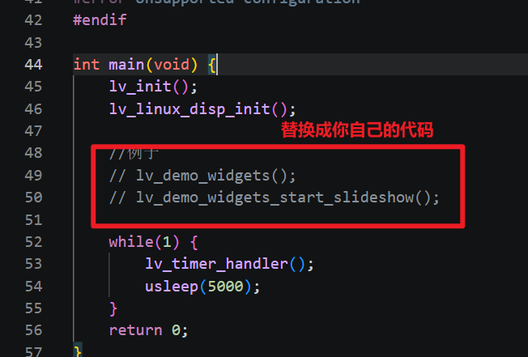

# 四、LVGL屏幕使用

lvgl有三层屏幕

- 活动屏幕

  随处可见的内容：按键，图片，滑动条...
  
  ```c
  lv_obj_t * lv_screen_active(void);//9.0屏幕    9.0以下版本lv_src_active
  
  lv_obj_t *src = lv_screen_active();//创建一个活动屏幕
  ```
  
- 顶层屏幕

  如：弹窗，菜单栏

  用于显示一些需要在所有屏幕上都可以见的内容

  ```
  lv_obj_t * lv_layer_top(void);
  ```

- 系统屏幕

  系统级别的信息，eg:最底层的图层，要保证信息是可见 鼠标
  
  ```
  lv_obj_t * lv_layer_sys(void);
  ```

在运行时候，先显示活动屏幕的内容，再显示顶层屏幕的内容，最后显示系统屏幕的内容，后显示的会把先显示的覆盖掉

# 五、LVGL对象

在LGVL中，用户界面的基本组成部分，是对象(控件)，也称为Widgets,eg:按键 标签 滑动条 图像 列表 文本框 ......

LVGL设计界面，各个对象之间有嵌套关系

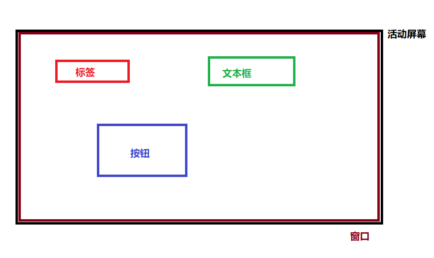

# 六、窗口对象的创建

**1.在基本对象的基础上创建一个新的子对象**

```
lv_obj_t * lv_obj_create(lv_obj_t * parent);
parent:父界面的指针，将窗口的创建在哪一个界面(屏幕)对象上
	NOTE:lvgl的窗口可以一层一层的嵌套
返回值：
	返回创建的子界面(窗口)对象
eg:
	//在活动屏幕上创建一个子对象
	lv_obj_t *src = lv_screen_active();//创建一个活动屏幕
	lv_obj_t *win = lv_obj_create(src);
```

2.设置窗口的大小

```c
//设置obj这个对象的宽为w
void lv_obj_set_width(lv_obj_t * obj, int32_t w);
//设置obj这个对象的高为h
void lv_obj_set_height(lv_obj_t * obj, int32_t h);
//设置obj这个对象的宽为w，高为h
void lv_obj_set_size(lv_obj_t * obj, int32_t w, int32_t h);
```

```c
pixel:像素点为单位
	lv_obj_set_height(win, 10);//设置窗口的高度为10个像素点长度

设置对象宽度/高度的特殊值LV_SIZE_CONTENT
	将会根据子对象所需的大小，自动调节自身的大小
	lv_obj_set_width(win, LV_SIZE_CONTENT);
	//设置窗口的宽度，以父对象为基准，自动调节为合适的大小

lv_pct()可以将一个值，转化为百分值，范围为0~100%
	lv_obj_set_width(win, lv_pct(50));
	//设置窗口的宽度，以父对象为基准，设置为父对象的宽度50%
```

3.设置窗口坐标位置

```
//指定对象，相对于父对象的x y轴的位置
void lv_obj_set_pos(lv_obj_t * obj, int32_t x, int32_t y);
```

4.设置对齐方式

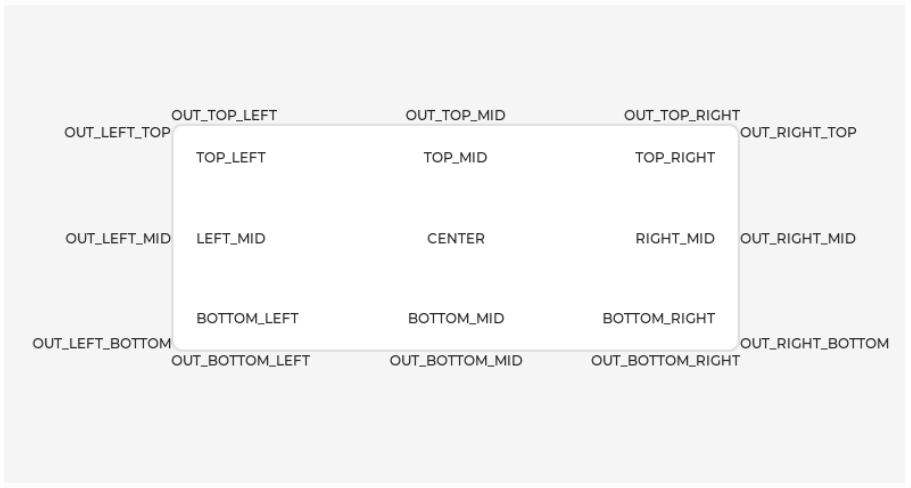

设置obj窗口在align(排列)指定的位置上lv_obj_set_align

```
void lv_obj_set_align(lv_obj_t * obj, lv_align_t align)
align:位置
typedef enum {
    LV_ALIGN_DEFAULT = 0,
    LV_ALIGN_TOP_LEFT,//顶部左边
    LV_ALIGN_TOP_MID,//顶部中间
    LV_ALIGN_TOP_RIGHT,//顶部右边
    LV_ALIGN_BOTTOM_LEFT,//底部左边
    LV_ALIGN_BOTTOM_MID,
    LV_ALIGN_BOTTOM_RIGHT,
    LV_ALIGN_LEFT_MID,//中间左边
    LV_ALIGN_RIGHT_MID,//中间右边
    LV_ALIGN_CENTER,//中间中心

    LV_ALIGN_OUT_TOP_LEFT,
    LV_ALIGN_OUT_TOP_MID,
    LV_ALIGN_OUT_TOP_RIGHT,
    LV_ALIGN_OUT_BOTTOM_LEFT,
    LV_ALIGN_OUT_BOTTOM_MID,
    LV_ALIGN_OUT_BOTTOM_RIGHT,
    LV_ALIGN_OUT_LEFT_TOP,
    LV_ALIGN_OUT_LEFT_MID,
    LV_ALIGN_OUT_LEFT_BOTTOM,
    LV_ALIGN_OUT_RIGHT_TOP,
    LV_ALIGN_OUT_RIGHT_MID,
    LV_ALIGN_OUT_RIGHT_BOTTOM,
} lv_align_t;

eg:设置居中
	lv_obj_set_align(win, LV_ALIGN_CENTER);
```

5.设置窗口位置，并且偏移(x,y)

```
void lv_obj_align(lv_obj_t * obj, lv_align_t align, int32_t x_ofs, int32_t y_ofs);
```

练习：需要再屏幕上显示一个窗口，需要把窗口大小设置，位置设置一下

```
void test01()
{
	//创建一个活动屏幕
    lv_obj_t *scr = lv_screen_active();
	
	//再活动屏幕上创建一个基本对象
    lv_obj_t *win = lv_obj_create(scr);
	
	//设置基本对象的大小
    lv_obj_set_size(win,100,100);
	
	//设置位置
    lv_obj_set_align(win,LV_ALIGN_RIGHT_MID );
}
```


# 七、样式的设计

lv_style_t是样式的对象，它必须定义成静态变量或全局变量，目的是保证函数在结束的时候空间不会被销毁

a.初始化样式

```c
void lv_style_init(lv_style_t * style);
eg：
	static lv_style_t style;
	lv_style_init(&style);
```

b.添加样式:lv_style_set_xxx（xxx:表示添加不同的样式)

```c
//获取颜色值
lv_color_t lv_color_hex(uint32_t c);
//设置背景颜色
void lv_style_set_bg_color(lv_style_t * style, lv_color_t value);
@value:颜色的值
    typedef struct {
        uint8_t blue;
        uint8_t green;
        uint8_t red;
    } lv_color_t;
eg:
	//设置背景颜色为红色
	lv_style_set_bg_color(&style,lv_color_hex(0xff0000));
//设置背景透明度 (0-255)
void lv_style_set_bg_opa(lv_style_t * style, lv_opa_t value);
@value:不透明程度
    enum _lv_opa_t {
        LV_OPA_TRANSP = 0,	//完全透明
        LV_OPA_0      = 0,	//完全透明
        LV_OPA_10     = 25,	//10%不透明度
        LV_OPA_20     = 51,
        LV_OPA_30     = 76,
        LV_OPA_40     = 102,
        LV_OPA_50     = 127,
        LV_OPA_60     = 153,
        LV_OPA_70     = 178,
        LV_OPA_80     = 204,
        LV_OPA_90     = 229,
        LV_OPA_100    = 255,	
        LV_OPA_COVER  = 255,
    };
eg:
	lv_style_set_bg_opa(&style, LV_OPA_100);
//设置边框颜色
void lv_style_set_border_color(lv_style_t * style, lv_color_t value);
//设置边框透明度
void lv_style_set_border_opa(lv_style_t * style, lv_opa_t value);
//设置边框的宽度
void lv_style_set_border_width(lv_style_t * style, int32_t value);
//设置边框的弧度
void lv_style_set_radius(lv_style_t * style, int32_t value);
//设置边框的范围 
void lv_style_set_border_side(lv_style_t * style, lv_border_side_t value);
@value:
    typedef enum {
        LV_BORDER_SIDE_NONE     = 0x00,//完全不显示
        LV_BORDER_SIDE_BOTTOM   = 0x01,//只显示下面的边框
        LV_BORDER_SIDE_TOP      = 0x02,//只显示上面的边框
        LV_BORDER_SIDE_LEFT     = 0x04,//只显示左边的边框
        LV_BORDER_SIDE_RIGHT    = 0x08,//只显示右面的边框
        LV_BORDER_SIDE_FULL     = 0x0F,//显示全部边框
        LV_BORDER_SIDE_INTERNAL = 0x10,//自定义拓展
    } lv_border_side_t;
```

c.给obj对象添加style,并且是在selector的情况下显示

```c
void lv_obj_add_style(lv_obj_t * obj, const lv_style_t * style, lv_style_selector_t selector);
@obj:要添加样式的对象
@style:要添加的样式
@selector：对应添加状态选择
	enum _lv_state_t {
    LV_STATE_DEFAULT     =  0x0000,//代表默认状态(松开的)
    LV_STATE_CHECKED     =  0x0001,//切换或检测(按下状态)
    LV_STATE_FOCUSED     =  0x0002,//鼠标/触摸点击，聚焦点击(不包含按键)
    LV_STATE_FOCUS_KEY   =  0x0004,//通过按钮聚焦
    LV_STATE_EDITED      =  0x0008,//由编码器编辑
    LV_STATE_HOVERED     =  0x0010,//鼠标悬空(现在不支持)
    LV_STATE_PRESSED     =  0x0020,//按下 由压力长按
    LV_STATE_SCROLLED    =  0x0040,//滚动
    LV_STATE_DISABLED    =  0x0080,//失能，空间被暂停禁用
    LV_STATE_USER_1      =  0x1000,
    LV_STATE_USER_2      =  0x2000,
    LV_STATE_USER_3      =  0x4000,
    LV_STATE_USER_4      =  0x8000,

    LV_STATE_ANY = 0xFFFF,    /**< Special value can be used in some functions to target all states*/
};

eg:
	添加样式给win
	lv_obj_add_style(win,&style,0);
```

更多的样式可参考下面文件

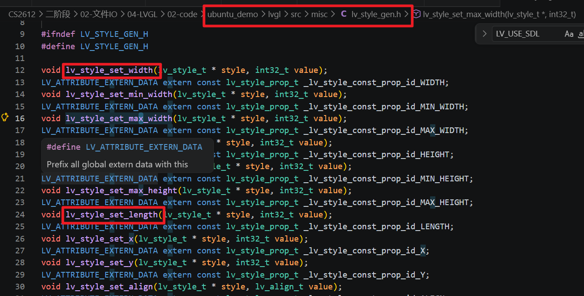

样式还可以直接设置，更多的样式可参考下面文件

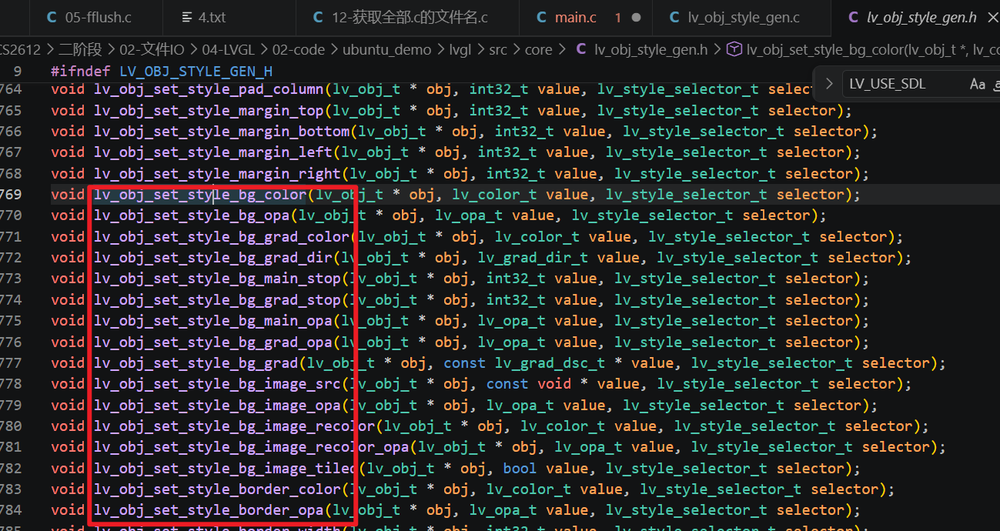

eg:

```c
//创建一个obj   win
//给win添加样式
lv_obj_set_style_bg_color(win,lv_color_hex(0xff0000),0);
```

练习：

```
void test02()
{
	//创建一个活动屏幕
	
	//在活动屏幕上创建基本对象
	
	//设置基本对象的大小
	
	//设置位置
	
	//定义静态样式变量
	
	//初始化样式
	
	//设置样式的背景颜色  透明度  边框颜色 边框的宽度 弧度  边框范围

	//把样式添加到窗口上
}
```

# 八、图片显示

lvgl自带了bmp和gif的解码器，可以直接创建并使用

bmp图片显示

- 在界面上创建一个图片的控件(静态控件)

  ```
  lv_obj_t * lv_image_create(lv_obj_t * parent);
  ```

- 在图片控件obj上显示src指向的内容(图片的文件名)

  ```
  void lv_image_set_src(lv_obj_t * obj, const void * src)
  src:写你的图片路径，注意要写绝对路径
  	eg:
  		"A:/mnt/hgfs/share/1.bmp"
  eg：
  
  	lv_obj_t *image = lv_image_create(win);
  	lv_image_set_src(image, "A:/mnt/hgfs/CS2612/二阶段/02-文件IO/04-LVGL/02-code/ubuntu_demo/pic/2.bmp");
  ```

- 设置图片的偏移

  ```
  void lv_image_set_offset_x(lv_obj_t * obj, int32_t x);
  void lv_image_set_offset_y(lv_obj_t * obj, int32_t y);
  ```

gif图片显示

- 在界面上创建一个图片的控件(动态控件)

  ```
  lv_obj_t * lv_gif_create(lv_obj_t * parent);
  ```

- 在图片控件obj上显示src指向的内容(图片的文件名)

  ```
  void lv_gif_set_src(lv_obj_t * obj, const void * src)
  src:写你的图片路径，注意要写绝对路径
  ```

注意点：lv_conf.h    已经给大家改过了 可自行检查一下 没有改的改一下

```c
(1)	#define LV_USE_BMP 1
	#define LV_USE_GIF 1
(2)#define LV_MEM_SIZE (10240 * 10240U)
	增加解码器的堆空间大小，原始的数据256kb
	若时在stm32,则不需要改，否则单片机的堆控件报错
(3)
	#define LV_USE_FS_STDIO 1
	//开启文件系统，允许解码器使用fopen fread 
	#define LV_USE_FS_POSIX 1
	//开启文件系统，允许解码器使用open read 
(4)盘符(硬件符号 ) 都写成'A'(可以写任意的盘符)
	#define LV_FS_STDIO_LETTER 'A'
	#define LV_FS_POSIX_LETTER 'A'
	显示图片，都以A开头
	因为linux下面是没有盘符的，但是lvgl必须要有 所以要定义
	假设有一个/mnt/hgfs/code/1.bmp
	路径写成"A:/mnt/hgfs/code/1.bmp"
	必须写绝对路径!!!
```

练习：完成2048游戏界面的设计

```
int game_grid[4][4] = {
	0,0,2,4,
	0,0,0,2,
	2,2,0,0,
	0,0,0,0
};

lv_obj_t *tile_image[4][4];

//初始化2048游戏界面
void ui_2048_init()
{
	//初始化游戏4*4格子的数据 (可以先不写，手动修改上面的数据)
    
    //创建窗口win
    //设置大小
    //设置位置
    
    //给win设置内边距
    lv_obj_set_style_pad_all(win,0,0);
    
    //在win中创建4*4的图像控件
    for(int i = 0;i<4;i++)
    {
    	for(int j = 0;j<4;j++)
    	{
    		//创建图片控件
    		
    		//设置图片控件位置lv_obj_set_pos
    		
    		//获取图片的路径保存到字符数组sprintf
    		
    		//设置图片控件显示哪张图片
    	}
    }
}
```

```c
#define TILE_SIZE 60

//定义2048游戏数组
static int game_grid[4][4] = {
	0,0,2,4,
	0,0,0,2,
	2,2,0,0,
	0,0,0,0
};

//保存图片控件的数组
static lv_obj_t *tile_image[4][4];

//2048游戏界面
static lv_obj_t *game_2048_screen = NULL;
//初始化2048游戏界面
static void ui_2048_init()
{
	//初始化游戏4*4格子的数据 (可以先不写，手动修改上面的数据)
    
    //创建窗口win
    game_2048_screen = lv_screen_active();
    lv_obj_t *win = lv_obj_create(game_2048_screen);
    //设置大小
    lv_obj_set_size(win,300,300);
    //设置位置
    lv_obj_set_align(win,9);
    
    //给win设置内边距
    lv_obj_set_style_pad_all(win,0,0);
    
    //在win中创建4*4的图像控件
    for(int i = 0;i<4;i++)
    {
    	for(int j = 0;j<4;j++)
    	{
    		//创建图片控件
            tile_image[i][j] = lv_image_create(win);
    		
    		//设置图片控件位置lv_obj_set_pos
            lv_obj_set_pos(tile_image[i][j],10+(TILE_SIZE+10)*j,10+(TILE_SIZE+10)*i);
    		
    		//获取图片的路径保存到字符数组sprintf
            char bmppathname[1024] = {0};
    		sprintf(bmppathname,"A:/mnt/hgfs/CS2612/二阶段/02-文件IO/04-LVGL/02-code/ubuntu_demo/pic/%d.bmp",game_grid[i][j]);
    		//设置图片控件显示哪张图片
            lv_image_set_src(tile_image[i][j],bmppathname);
    	}
    }
}
```


# 九、标签控件label

a.创建一个标签控件

```c
lv_obj_t * lv_label_create(lv_obj_t * parent);
eg：
	在某个按键上显示文本，则按键就是这个标签的父对象
	lv_obj_t *lab =  lv_label_create(button);
```

b.在lab标签上显示文本内容

```c
void lv_label_set_text(lv_obj_t * obj, const char * text);
@obj:标签对象名
@text:字符串 注意先 别写中文
eg:
	lv_label_set_text(lab,"abcd");
```

c.在lab标签上格式化输出文件内容

```c
void lv_label_set_text_fmt(lv_obj_t * obj, const char * fmt, ...);
@obj:标签对象名
@fmt:指定格式
eg:
	lv_label_set_text_fmt(lab,"score:%d",score);
```

d.获取lab标签上的字符串

```c
char * lv_label_get_text(const lv_obj_t * obj);
eg:
	char *str = lv_label_get_text(lab);//str就是lab显示的字符串
```

e.标签文本长度处理

可以在设置标签对象时，将标签的长宽，设置为LV_SIZE_CONTENT自动调整

```c
void lv_label_set_long_mode(lv_obj_t * obj, lv_label_long_mode_t long_mode);
@obj:指向标签对象的指针
@long_mode：标签在超出所设定的范围宽度后执行的工作模式
    enum _lv_label_long_mode_t {
        LV_LABEL_LONG_WRAP,             /**< 保持控件宽度，超出宽度的文本自动换行，并自动扩展控件高度 */
        LV_LABEL_LONG_DOT,              /**< 固定控件尺寸，文本过长时在末尾显示省略号（...） */
        LV_LABEL_LONG_SCROLL,           /**< 固定控件尺寸，文本过长时来回滚动显示 */
        LV_LABEL_LONG_SCROLL_CIRCULAR,  /**< 固定控件尺寸，文本过长时循环滚动显示（首尾无缝衔接） */
        LV_LABEL_LONG_CLIP,             /**< 固定控件尺寸，直接裁剪超出范围的文本（不显示多余内容） */
    };

注意：标签的尺寸应在执行此功能后进行设定
	除WRAP之外的模式选择，不能使用LV_SIZE_CONTENT自动调整
	会出现工作模式，无法正常执行的情况
```

练习：

```
1.在开发板或者是模拟器上(活动屏幕上)创建9个窗口，让其显示在9个分区
2.9个窗口的大小为200*100，在每个窗口中添加标签，标签的文本分别为1-9
```

```c
static void test03()
{
    lv_obj_t *win[9];
	//创建一个活动屏幕
    lv_obj_t *scr = lv_screen_active();

    //创建9个窗口
    for(int i = 0;i<9;i++)
    {
        //再活动屏幕上创建一个基本对象
        win[i] = lv_obj_create(scr);      
        
        //设置大小
        lv_obj_set_size(win[i],200,100);

        //设置位置
        lv_obj_set_align(win[i],i+1);

        //为每个窗口创建子对象标签
        lv_obj_t *lab =  lv_label_create(win[i]);

        //在标签上显示数字
        lv_label_set_text_fmt(lab,"%d",i+1);

    }
  
}
```

```c
static void test04()
{

	//创建一个活动屏幕
    lv_obj_t *scr = lv_screen_active();

    //创建标签
    lv_obj_t *lab = lv_label_create(scr);
    //设置标签宽高
    lv_obj_set_size(lab,50,100);
 
    //在标签上内容
    lv_label_set_text(lab,"adaasdahsdkasfsdhfdhff");

    //设置文本处理模式
    lv_label_set_long_mode(lab,LV_LABEL_LONG_SCROLL_CIRCULAR);
 
}

void test()
{
    //想调用那个测试函数 就用哪个测试函数名字
    test04();
}
```

## 把自己写的模块代码添加到LVGL工程中编译运行

编写test.c test.h 2048.c 2048.h，放在mycode目录下

test.c

```c
#include "test.h"
#include "../lvgl/lvgl.h"
static void test01()
{
	//创建一个活动屏幕
    lv_obj_t *scr = lv_screen_active();
	
	//再活动屏幕上创建一个基本对象
    lv_obj_t *win = lv_obj_create(scr);
	
	//设置基本对象的大小
    lv_obj_set_size(win,100,100);
	
	//设置位置
    lv_obj_set_align(win,LV_ALIGN_RIGHT_MID );
}

static void test03()
{
    lv_obj_t *win[9];
	//创建一个活动屏幕
    lv_obj_t *scr = lv_screen_active();

    //创建9个窗口
    for(int i = 0;i<9;i++)
    {
        //再活动屏幕上创建一个基本对象
        win[i] = lv_obj_create(scr);      
        
        //设置大小
        lv_obj_set_size(win[i],200,100);

        //设置位置
        lv_obj_set_align(win[i],i+1);

        //为每个窗口创建子对象标签
        lv_obj_t *lab =  lv_label_create(win[i]);

        //在标签上显示数字
        lv_label_set_text_fmt(lab,"%d",i+1);

    }
  
}

void test()
{
    //想调用那个测试函数 就用哪个测试函数名字
    test03();
}
```

test.h

```c
#ifndef _TEST_H_
#define _TEST_H_

void test();

#endif
```

2048.c

```c
#include "2048.h"
#include "../lvgl/lvgl.h"
#include <stdio.h>
#define TILE_SIZE 60

//定义2048游戏数组
static int game_grid[4][4] = {
	0,0,2,4,
	0,0,0,2,
	2,2,0,0,
	0,0,0,0
};

//保存图片控件的数组
static lv_obj_t *tile_image[4][4];

//2048游戏界面
static lv_obj_t *game_2048_screen = NULL;
//初始化2048游戏界面
void ui_2048_init()
{
	//初始化游戏4*4格子的数据 (可以先不写，手动修改上面的数据)
    
    //创建窗口win
    game_2048_screen = lv_screen_active();
    lv_obj_t *win = lv_obj_create(game_2048_screen);
    //设置大小
    lv_obj_set_size(win,300,300);
    //设置位置
    lv_obj_set_align(win,9);
    
    //给win设置内边距
    lv_obj_set_style_pad_all(win,0,0);
    
    //在win中创建4*4的图像控件
    for(int i = 0;i<4;i++)
    {
    	for(int j = 0;j<4;j++)
    	{
    		//创建图片控件
            tile_image[i][j] = lv_image_create(win);
    		
    		//设置图片控件位置lv_obj_set_pos
            lv_obj_set_pos(tile_image[i][j],10+(TILE_SIZE+10)*j,10+(TILE_SIZE+10)*i);
    		
    		//获取图片的路径保存到字符数组sprintf
            char bmppathname[1024] = {0};
    		sprintf(bmppathname,"A:/mnt/hgfs/CS2612/二阶段/02-文件IO/04-LVGL/02-code/ubuntu_demo/pic/%d.bmp",game_grid[i][j]);
    		//设置图片控件显示哪张图片
            lv_image_set_src(tile_image[i][j],bmppathname);
    	}
    }
}
```

2048.h

```c
#ifndef _2048_H_
#define _2048_H_

//初始化2048游戏界面
void ui_2048_init();

#endif
```

main.c

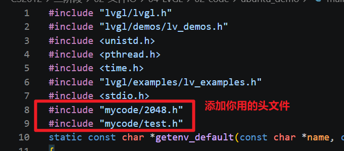

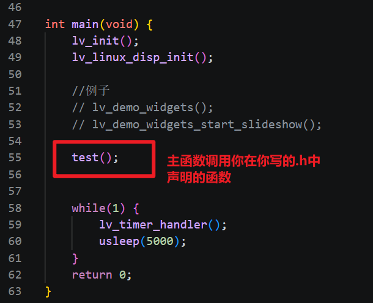

修改cmakelists.txt

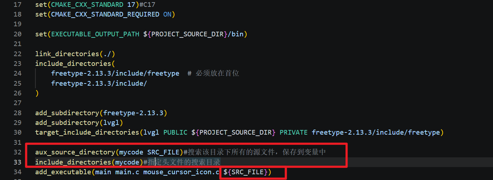

# 十、字体

​	在lvgl，字体大小是提前用像素值设计好的

​	在工程目录的lvgl/src/font已经设计好了字体的大小，我们可以直接调用字体，也是通过样式设计得到的

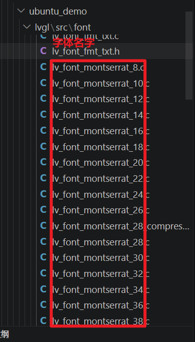

a.设置字体颜色

```c
void lv_style_set_text_color(lv_style_t * style, lv_color_t value);
eg:
	static lv_style_t style;
	lv_style_init(&style);
	lv_style_set_text_color(&style, lv_color_hex(0xff0000));
	lv_obj_add_style(lab,&style,0);
eg:
	lv_obj_set_style_text_color(lab,lv_color_hex(0xff0000),0);
```

b.修改字体大小

```c
(1)创建一个字体大小lv_font_montserrat_30的规则
eg:
	const lv_font_t *font = &lv_font_montserrat_30;
(2)设置字体放到样式中去
	void lv_style_set_text_font(lv_style_t * style, const lv_font_t * value);
eg:
	static lv_style_t style;
	lv_style_init(&style);
	lv_style_set_text_font(&style,font);
	lv_obj_add_style(lab,&style,0);
eg:
	lv_obj_set_style_text_font(lab,font,0);
(3)把样式添加到标签控件中
void lv_obj_add_style(lv_obj_t * obj, const lv_style_t * style, lv_style_selector_t selector);
```

练习：给之前你的标签设置字体大小和颜色

```c
static void test05()
{
    lv_obj_t *win[9];
	//创建一个活动屏幕
    lv_obj_t *scr = lv_screen_active();

    //创建9个窗口
    for(int i = 0;i<9;i++)
    {
        //再活动屏幕上创建一个基本对象
        win[i] = lv_obj_create(scr);      
        
        //设置大小
        lv_obj_set_size(win[i],200,100);

        //设置位置
        lv_obj_set_align(win[i],i+1);

        //为每个窗口创建子对象标签
        lv_obj_t *lab =  lv_label_create(win[i]);

        //在标签上显示数字
        lv_label_set_text_fmt(lab,"%d",i+1);

        //设置字体颜色
        lv_obj_set_style_text_color(lab,lv_color_hex(0xff0000),0);

        //修改字体大小
        lv_obj_set_style_text_font(lab,&lv_font_montserrat_30,0);

    }
  
}

void test()
{
    //想调用那个测试函数 就用哪个测试函数名字
    test05();
}
```

## 使用自己的汉字库

1.  先下载字体文件(xxx.ttf)

    可以在https://lvgl.100ask.net/8.1/tools/fonts-zh-source.html

    可以自己找你电脑C:\Windows\fonts

2.  使用字体转换器

    https://lvgl.io/tools/fontconverter 

    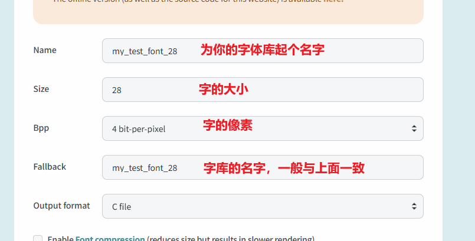

    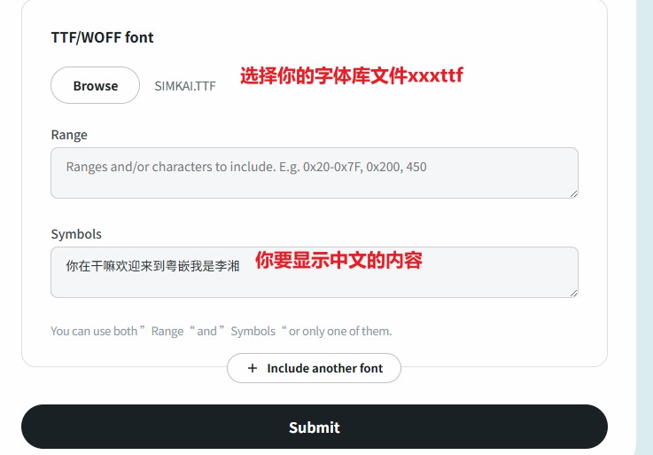

    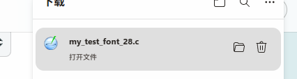

3.  会生成一个.c文件，放到mycode文件夹下面中

    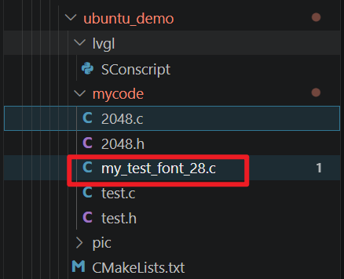

4.  写代码，把字体添加到你的标签上去

    ```c
    //使用自己的字体库
    static void test06()
    {
        //一定要先声明你的字体文件名字
        extern const lv_font_t my_test_font_28;
    	//创建一个活动屏幕
        lv_obj_t *scr = lv_screen_active();
    
        //创建标签
        lv_obj_t *lab = lv_label_create(scr);
        //设置标签宽高
        lv_obj_set_size(lab,100,100);
     
        //在标签上内容
        lv_label_set_text(lab,"李湘");
    
        //设置字体颜色
        lv_obj_set_style_text_color(lab,lv_color_hex(0xff0000),0);
    
        //修改字体大小
        lv_obj_set_style_text_font(lab,&my_test_font_28,0);
    
    }
    
    void test()
    {
        //想调用那个测试函数 就用哪个测试函数名字
        test06();
    }
    ```

    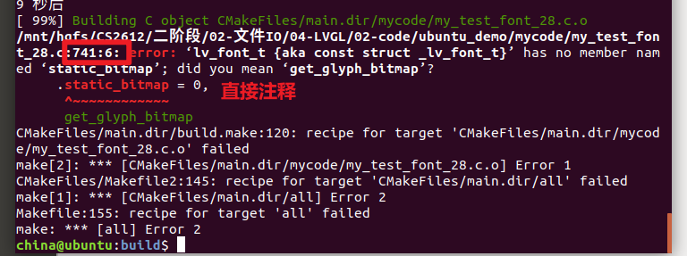

## **字体库freetype的使用**

1.  修改lv_conf.h 启用一下选项

    ```
    #define LV_USE_FREETYPE 1
    ```

2.  测试代码，编辑main.c

    参考：ubuntu_demo\lvgl\examples\libs\freetype\lv_example_freetype_1.c

    ```
    //添加头文件
    #include "lvgl/examples/lv_examples.h"
    //在main中添加freetype例子
    lv_example_freetype_1();
    
    注：
    	若在开发板运行程序，字体xxx.ttf的文件需要上传到开发板，并且字体的路径要跟开发板的字体路径要一致
    ```

例子：

```c
/**
 * Load a font with FreeType
 */
void test07(void)
{
    /*Create a font*/
    lv_font_t * font = lv_freetype_font_create("/mnt/hgfs/CS2612/二阶段/02-文件IO/04-LVGL/02-code/ubuntu_demo/SIMKAI.TTF",
                                               LV_FREETYPE_FONT_RENDER_MODE_BITMAP,
                                               32,
                                               LV_FREETYPE_FONT_STYLE_NORMAL);

    if(!font) {
        LV_LOG_ERROR("freetype font create failed.");
        return;
    }

	//创建一个活动屏幕
    lv_obj_t *scr = lv_screen_active();

    //创建标签
    lv_obj_t *lab = lv_label_create(scr);
    //设置标签宽高
    lv_obj_set_size(lab,400,400);
 
    //在标签上内容
    lv_label_set_text(lab,"你是谁哈哈哈");

    //设置字体颜色
    lv_obj_set_style_text_color(lab,lv_color_hex(0xff0000),0);

    //修改字体大小
    lv_obj_set_style_text_font(lab,font,0);
}

void test()
{
    //想调用那个测试函数 就用哪个测试函数名字
    test07();
}
```


# 十一、按键

按键的创建

```c
lv_obj_t * lv_button_create(lv_obj_t * parent)
eg:
	lv_obj_t *btn = lv_button_create(win)
```

按钮本身无法显示文字，我们必须在button基础上创建一个label标签，这样子才能显示文字

```
一般创建完按钮后，还会以按键为父对象，创建子对象label
```

当用户对按钮进行按下 松开 单击等才做的时候，都会触发相关的事件，如果关心某个事件，订阅的时候把这个事件和一个函数关联起来，后续发生该事件，就会自动调用该函数，这个函数叫做该事件的回调函数

```c
lv_event_dsc_t * lv_obj_add_event_cb(lv_obj_t * obj, lv_event_cb_t event_cb, lv_event_code_t filter, void * user_data)
@obj：你需要添加的事件的对象名
@event_cb:回调函数，写你点击或松开的时候需要做的事件(函数名),类型 lv_event_cb_t
	typedef void (*lv_event_cb_t)(lv_event_t * e);
	回调函数的格式固定的
		void 函数名(lv_event_t * e)
		{
			//相关的代码
		}
	struct lv_event_t {
        void * current_target;//当前事件的对象
        void * original_target;//原始事件的对象
        lv_event_code_t code;//事件的编码 eg:松开 按下
        void * user_data;//添加事件的传入的数据
        ...
	};
@filter：触发的事件
typedef enum {
        LV_EVENT_ALL = 0,//所有事件
        LV_EVENT_PRESSED, //按下
        LV_EVENT_PRESSING, //正在被按下
        LV_EVENT_SHORT_CLICKED, //单击
        LV_EVENT_LONG_PRESSED, //长按
        LV_EVENT_CLICKED,  //点击
        LV_EVENT_RELEASED,//松开
	} lv_event_code_t;	
@user_data：用来传递用户数据给回调函数，如果不需要就为NULL
```

 回调函数内部你们可能需要的函数

```c
//获取事件发生的编码 eg:点击 松开
lv_event_code_t lv_event_get_code(lv_event_t * e)
```

```c
//获取注册事件发生的对象
void * lv_event_get_target(lv_event_t * e)
```

```c
//获取注册事件的用户数据
void * lv_event_get_user_data(lv_event_t * e)
```

```c
//获取输入设备
lv_indev_t * lv_indev_active(void)
//获取一个点击坐标
void lv_indev_get_point(const lv_indev_t * indev, lv_point_t * point)
@indev输入设备
@point坐标
```

```c
//获取obj上的第idx个子对象(顺序是按照添加创建时的顺序来进行设置的)
lv_obj_t * lv_obj_get_child(const lv_obj_t * obj, int32_t idx);
```

eg：没有传参数

```c
static int click_count = 0;
lv_obj_t *lab = NULL;
static void test08_cb(lv_event_t * e)
{
    //次数+1
    click_count++;

    //更新lab
    lv_label_set_text_fmt(lab,"prv:%d",click_count);
}

/**
 * Load a font with FreeType
 */
static void test08(void)
{

	//创建一个活动屏幕
    lv_obj_t *scr = lv_screen_active();

    //创建按钮
    lv_obj_t *btn = lv_button_create(scr);

    //按钮设置大小
    lv_obj_set_size(btn,100,50);

    //创建标签
    lab = lv_label_create(btn);
 
    //在标签上内容
    lv_label_set_text_fmt(lab,"prv:%d",click_count);

    //将按钮和函数进行绑定
    lv_obj_add_event_cb(btn, test08_cb, LV_EVENT_CLICKED, NULL);

}
```

eg:没有传参，通过点击的对象获取子对象

```c
static int click_count = 0;
static void test08_cb(lv_event_t * e)
{
    //获取注册事件发生的对象
    lv_obj_t *btn = lv_event_get_target(e);
    //获取obj上的第0个子对象
    lv_obj_t *lab = lv_obj_get_child(btn, 0);
    //次数+1
    click_count++;

    //更新lab
    lv_label_set_text_fmt(lab,"prv:%d",click_count);
}

/**
 * Load a font with FreeType
 */
static void test08(void)
{

	//创建一个活动屏幕
    lv_obj_t *scr = lv_screen_active();

    //创建按钮
    lv_obj_t *btn = lv_button_create(scr);

    //按钮设置大小
    lv_obj_set_size(btn,100,50);

    //创建标签
    lv_obj_t *lab = lv_label_create(btn);
 
    //在标签上内容
    lv_label_set_text_fmt(lab,"prv:%d",click_count);

    //将按钮和函数进行绑定
    lv_obj_add_event_cb(btn, test08_cb, LV_EVENT_CLICKED, NULL);

}
```

eg:传参数

```c
static int click_count = 0;
static void test08_cb(lv_event_t * e)
{
    //获取传入的用户数据
    lv_obj_t *lab = lv_event_get_user_data(e);
    //次数+1
    click_count++;

    //更新lab
    lv_label_set_text_fmt(lab,"prv:%d",click_count);
}

/**
 * Load a font with FreeType
 */
static void test08(void)
{

	//创建一个活动屏幕
    lv_obj_t *scr = lv_screen_active();

    //创建按钮
    lv_obj_t *btn = lv_button_create(scr);

    //按钮设置大小
    lv_obj_set_size(btn,100,50);

    //创建标签
    lv_obj_t *lab = lv_label_create(btn);
 
    //在标签上内容
    lv_label_set_text_fmt(lab,"prv:%d",click_count);

    //将按钮和函数进行绑定
    lv_obj_add_event_cb(btn, test08_cb, LV_EVENT_CLICKED, lab);

}

void test()
{
    //想调用那个测试函数 就用哪个测试函数名字
    test08();
}
```

eg:获取点击坐标

```C
void test09_cb(lv_event_t *e)
{
    lv_point_t point;
    //获取一个点击坐标
    lv_indev_get_point(lv_indev_active(), &point);
    LV_LOG_USER("x:%d,y:%d\n",point.x,point.y);
}

static void test09(void)
{

	//创建一个活动屏幕
    lv_obj_t *scr = lv_screen_active();

    //创建基本对象
    lv_obj_t *win = lv_obj_create(scr);    

    //设置宽高
    lv_obj_set_size(win,1024,600);

    //将win和函数进行绑定
    lv_obj_add_event_cb(win, test09_cb, LV_EVENT_CLICKED, NULL);    
}

void test()
{
    //想调用那个测试函数 就用哪个测试函数名字
    test09();
}
```

eg:获取滑动方向

```c
static lv_point_t start_point;//按下
static lv_point_t end_point;//松开
/*
    0 点击
    1 上
    2 下
    3 左
    4 右
*/
static int get_slide(lv_point_t start_point,lv_point_t end_point)
{
    int x = end_point.x-start_point.x;
    int y = end_point.y-start_point.y;

    if(x == 0 && y == 0)
    {
        return 0;
    }
    else if(abs(x) > abs(y))//左和右
    {
        if(x>0)
        {
            return 4;
        }
        else
        {
            return 3;
        }
    }
    else //上和下
    {
        if(y>0)
        {
            return 2;
        }
        else
        {
            return 1;
        }
    }
}
static void test10_cb(lv_event_t *e)
{

    //获取事件编码
    lv_event_code_t code = lv_event_get_code(e);
    if(code == LV_EVENT_PRESSED)//按下
    {
        //获取一个点击坐标
        lv_indev_get_point(lv_indev_active(), &start_point);   
    }
    else if(code == LV_EVENT_RELEASED)//松开
    {
        //获取一个点击坐标
        lv_indev_get_point(lv_indev_active(), &end_point);   
        
        //获取滑动方向
        int r = get_slide(start_point,end_point);
        if(r == 0)
        {
            printf("click(%d,%d)\n",end_point.x,end_point.y);
        }
        else if(r == 1)
        {
            printf("up\n");
        }
        else if(r == 2)
        {
            printf("down\n");
        }
        else if(r == 3)
        {
            printf("left\n");
        }
        else if(r == 4)
        {
            printf("right\n");
        }
    }
}

static void test10(void)
{

	//创建一个活动屏幕
    lv_obj_t *scr = lv_screen_active();

    //创建基本对象
    lv_obj_t *win = lv_obj_create(scr);    

    //设置宽高
    lv_obj_set_size(win,1024,600);

    //将win和函数进行绑定
    lv_obj_add_event_cb(win, test10_cb, LV_EVENT_ALL, NULL);     
}

void test()
{
    //想调用那个测试函数 就用哪个测试函数名字
    test10();
}
```

作业：完成电子相册，点击左边的按钮，切换上一张图片，点击右边的按钮，切换下一张图片，顺便做一个返回按钮，放在界面的右上角，在2048的界面中也做一个返回按钮，再做一个界面，里面包含了2048和电子相册的按钮

```c
static char *bmp_path[3] = {
    "A:/mnt/hgfs/CS2612/二阶段/02-文件IO/04-LVGL/02-code/ubuntu_demo/pic/2.bmp",
    "A:/mnt/hgfs/CS2612/二阶段/02-文件IO/04-LVGL/02-code/ubuntu_demo/pic/4.bmp",
    "A:/mnt/hgfs/CS2612/二阶段/02-文件IO/04-LVGL/02-code/ubuntu_demo/pic/8.bmp"
};
//当前显示图片的下标
static int curren_bmp_index = 0;
static void change_button_cb(lv_event_t *e)
{
    //获取传入的参数
    lv_obj_t *win = lv_event_get_user_data(e);
    //获取win的第0个子对象
    lv_obj_t *image = lv_obj_get_child(win,0);
    //获取win的第一个子对象
    lv_obj_t *prev_btn = lv_obj_get_child(win,1);
    //获取win的第二个子对象
    lv_obj_t *next_btn = lv_obj_get_child(win,2);

    //获取当前点击的对象
    lv_obj_t*button = lv_event_get_target(e);
    if(button == prev_btn)
    {
        curren_bmp_index=(curren_bmp_index-1+3)%3;
    }
    else if(button == next_btn)
    {
        curren_bmp_index=(curren_bmp_index+1+3)%3;
    }

     //显示图片
    lv_image_set_src(image,bmp_path[curren_bmp_index]);
}

//电子相册界面初始化
static void ui_album_screen_init()
{
	//创建一个活动屏幕
    lv_obj_t *scr = lv_screen_active();

    //创建基本对象
    lv_obj_t *win = lv_obj_create(scr);    
    //设置宽高
    lv_obj_set_size(win,1024,600);    

    //创建图片控件
    lv_obj_t *image = lv_image_create(win);
    lv_image_set_src(image,bmp_path[curren_bmp_index]);

    //创建两个按钮
    lv_obj_t*prev_btn = lv_button_create(win);
    lv_obj_t*next_btn = lv_button_create(win);
    //设置按钮的位置
    lv_obj_set_align(prev_btn,LV_ALIGN_BOTTOM_LEFT);
    lv_obj_set_align(next_btn,LV_ALIGN_BOTTOM_RIGHT);
    //为两个按钮创建标签
    lv_obj_t*prev_btn_lab = lv_label_create(prev_btn);
    lv_label_set_text(prev_btn_lab,"prev");
    lv_obj_t*next_btn_lab = lv_label_create(next_btn);
    lv_label_set_text(next_btn_lab,"next");
    //为两个按钮设置回调函数
    lv_obj_add_event_cb(prev_btn,change_button_cb,LV_EVENT_CLICKED,win);
    lv_obj_add_event_cb(next_btn,change_button_cb,LV_EVENT_CLICKED,win);

    //创建返回按钮
    lv_obj_t*return_btn = lv_button_create(win);
    lv_obj_set_align(return_btn,LV_ALIGN_TOP_RIGHT);
    lv_obj_t*return_btn_lab = lv_label_create(return_btn);
    lv_label_set_text(return_btn_lab,"return");

}

void test()
{
    //想调用那个测试函数 就用哪个测试函数名字
    ui_album_screen_init();
}
```


# 十二、界面的切换

- 添加控件属性

  ```c
  void lv_obj_add_flag(lv_obj_t * obj, lv_obj_flag_t f);
  obj:要添加的属性的obj
  f:要添加的属性lv_obj_flag_t
  typedef enum {
      LV_OBJ_FLAG_HIDDEN,//隐藏
      LV_OBJ_FLAG_CLICKABLE//点击后被输入子系统指定属性	
      }lv_obj_flag_t;
  ```
  
- 移除控件属性

  ```
  void lv_obj_remove_flag(lv_obj_t * obj, lv_obj_flag_t f)
  obj:要移除的属性的obj
  f:要移除的属性lv_obj_flag_t
  ```

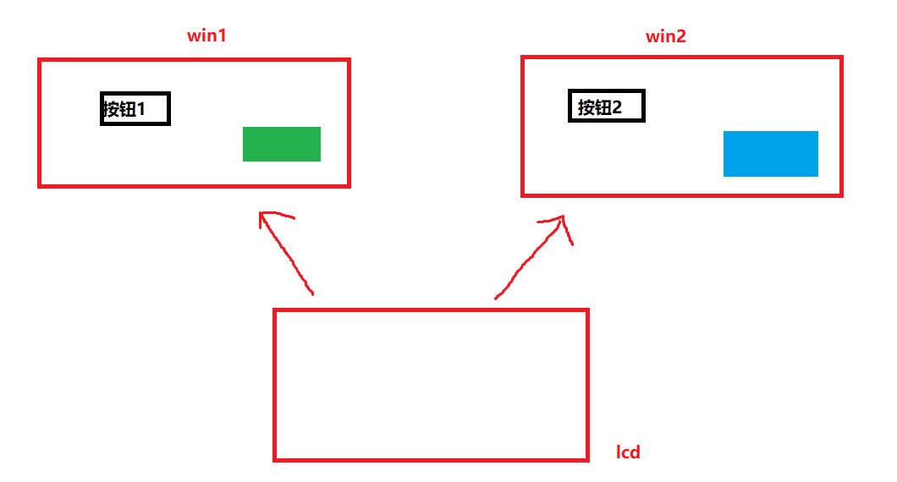

```
一开始的时候,按键显示botton,显示绿色的窗口，显示蓝色的窗口，把蓝色窗口隐藏
	->界面1的效果
按下botton的时候,把botton上标签的字改成botton2，把绿色窗口隐藏，把蓝色的窗口隐藏属性去除
	->界面2的效果
按下botton2的时候,把botton2上标签的字改成botton1，把蓝色窗口隐藏，把绿色的窗口隐藏属性去除
	->界面1的效果
```

方式1：

```c
//显示页面
lv_obj_t *test11_win1 = NULL;
lv_obj_t *test11_win2 = NULL;
void test11_display_page(lv_obj_t *screen)
{
    //隐藏
    lv_obj_add_flag(test11_win1,LV_OBJ_FLAG_HIDDEN);
    lv_obj_add_flag(test11_win2,LV_OBJ_FLAG_HIDDEN);
    //显示
    lv_obj_remove_flag(screen, LV_OBJ_FLAG_HIDDEN);
}

//切换界面2
void test11_change_win2_cb(lv_event_t *e)
{
    test11_display_page(test11_win2);
}

//切换界面1
void test11_change_win1_cb(lv_event_t *e)
{
    test11_display_page(test11_win1);
}
//方式1 切换界面
void test11()
{
	//创建一个活动屏幕
    lv_obj_t *scr = lv_screen_active();

    //创建基本对象
    test11_win1 = lv_obj_create(scr);    
    //设置宽高
    lv_obj_set_size(test11_win1,1024,600); 
    //创建标签
    lv_obj_t *lab1 = lv_label_create(test11_win1);
    lv_label_set_text(lab1,"this is screen1");
    //创建按钮
    lv_obj_t *but1 = lv_button_create(test11_win1);
    lv_obj_set_size(but1,150,50); 
    lv_obj_set_align(but1,9);
    lv_obj_t *but1_lab = lv_label_create(but1);  
    lv_label_set_text(but1_lab,"change screen2"); 
    lv_obj_add_event_cb(but1,test11_change_win2_cb,LV_EVENT_CLICKED,NULL); 

    //创建基本对象
    test11_win2 = lv_obj_create(scr);    
    //设置宽高
    lv_obj_set_size(test11_win2,1024,600); 
    //创建标签
    lv_obj_t *lab2 = lv_label_create(test11_win2);
    lv_label_set_text(lab2,"this is screen2");
    //创建按钮
    lv_obj_t *but2 = lv_button_create(test11_win2);
    lv_obj_set_size(but2,150,50); 
    lv_obj_set_align(but2,9);
    lv_obj_t *but2_lab = lv_label_create(but2);  
    lv_label_set_text(but2_lab,"change screen1"); 
    lv_obj_add_event_cb(but2,test11_change_win1_cb,LV_EVENT_CLICKED,NULL); 

    //显示页面
    test11_display_page(test11_win1);
}
```

方式2:（推荐的方式）

```
//加载界面
lv_screen_load(放你要加载的页面名字，一定要要注意，加载的页面的父对象一定NULL,会直接把页面作为活动屏幕)

```

```c
//显示页面
lv_obj_t *test12_win1 = NULL;
lv_obj_t *test12_win2 = NULL;
void init_scr1();
void init_scr2();

//切换界面2
void test12_change_win2_cb(lv_event_t *e)
{
    //界面2不存在则创建
    if(test12_win2 == NULL)
    {
        init_scr2();
    }

    //加载界面2并删除界面1
    lv_screen_load(test12_win2);
    lv_obj_delete(test12_win1);
    test12_win1 = NULL;
}

//切换界面1
void test12_change_win1_cb(lv_event_t *e)
{
    //界面1不存在则创建
    if(test12_win1 == NULL)
    {
        init_scr1();
    }

    //加载界面1并删除界面2
    lv_screen_load(test12_win1);
    lv_obj_delete(test12_win2);
    test12_win2 = NULL;
}

//初始化界面1
void init_scr1()
{
    //创建基本对象
    test12_win1 = lv_obj_create(NULL);    
    // //设置宽高
    // lv_obj_set_size(test12_win1,1024,600); 
    //创建标签
    lv_obj_t *lab1 = lv_label_create(test12_win1);
    lv_label_set_text(lab1,"this is screen1");
    //创建按钮
    lv_obj_t *but1 = lv_button_create(test12_win1);
    lv_obj_set_size(but1,150,50); 
    lv_obj_set_align(but1,9);
    lv_obj_t *but1_lab = lv_label_create(but1);  
    lv_label_set_text(but1_lab,"change screen2"); 
    lv_obj_add_event_cb(but1,test12_change_win2_cb,LV_EVENT_CLICKED,NULL); 
    
    //加载界面1
    lv_screen_load(test12_win1);//test12_win1作为活动屏幕
}
//初始化界面2
void init_scr2()
{
    //创建基本对象
    test12_win2 = lv_obj_create(NULL);    
    // //设置宽高
    // lv_obj_set_size(test12_win2,1024,600); 
    //创建标签
    lv_obj_t *lab2 = lv_label_create(test12_win2);
    lv_label_set_text(lab2,"this is screen2");
    //创建按钮
    lv_obj_t *but2 = lv_button_create(test12_win2);
    lv_obj_set_size(but2,150,50); 
    lv_obj_set_align(but2,9);
    lv_obj_t *but2_lab = lv_label_create(but2);  
    lv_label_set_text(but2_lab,"change screen1"); 
    lv_obj_add_event_cb(but2,test12_change_win1_cb,LV_EVENT_CLICKED,NULL); 
    //加载界面2
    lv_screen_load(test12_win2);//test12_win2作为活动屏幕

}

//两个界面切换示例
void test12()
{
    init_scr1();
}
```

练习：实现三个界面的切换

2048.c

```c
#include "2048.h"
#include <stdio.h>
#include "main_interface.h"
#define TILE_SIZE 60

//定义2048游戏数组
static int game_grid[4][4] = {
	0,0,2,4,
	0,0,0,2,
	2,2,0,0,
	0,0,0,0
};

//保存图片控件的数组
static lv_obj_t *tile_image[4][4];

static void to_select_app_screen_cb(lv_event_t *e)
{
    //选择界面不存在则创建
    if(select_app_screen == NULL)
    {
        //初始化选择界面
        select_app_screen = ui_select_app_screen_init();
    }

    //加载选择界面并删除2048界面
    lv_screen_load(select_app_screen);
    if(game_2048_screen!=NULL)
    {
        lv_obj_delete(game_2048_screen);
        game_2048_screen = NULL;
    }
}


//初始化2048游戏界面
lv_obj_t * ui_2048_init()
{
	//初始化游戏4*4格子的数据 (可以先不写，手动修改上面的数据)
    
    //创建窗口win
    lv_obj_t *game_2048_screen = lv_obj_create(NULL);

    lv_obj_t *win = lv_obj_create(game_2048_screen);
    //设置大小
    lv_obj_set_size(win,300,300);
    //设置位置
    lv_obj_set_align(win,9);
    
    //给win设置内边距
    lv_obj_set_style_pad_all(win,0,0);
    
    //在win中创建4*4的图像控件
    for(int i = 0;i<4;i++)
    {
    	for(int j = 0;j<4;j++)
    	{
    		//创建图片控件
            tile_image[i][j] = lv_image_create(win);
    		
    		//设置图片控件位置lv_obj_set_pos
            lv_obj_set_pos(tile_image[i][j],10+(TILE_SIZE+10)*j,10+(TILE_SIZE+10)*i);
    		
    		//获取图片的路径保存到字符数组sprintf
            char bmppathname[1024] = {0};
    		sprintf(bmppathname,"A:/mnt/hgfs/CS2612/二阶段/02-文件IO/04-LVGL/02-code/ubuntu_demo/pic/%d.bmp",game_grid[i][j]);
    		//设置图片控件显示哪张图片
            lv_image_set_src(tile_image[i][j],bmppathname);
    	}
    }


    //创建返回按钮
    lv_obj_t*return_btn = lv_button_create(game_2048_screen);
    lv_obj_set_align(return_btn,LV_ALIGN_TOP_RIGHT);
    lv_obj_t*return_btn_lab = lv_label_create(return_btn);
    lv_label_set_text(return_btn_lab,"return");
     lv_obj_add_event_cb(return_btn,to_select_app_screen_cb,LV_EVENT_CLICKED,NULL); 


    //加载活动屏幕
    lv_screen_load(game_2048_screen);
    
    return game_2048_screen;
}
```

2048.h

```c
#ifndef _2048_H_
#define _2048_H_
#include "../lvgl/lvgl.h"

//初始化2048游戏界面
lv_obj_t * ui_2048_init();

#endif
```

album.c

```c
#include "album.h"
#include "main_interface.h"
static char *bmp_path[3] = {
    "A:/mnt/hgfs/CS2612/二阶段/02-文件IO/04-LVGL/02-code/ubuntu_demo/pic/2.bmp",
    "A:/mnt/hgfs/CS2612/二阶段/02-文件IO/04-LVGL/02-code/ubuntu_demo/pic/4.bmp",
    "A:/mnt/hgfs/CS2612/二阶段/02-文件IO/04-LVGL/02-code/ubuntu_demo/pic/8.bmp"
};
//当前显示图片的下标
static int curren_bmp_index = 0;
static void change_button_cb(lv_event_t *e)
{
    //获取传入的参数
    lv_obj_t *win = lv_event_get_user_data(e);
    //获取win的第0个子对象
    lv_obj_t *image = lv_obj_get_child(win,0);
    //获取win的第一个子对象
    lv_obj_t *prev_btn = lv_obj_get_child(win,1);
    //获取win的第二个子对象
    lv_obj_t *next_btn = lv_obj_get_child(win,2);

    //获取当前点击的对象
    lv_obj_t*button = lv_event_get_target(e);
    if(button == prev_btn)
    {
        curren_bmp_index=(curren_bmp_index-1+3)%3;
    }
    else if(button == next_btn)
    {
        curren_bmp_index=(curren_bmp_index+1+3)%3;
    }

     //显示图片
    lv_image_set_src(image,bmp_path[curren_bmp_index]);
}

static void to_select_app_screen_cb(lv_event_t *e)
{
    //选择界面不存在则创建
    if(select_app_screen == NULL)
    {
        //初始化选择界面
        select_app_screen = ui_select_app_screen_init();
    }

    //加载选择界面并删除电子相册界面
    lv_screen_load(select_app_screen);
    if(album_screen!=NULL)
    {
        lv_obj_delete(album_screen);
        album_screen = NULL;
    }
}

//电子相册界面初始化
lv_obj_t* ui_album_screen_init()
{
	//创建一个活动屏幕
    lv_obj_t *scr = lv_obj_create(NULL);

    //创建基本对象
    lv_obj_t *win = lv_obj_create(scr);    
    //设置宽高
    lv_obj_set_size(win,1024,600);    

    //创建图片控件
    lv_obj_t *image = lv_image_create(win);
    lv_image_set_src(image,bmp_path[curren_bmp_index]);

    //创建两个按钮
    lv_obj_t*prev_btn = lv_button_create(win);
    lv_obj_t*next_btn = lv_button_create(win);
    //设置按钮的位置
    lv_obj_set_align(prev_btn,LV_ALIGN_BOTTOM_LEFT);
    lv_obj_set_align(next_btn,LV_ALIGN_BOTTOM_RIGHT);
    //为两个按钮创建标签
    lv_obj_t*prev_btn_lab = lv_label_create(prev_btn);
    lv_label_set_text(prev_btn_lab,"prev");
    lv_obj_t*next_btn_lab = lv_label_create(next_btn);
    lv_label_set_text(next_btn_lab,"next");
    //为两个按钮设置回调函数
    lv_obj_add_event_cb(prev_btn,change_button_cb,LV_EVENT_CLICKED,win);
    lv_obj_add_event_cb(next_btn,change_button_cb,LV_EVENT_CLICKED,win);

    //创建返回按钮
    lv_obj_t*return_btn = lv_button_create(win);
    lv_obj_set_align(return_btn,LV_ALIGN_TOP_RIGHT);
    lv_obj_t*return_btn_lab = lv_label_create(return_btn);
    lv_label_set_text(return_btn_lab,"return");
    lv_obj_add_event_cb(return_btn,to_select_app_screen_cb,LV_EVENT_CLICKED,NULL); 

    //加载活动屏幕
    lv_screen_load(scr);

    //返回界面
    return scr;
}
```

album.h

```c
#ifndef _ALBUM_H_
#define _ALBUM_H_
#include "../lvgl/lvgl.h"
lv_obj_t* ui_album_screen_init();

#endif
```

main_interface.c

```c
#include "main_interface.h"
#include "2048.h"
#include "stdio.h"
#include "album.h"
lv_obj_t *game_2048_screen = NULL;
lv_obj_t *album_screen = NULL;
lv_obj_t *select_app_screen = NULL;
static void to_game_2048_screen_cb(lv_event_t *e)
{
    //2048界面不存在则创建
    if(game_2048_screen == NULL)
    {
        //初始化2048界面
        game_2048_screen = ui_2048_init();
    }

    //加载2048界面并删除选择app界面
    lv_screen_load(game_2048_screen);
    if(select_app_screen!=NULL)
    {
        lv_obj_delete(select_app_screen);
        select_app_screen = NULL;
    }
}

static void to_album_screen_cb(lv_event_t *e)
{
    //电子相册界面不存在则创建
    if(album_screen == NULL)
    {
        //初始化电子相册界面
        album_screen = ui_album_screen_init();
    }

    //加载电子相册并删除选择app界面
    lv_screen_load(album_screen);
    if(select_app_screen!=NULL)
    {
        lv_obj_delete(select_app_screen);
        select_app_screen = NULL;
    }
}

//初始化选择app界面
lv_obj_t * ui_select_app_screen_init()
{
	//创建一个活动屏幕
    lv_obj_t *select_app_screen = lv_obj_create(NULL);

    //创建基本对象
    lv_obj_t *win = lv_obj_create(select_app_screen);    
    //设置宽高
    lv_obj_set_size(win,1024,600);    

    //添加2048按钮
    lv_obj_t*bt_2048 = lv_button_create(win);
    lv_obj_set_size(bt_2048,120,40);
    lv_obj_align(bt_2048,9,0,-50);
    //添加标签
    lv_obj_t*bt_2048_lab = lv_label_create(bt_2048);
    lv_label_set_text(bt_2048_lab,"2048");
    lv_obj_center(bt_2048_lab);
    lv_obj_add_event_cb(bt_2048,to_game_2048_screen_cb,LV_EVENT_CLICKED,NULL); 

    //添加电子相册按钮
    lv_obj_t*bt_album = lv_button_create(win);
    lv_obj_set_size(bt_album,120,40);
    lv_obj_align(bt_album,9,0,50);
    //添加标签
    lv_obj_t*bt_album_lab = lv_label_create(bt_album);
    lv_label_set_text(bt_album_lab,"album");
    lv_obj_center(bt_album_lab);
    lv_obj_add_event_cb(bt_album,to_album_screen_cb,LV_EVENT_CLICKED,NULL); 

    //加载活动屏幕
    lv_screen_load(select_app_screen);

    return select_app_screen;
}
```

main_interface.h

```c
#ifndef _MAIN_INTERFACE_H_
#define _MAIN_INTERFACE_H_
#include "../lvgl/lvgl.h"
extern lv_obj_t *game_2048_screen;
extern lv_obj_t *album_screen;
extern lv_obj_t *select_app_screen;
lv_obj_t * ui_select_app_screen_init();

#endif
```


# 十二、输入文本框

## 1.创建软键盘

```c
//创建软键盘
lv_obj_t * lv_keyboard_create(lv_obj_t * parent);
```

## 2.创建文本输入框

用户可以在此输入，默认是多行输入，可以设置为单行输入，还可以设置为密码输入模式

```c
//创建文本输入框
lv_obj_t * lv_textarea_create(lv_obj_t * parent);
//设置单行显示
void lv_textarea_set_one_line(lv_obj_t * obj, bool en);
@en 布尔类型 true/false
//设置为密码输入模式
void lv_textarea_set_password_mode(lv_obj_t * obj, bool en);
@en 布尔类型 true/false
//在没有输入的时候情况下，默认显示字符串
void lv_textarea_set_placeholder_text(lv_obj_t * obj, const char * txt);
@txt:需要默认显示的字符串
```

## 3.关联键盘和文本区域

```c
//将键盘与文本框建立关联 键盘输入的字符就会显示到这个文本框中
void lv_keyboard_set_textarea(lv_obj_t * obj, lv_obj_t * ta)
@obj：要关联的软键盘的控件结构体指针
@ta：要关联的文本输入框空间的结构体指针

//获取文本框的内容
const char * lv_textarea_get_text(const lv_obj_t * obj);
```

## 4.处理键盘事件 (可选)

```c
lv_event_dsc_t * lv_obj_add_event_cb(lv_obj_t * obj, lv_event_cb_t event_cb, lv_event_code_t filter, void * user_data);
@filter：
	LV_EVENT_FOCUSED :当对象成为输入焦点时(例如用户点击输入框)
	LV_EVENT_DEFOCUSED :当对象失去输入焦点时(例如用户点击其他区域)
	LV_EVENT_READY :点击键盘上的勾
	常用于点击输入框，显示软键盘，点击其他的区域，隐藏软键盘
```

登录界面

```c
//键盘事件回调
static void textarea_event_cb(lv_event_t *e)
{
    //获取是是什么事件
    lv_event_code_t code = lv_event_get_code(e);
    //获取传入的参数  软键盘
    lv_obj_t *key = lv_event_get_user_data(e);
    //获取点击的对象  文本框
    lv_obj_t *ta = lv_event_get_target(e);

    if(code == LV_EVENT_FOCUSED)
    {
        //让你的键盘会文本框建立关系
        lv_keyboard_set_textarea(key,ta);
        //显示键盘
        lv_obj_remove_flag(key,LV_OBJ_FLAG_HIDDEN);
    }
    else if(code == LV_EVENT_DEFOCUSED || code == LV_EVENT_READY)
    {
        //让你的键盘会文本框断开关系
        lv_keyboard_set_textarea(key,NULL);
        //隐藏键盘
        lv_obj_add_flag(key,LV_OBJ_FLAG_HIDDEN);        
    }
}

static void login_btn_click_cb(lv_event_t *e)
{
    //获取传入的参数
    lv_obj_t * win = lv_event_get_user_data(e);
    //获取win的第2个子对象
    lv_obj_t *username_text = lv_obj_get_child(win,2);
    //获取win的第3个子对象
    lv_obj_t *passwd_text = lv_obj_get_child(win,3);
    const char *usrname_str = lv_textarea_get_text(username_text);
    const char *passwd_str = lv_textarea_get_text(passwd_text);
    printf("usr:%s passwd:%s\n",usrname_str,passwd_str);

    if(strcmp(usrname_str,"admin")==0 && strcmp(passwd_str,"123456")==0)
    {
        //登录成功
        printf("登录成功\n");
        //跳转到选择app界面
        select_app_screen = ui_select_app_screen_init();
    }
    else
    {
        printf("登录失败\n");
    }
    /*
        FILE*fp = fopen("user.txt","r");

        char usrname[50] = {0};
        char passwd[50] = {0};

        int flag = 0;
        while(!feof(fp))
        {
            fscanf(fp,"%s %s\n",usrname,passwd);
            if(strcmp(usrname_str,usrname)==0 && strcmp(passwd_str,passwd)==0)
            {
                flag = 1;
                break;
            }         
        }

        if(flag == 1)
        {
            //登录成功
            printf("登录成功\n");
            //跳转到选择app界面
            select_app_screen = ui_select_app_screen_init();
        }
        else
        {
            printf("登录失败\n");
        }

    */
}

static void test13()
{
    lv_obj_t *login_screen = lv_obj_create(NULL);
    lv_obj_t *win = lv_obj_create(login_screen);
    lv_obj_set_size(win,1024,600);

    //设计窗口的样式

    //创建用户名的标签
    lv_obj_t *username_lab = lv_label_create(win);
    //设置标签大小
    lv_obj_set_size(username_lab,100,50);
    //设置标签相对于父对象的位置
    lv_obj_set_pos(username_lab,250,100);
    lv_label_set_text(username_lab,"username");

    //创建密码的标签
    lv_obj_t *passwd_lab = lv_label_create(win);
    //设置标签大小
    lv_obj_set_size(passwd_lab,100,50);
    //设置标签相对于父对象的位置
    lv_obj_set_pos(passwd_lab,250,200);
    lv_label_set_text(passwd_lab,"password");

    //创建用户名的输入框
    lv_obj_t *username_text = lv_textarea_create(win);
    lv_obj_set_size(username_text,200,60);
    lv_obj_set_pos(username_text,350,100);
    //设置单行输入模式
    lv_textarea_set_one_line(username_text,true);

    //创建密码的输入框
    lv_obj_t *passwd_text = lv_textarea_create(win);
    lv_obj_set_size(passwd_text,200,60);
    lv_obj_set_pos(passwd_text,350,200);
    //设置单行输入模式
    lv_textarea_set_one_line(passwd_text,true);   
    //设置为密码输入模式
    lv_textarea_set_password_mode(passwd_text, true);

    //创建登录按钮
    lv_obj_t*login_btn = lv_button_create(win);
    lv_obj_set_pos(login_btn,300,300);
    lv_obj_t*login_btn_lab = lv_label_create(login_btn);
    lv_label_set_text(login_btn_lab,"login");
    lv_obj_add_event_cb(login_btn,login_btn_click_cb,LV_EVENT_CLICKED,win); 


    //创建软键盘
    lv_obj_t*key = lv_keyboard_create(login_screen);
    //一开始软键盘应该是隐藏的
    lv_obj_add_flag(key,LV_OBJ_FLAG_HIDDEN);
    //用户文本框
    lv_obj_add_event_cb(username_text,textarea_event_cb,LV_EVENT_ALL,key);   
    //密码文本框
    lv_obj_add_event_cb(passwd_text,textarea_event_cb,LV_EVENT_ALL,key);   

    //加载活动屏幕
    lv_screen_load(login_screen);
}


void test()
{
    //想调用那个测试函数 就用哪个测试函数名字
    test13();
}
```


### **中文汉字输入键盘**

1. **首先，确保你的LVGL配置支持中文输入法**

   在`lv_conf.h`中启用以下配置：

   ```c
   #define LV_USE_IME_PINYIN 1
   #define LV_IME_PINYIN_USE_K9_MODE 1  // 启用9键拼音输入
   #define LV_IME_PINYIN_K9_CAND_TEXT_NUM 5  // 候选词数量
   ```

2. **参考lvgl/examples/others/ime/lv_example_ime_pinyin_1.c**

4. **修改main函数初始化输入法**

   ```c
   #include "lvgl/examples/lv_examples.h"
   int main(int argc,char **argv) {
       lv_init();
       
       // 初始化显示
       lv_linux_disp_init();
       
       lv_example_ime_pinyin_1();
       
       while(1) {
           lv_timer_handler();
           usleep(5000);
       }
       return 0;
   }
   ```
   
   

   参考代码：
   
   ```c
   static void test14(void)
   {
       //创建字体
       lv_font_t * font = lv_freetype_font_create("/mnt/hgfs/CS2612/二阶段/02-文件IO/04-LVGL/02-code/ubuntu_demo/SIMKAI.TTF",
                                                  LV_FREETYPE_FONT_RENDER_MODE_BITMAP,
                                                  16,
                                                  LV_FREETYPE_FONT_STYLE_NORMAL);
   
       //创建拼音
       lv_obj_t * pinyin_ime = lv_ime_pinyin_create(lv_screen_active());
       //设置字体
       lv_obj_set_style_text_font(pinyin_ime, font, 0);
       //设置你词典
       //lv_ime_pinyin_set_dict(pinyin_ime, your_dict); // Use a custom dictionary. If it is not set, the built-in dictionary will be used.
   
       /* 文本框 */
       lv_obj_t * ta1 = lv_textarea_create(lv_screen_active());
       //设置单行输入模式
       lv_textarea_set_one_line(ta1, true);
       //设置文本框的字体
       lv_obj_set_style_text_font(ta1, font, 0);
       lv_obj_align(ta1, LV_ALIGN_TOP_LEFT, 0, 0);
   
       /*键盘*/
       lv_obj_t * kb = lv_keyboard_create(lv_screen_active());
       //把拼音输入法加入到键盘中
       lv_ime_pinyin_set_keyboard(pinyin_ime, kb);
       //让键盘与文本框建立关系
       lv_keyboard_set_textarea(kb, ta1);
   
       lv_obj_add_event_cb(ta1, textarea_event_cb, LV_EVENT_ALL, kb);
   }
   ```
   
   若你要选择自己的词典，再lv_conf.h中关闭 LV_IME_PINYIN_USE_DEFAULT_DICT
   
   ```
   #define LV_IME_PINYIN_USE_DEFAULT_DICT 0
   ```
   
   添加自己的词典
   
   ```
   lv_pinyin_dict_t dict[] = {
       { "a", "啊阿吖嗄腌锕錒呵腌" },  
       { "ai", "爱哎唉埃挨矮艾碍癌哀蔼" },  
       { "an", "安按暗岸案俺鞍氨庵胺鹌" },  
       { "ang", "昂肮盎腌骯醠枊" },  
       { "ao", "奥熬傲凹澳懊翱袄敖鳌" },  
       { "ba", "吧把八爸巴拔罢霸坝芭疤" },  
       { "bai", "白百摆败拜柏掰佰呗稗捭" },  
       { "ban", "班搬板办半般版伴扮拌颁" },  
       { "bang", "帮棒绑榜膀磅傍邦浜谤" },  
       { "bao", "包报保抱宝暴饱薄爆豹" },  
       { "bei", "北被备背杯悲碑贝辈倍卑" },  
       { "ben", "本奔笨苯夯贲锛畚坌" },  
       { "beng", "蹦绷甭泵崩迸嘣蚌甏" },  
       { "bi", "比笔必逼鼻闭毕碧避币彼" },  
       { "bian", "边变便编遍辩扁鞭辨贬" },  
       { "biao", "表标彪膘镖裱杓飑骠" },  
       { "bie", "别憋瘪蹩鳖彆" },  
       { "bin", "宾彬滨濒殡鬓缤斌槟" },  
       { "bing", "冰病兵并饼丙柄秉屏禀" },  
       { "bo", "波播伯博剥拨薄勃驳玻" },  
       { "bu", "不步部补布捕卜怖哺簿" },  
       { "ca", "擦嚓礤" },  
       { "cai", "才菜采财猜踩裁材彩睬" },  
       { "can", "参残餐惨蚕灿惭掺璨" },  
       { "cang", "藏仓苍舱沧伧" },  
       { "cao", "草操曹糙嘈槽漕艹" },  
       { "ce", "测策侧册厕恻" },  
       { "cen", "岑涔" },  
       { "ceng", "层曾蹭噌" },  
       { "cha", "茶查差插察叉茬碴搽" },  
       { "chai", "柴拆差豺钗侪虿" },  
       { "chan", "产缠馋禅蝉铲掺阐颤" },  
       { "chang", "长常厂唱场尝肠昌敞畅" },  
       { "chao", "超吵抄朝潮炒钞巢嘲" },  
       { "che", "车扯撤彻澈掣" },  
       { "chen", "晨陈沉尘臣趁衬辰琛" },  
       { "cheng", "成城程称乘盛诚承撑秤" },  
       { "chi", "吃迟尺池痴持赤齿耻" },  
       { "chong", "冲重虫充宠崇铳舂" },  
       { "chou", "抽愁丑臭仇筹绸酬瞅" },  
       { "chu", "出处初除触楚厨储畜" },  
       { "chuai", "揣踹啜" },  
       { "chuan", "传船穿串喘川椽钏" },  
       { "chuang", "窗床创闯疮幢" },  
       { "chui", "吹垂锤炊陲槌" },  
       { "chun", "春纯唇蠢醇淳椿" },  
       { "chuo", "戳绰啜辍龊" },  
       { "ci", "词次此刺瓷辞慈磁赐" },  
       { "cong", "从匆聪葱丛囱淙琮" },  
       { "cou", "凑辏腠" },  
       { "cu", "粗促醋簇猝蹙蹴" },  
       { "cuan", "窜篡蹿攒汆" },  
       { "cui", "催脆崔粹摧翠悴淬" },  
       { "cun", "村存寸蹲忖皴" },  
       { "cuo", "错搓挫措厝磋蹉" },  
       { "da", "大答打达搭瘩哒嗒沓" },  
       { "dai", "代带待袋戴呆贷歹逮" },  
       { "dan", "但单蛋担淡胆弹丹耽" },  
       { "dang", "当党荡档挡铛裆" },  
       { "dao", "到道倒岛刀盗稻导捣" },  
       { "de", "的得德地底" },  
       { "dei", "得" },  
       { "deng", "等灯登邓瞪凳蹬" },  
       { "di", "地第低底弟敌滴帝递" },  
       { "dian", "点电店典颠垫殿滇甸" },  
       { "diao", "调掉吊雕叼碉钓" },  
       { "die", "爹跌叠碟蝶谍迭" },  
       { "ding", "定顶盯订丁鼎叮钉" },  
       { "diu", "丢铥" },  
       { "dong", "东动冬懂洞冻栋董" },  
       { "dou", "都斗豆抖兜逗陡痘" },  
       { "du", "读度独毒堵肚杜赌" },  
       { "duan", "短段断端锻缎" },  
       { "dui", "对队堆兑怼碓" },  
       { "dun", "顿蹲盾吨钝炖遁" },  
       { "duo", "多夺朵躲舵剁跺堕" },  
       { "e", "饿额鹅恶俄哦蛾扼" },  
       { "ei", "诶" },  
       { "en", "恩摁蒽" },  
       { "er", "儿二而耳尔饵贰迩" },  
       { "fa", "发法罚乏伐阀筏珐" },  
       { "fan", "反饭翻凡烦犯范繁返" },  
       { "fang", "方放房访防芳仿妨纺" },  
       { "fei", "飞非费肥废肺啡菲妃" },  
       { "fen", "分份粉奋愤纷坟芬氛" },  
       { "feng", "风封疯丰峰缝凤奉枫" },  
       { "fo", "佛" },  
       { "fou", "否缶" },  
       { "fu", "父服福富夫复付负附" },  
       { "ga", "嘎尬咖噶轧伽旮" },  
       { "gai", "该改盖概钙丐溉垓" },  
       { "gan", "干感赶敢甘肝杆竿柑" },  
       { "gang", "刚钢港岗纲缸杠肛" },  
       { "gao", "高搞告稿糕膏镐皋" },  
       { "ge", "哥个歌格割隔革葛戈" },  
       { "gei", "给" },  
       { "gen", "跟根艮哏" },  
       { "geng", "更耕耿梗庚羹埂" },  
       { "gong", "工公共供功攻宫弓恭" },  
       { "gou", "狗够勾购沟构苟钩垢" },  
       { "gu", "古故顾股骨鼓谷固孤" },  
       { "gua", "瓜挂刮寡呱卦褂" },  
       { "guai", "怪乖拐掴" },  
       { "guan", "关管官观馆惯冠灌" },  
       { "guang", "光广逛咣胱" },  
       { "gui", "归贵鬼规跪柜轨桂龟" },  
       { "gun", "滚棍辊衮" },  
       { "guo", "国过果锅郭裹帼" },  
       // { "ha", "哈蛤虾呵" },  
       { "hai", "还海害孩嗨亥骇氦骸" },  
       { "han", "汉喊含寒汗韩旱函罕" },  
       { "hang", "行航巷杭夯吭沆绗" },  
       { "hao", "好号豪毫耗浩郝嚎昊" },  
       { "he", "和喝合河何核贺荷赫" },  
       { "hei", "黑嘿嗨" },  
       { "hen", "很恨狠痕" },  
       { "heng", "横恒哼衡亨桁珩" },  
       { "hong", "红轰哄洪宏虹鸿弘泓" },  
       { "hou", "后候厚猴喉吼侯逅" },  
       { "hu", "湖户呼虎胡护互忽狐" },  
       { "hua", "话花化画华滑划哗桦" },  
       { "huai", "坏怀划槐徊淮" },  
       { "huan", "换还欢环患缓唤幻焕" },  
       { "huang", "黄慌晃荒皇凰谎煌" },  
       { "hui", "会回灰挥汇辉毁惠悔" },  
       { "hun", "混昏婚魂浑荤诨" },  
       { "huo", "或活火伙货获祸惑霍" },  
       { "i", "" },  
       { "ji", "几及急既即机鸡积记" },  
       { "jia", "家加假价架甲佳夹嘉" },  
       { "jian", "见件减间建检简坚健" },  
       { "jiang", "将讲江奖降浆僵匠" },  
       { "jiao", "叫教交较觉角脚焦胶" },  
       { "jie", "接节街结解界姐阶借" },  
       { "jin", "进今近金仅紧尽劲斤" },  
       { "jing", "经精京静境景竟惊净" },  
       { "jiong", "窘炯迥" },  
       { "jiu", "就九酒旧久揪救纠舅" },  
       { "ju", "句举具局居剧巨聚拒" },  
       { "juan", "卷捐娟倦眷绢鹃" },  
       { "jue", "觉决绝爵掘诀倔角" },  
       { "jun", "军君均菌俊峻骏钧" },  
       { "ka", "卡咖咯咔喀佧" },  
       { "kai", "开凯慨楷揩恺铠" },  
       { "kan", "看砍刊堪坎侃槛勘" },  
       { "kang", "抗康扛炕亢慷糠" },  
       { "kao", "考靠烤拷犒栲" },  
       { "ke", "可克科客刻课颗壳柯" },  
       { "ken", "肯啃恳垦" },  
       { "keng", "坑吭铿" },  
       { "kong", "空恐控孔崆" },  
       { "kou", "口扣抠寇叩" },  
       { "ku", "苦哭库裤酷枯窟骷" },  
       { "kua", "夸跨垮挎胯" },  
       { "kuai", "快块筷会侩蒯" },  
       { "kuan", "宽款髋" },  
       { "kuang", "况狂矿框旷筐眶" },  
       { "kui", "亏愧奎溃葵窥魁馈" },  
       { "kun", "困昆捆坤悃" },  
       { "kuo", "阔扩括廓" },  
       { "la", "拉啦辣蜡腊喇垃" },  
       { "lai", "来赖莱睐癞籁" },  
       { "lan", "蓝兰烂懒栏拦篮览澜" },  
       { "lang", "浪狼朗郎廊琅榔" },  
       { "lao", "老劳牢捞唠烙涝" },  
       { "le", "了乐勒肋叻" },  
       { "lei", "类累雷泪勒垒磊蕾" },  
       { "leng", "冷愣棱楞" },  
       { "li", "例梨里离力理利李立历丽" },  
       { "lia", "俩" },  
       { "lian", "连脸练联恋莲链怜廉" },  
       { "liang", "两量亮良凉辆梁粮" },  
       { "liao", "了料聊疗辽僚寥撩" },  
       { "lie", "列烈裂猎劣咧冽" },  
       { "lin", "林临邻淋琳磷鳞凛" },  
       { "ling", "领另零灵令铃陵岭凌" },  
       { "liu", "六流留刘柳溜榴琉" },  
       { "lo", "咯" },  
       { "long", "龙弄隆笼聋垄拢陇" },  
       { "lou", "楼漏搂陋娄篓" },  
       { "lu", "路露陆录鹿炉卢鲁碌" },  
       { "luan", "乱卵峦挛孪" },  
       { "lun", "论轮伦沦仑纶" },  
       { "luo", "落罗洛络逻萝裸骆" },  
       { "lv", "绿率律旅虑驴吕铝" },  
       { "lve", "略掠" },  
       { "ma", "吗马妈麻骂码嘛玛" },  
       { "mai", "买卖麦埋迈脉霾" },  
       { "man", "满慢漫蛮瞒蔓曼" },  
       { "mang", "忙盲茫芒氓莽" },  
       { "mao", "猫毛冒帽矛貌茂贸" },  
       { "me", "么麽" },  
       { "mei", "没美每妹梅眉媒枚" },  
       { "men", "们门闷扪" },  
       { "meng", "梦猛蒙盟萌孟朦" },  
       { "mi", "米密迷眯蜜秘弥靡" },  
       { "mian", "面免棉眠缅勉冕" },  
       { "miao", "秒妙苗描庙瞄渺" },  
       { "mie", "灭蔑咩" },  
       { "min", "民敏抿皿悯闽" },  
       { "ming", "名明命鸣铭冥茗" },  
       { "miu", "谬缪" },  
       { "mo", "摸磨末莫默魔模摩" },  
       { "mou", "某谋眸牟缪" },  
       { "mu", "目母木幕慕牧墓姆" },  
       { "na", "那拿哪纳娜呐捺" },  
       { "nai", "奶耐乃奈氖" },  
       { "nan", "男难南喃楠囡" },  
       { "nang", "囊囔馕" },  
       { "nao", "闹脑恼挠淖孬" },  
       { "ne", "呢讷" },  
       { "nei", "内那馁" },  
       { "nen", "嫩恁" },  
       { "neng", "能" },  
       { "ni", "你泥尼逆妮匿腻拟" },  
       { "nian", "年念粘碾捻蔫" },  
       { "niang", "娘酿" },  
       { "niao", "鸟尿袅" },  
       { "nie", "捏聂孽涅啮" },  
       { "nin", "您" },  
       { "ning", "宁凝拧狞泞" },  
       { "niu", "牛扭纽钮拗" },  
       { "nong", "农弄浓脓侬" },  
       { "nou", "耨" },  
       { "nu", "怒奴努弩驽" },  
       { "nuan", "暖" },  
       { "nue", "虐疟" },  
       { "nuo", "挪诺糯懦" },  
       { "o", "哦喔噢" },  
       { "ou", "偶欧呕殴鸥藕" },  
       { "pa", "怕爬趴啪帕琶葩" },  
       { "pai", "派排拍牌徘湃" },  
       { "pan", "盘判盼叛攀畔潘" },  
       { "pang", "旁胖庞乓膀磅" },  
       { "pao", "跑炮抛泡袍刨咆" },  
       { "pei", "配陪赔佩培呸沛" },  
       { "pen", "喷盆湓" },  
       { "peng", "碰朋捧棚鹏烹彭" },  
       { "pi", "皮批屁披匹劈疲僻" },  
       { "pian", "片篇骗偏便翩" },  
       { "piao", "票漂飘瓢嫖瞟" },  
       { "pie", "撇瞥" },  
       { "pin", "品贫拼频聘拚姘" },  
       { "ping", "苹平评瓶凭屏乒萍" },  
       { "po", "破坡婆迫泼颇泊魄" },  
       { "pou", "剖" },  
       { "pu", "普扑铺谱朴葡蒲" },  
       { "qi", "起其七气期齐奇妻骑" },  
       { "qia", "恰掐洽" },  
       { "qian", "前钱千签浅牵欠铅" },  
       { "qiang", "强枪墙抢腔呛羌" },  
       { "qiao", "桥瞧乔巧敲翘俏窍" },  
       { "qie", "切且窃茄怯妾" },  
       { "qin", "亲琴勤侵秦钦芹寝" },  
       { "qing", "情请清青轻晴庆倾" },  
       { "qiong", "穷琼穹" },  
       { "qiu", "求球秋丘囚酋泅" },  
       { "qu", "去取区曲趣屈渠趋" },  
       { "quan", "全权圈劝泉拳犬券" },  
       { "que", "却确缺雀瘸鹊" },  
       { "qun", "群裙逡" },  
       { "ran", "然染燃冉苒" },  
       { "rang", "让嚷壤瓤" },  
       { "rao", "绕扰饶娆" },  
       { "re", "热惹" },  
       { "ren", "人认任忍仁韧妊" },  
       { "reng", "仍扔" },  
       { "ri", "日" },  
       { "rong", "容荣融绒溶蓉熔" },  
       { "rou", "肉柔揉蹂" },  
       { "ru", "如入辱乳儒蠕汝" },  
       { "ruan", "软阮" },  
       { "rui", "瑞锐蕊芮" },  
       { "run", "润闰" },  
       { "ruo", "若弱偌" },  
       { "sa", "撒洒萨卅" },  
       { "sai", "塞赛腮鳃" },  
       { "san", "三散伞叁" },  
       { "sang", "桑丧嗓" },  
       { "sao", "扫骚嫂搔" },  
       { "se", "色塞瑟涩" },  
       { "sen", "森" },  
       { "seng", "僧" },  
       { "sha", "杀沙啥傻厦纱刹" },  
       { "shai", "晒筛" },  
       { "shan", "山闪善衫删扇陕" },  
       { "shang", "上商伤尚赏裳" },  
       { "shao", "少烧稍勺绍哨" },  
       { "she", "社设射蛇舍舌涉" },  
       { "shen", "身深神什伸甚沈" },  
       { "sheng", "生声省胜升盛剩" },  
       { "shi", "市食师是时释十使事实式识" },  
       { "shou", "手受收首守瘦售" },  
       { "shu", "书数树属术熟输" },  
       { "shua", "刷耍" },  
       { "shuai", "摔甩帅衰" },  
       { "shuan", "栓拴" },  
       { "shuang", "双爽霜" },  
       { "shui", "水谁睡税" },  
       { "shun", "顺瞬吮" },  
       { "shuo", "说硕烁" },  
       { "si", "四死思司似私丝斯" },  
       { "song", "送松宋耸诵讼" },  
       { "sou", "搜艘嗽嗖" },  
       { "su", "速素苏诉俗肃宿" },  
       { "suan", "算酸蒜" },  
       { "sui", "岁随虽碎穗遂髓" },  
       { "sun", "孙损笋" },  
       { "suo", "所缩锁索嗦梭" },  
       { "ta", "他她它踏塔塌榻" },  
       { "tai", "太台态抬泰胎苔汰" },  
       { "tan", "谈叹探弹坦摊贪潭" },  
       { "tang", "堂汤唐躺糖趟塘" },  
       { "tao", "套讨逃桃陶涛淘" },  
       { "te", "特忑" },  
       { "teng", "疼腾藤誊" },  
       { "ti", "体提题替踢梯涕啼" },  
       { "tian", "天田甜添填舔恬" },  
       { "tiao", "条调跳挑迢眺" },  
       { "tie", "铁贴帖" },  
       { "ting", "听停庭挺厅亭婷" },  
       { "tong", "同通痛童统铜桶" },  
       { "tou", "头投偷透" },  
       { "tu", "图土突途徒吐涂" },  
       { "tuan", "团湍" },  
       { "tui", "推退腿褪" },  
       { "tun", "吞屯臀" },  
       { "tuo", "脱托拖妥拓陀驼" },  
       { "u", "" },  
       { "v", "" },  
       { "wa", "哇挖瓦娃袜娲" },  
       { "wai", "外歪崴" },  
       { "wan", "完万晚玩碗弯湾丸" },  
       { "wang", "往王望忘网旺亡妄" },  
       { "wei", "为位未委维味围伟" },  
       { "wen", "问文温闻稳吻纹" },  
       { "weng", "翁嗡瓮" },  
       { "wo", "我握窝卧沃涡斡" },  
       { "wu", "无五物务武午舞屋" },  
       { "xi", "西系息喜洗细习吸" },  
       { "xia", "下夏吓瞎虾峡霞" },  
       { "xian", "现先线显县闲险限" },  
       { "xiang", "想相向象香乡像响" },  
       { "xiao", "小笑校消晓效萧削" },  
       { "xie", "些写谢协鞋斜歇" },  
       { "xin", "心新信欣辛薪芯馨" },  
       { "xing", "行性星兴形醒姓幸" },  
       { "xiong", "雄兄凶胸熊匈" },  
       { "xiu", "修秀休袖羞朽嗅" },  
       { "xu", "许续需须徐序虚蓄" },  
       { "xuan", "选宣旋悬玄炫轩" },  
       { "xue", "学血雪削穴靴" },  
       { "xun", "讯训寻迅询循熏" },  
       { "ya", "呀压牙雅亚鸭丫崖" },  
       { "yan", "眼言严演烟沿研颜" },  
       { "yang", "样阳养羊洋央扬仰" },  
       { "yao", "要药摇咬腰妖邀" },  
       { "ye", "也夜业叶爷野液页" },  
       { "yi", "一以已意议义医衣" },  
       { "yin", "因音引印银隐饮阴" },  
       { "ying", "应影英营硬迎赢鹰" },  
       { "yo", "哟唷" },  
       { "yong", "用永勇拥泳庸涌" },  
       { "you", "有又由友右油游优" },  
       { "yu", "于与语育余遇雨鱼" },  
       { "yuan", "远原员元院圆愿源" },  
       { "yue", "月越约乐阅跃岳" },  
       { "yun", "云运允晕韵孕匀" },  
       { "za", "杂砸咋扎" },  
       { "zai", "在再载灾仔宰哉" },  
       { "zan", "咱暂攒赞" },  
       { "zang", "脏藏葬赃" },  
       { "zao", "早造遭澡燥糟灶" },  
       { "ze", "则责择泽咋仄" },  
       { "zei", "贼" },  
       { "zen", "怎谮" },  
       { "zeng", "增曾赠憎" },  
       { "zha", "炸扎渣闸眨榨喳" },  
       { "zhai", "债宅摘窄斋" },  
       { "zhan", "站展战占沾斩盏" },  
       { "zhang", "长张章掌涨丈障" },  
       { "zhao", "找照招朝赵兆罩" },  
       { "zhe", "这着者折哲遮辙" },  
       { "zhen", "真阵镇针震珍诊" },  
       { "zheng", "拯正政证争整征症" },  
       { "zhi", "之知只制直治指" },  
       { "zhong", "中种重众钟终忠" },  
       { "zhou", "周州洲粥轴宙皱" },  
       { "zhu", "主住注助猪竹筑" },  
       { "zhua", "抓爪" },  
       { "zhuai", "拽" },  
       { "zhuan", "转专赚砖撰" },  
       { "zhuang", "装状壮庄撞妆" },  
       { "zhui", "追坠缀锥赘" },  
       { "zhun", "准谆" },  
       { "zhuo", "桌捉着灼浊啄" },  
       { "zi", "自子字资紫仔姿" },  
       { "zui", "最罪嘴醉" },  
       { "zuo", "做左作坐座昨" },  
       { "zong", "总宗纵踪棕粽" },  
       { "zou", "走奏揍邹" },  
       {NULL, NULL}
   };
   ```
   
   

# 十三、画布canvas

可以用来绘制自己定义的颜色的像素点

可以参考lv_port_linux_success\lvgl\examples\widgets\canvas\lv_example_canvas_2.c

eg:

```
在main.c添加头文件
#include "lvgl/examples/lv_examples.h"

在main函数添加里面的函数
lv_example_canvas_2();
```

参考代码：

```c
static lv_obj_t * canvas;
void draw_point(int x,int y,unsigned int color)
{
    lv_canvas_set_px(canvas, x, y, lv_color_hex(color), LV_OPA_COVER);
}

void draw_rectangle(int x0,int y0,int w,int h,unsigned int color)
{
    for(int i = y0;i<y0+h;i++)
    {
        for(int j = 0;j<x0+w;j++)
        {
            draw_point(j,i,color);
        }
    }
}
//画布初始化
void draw_init()
{
    //定义并初始化一个静态绘制缓冲区，用于画布
    LV_DRAW_BUF_DEFINE_STATIC(draw_buf, 800, 480, LV_COLOR_FORMAT_ARGB8888);
    LV_DRAW_BUF_INIT_STATIC(draw_buf);

    //创建画布
    canvas = lv_canvas_create(lv_screen_active());
    lv_canvas_set_draw_buf(canvas, &draw_buf);
    lv_obj_center(canvas);

    //画布填充颜色 LV_OPA_COVER不透明
    lv_canvas_fill_bg(canvas, lv_color_hex(0xffffff), LV_OPA_COVER);
}
//使用画布显示矩形
void mytest15(void)
{
    //画布初始化
    draw_init(); 
    draw_rectangle(0,0,200,100,0xff0000);  
}
```

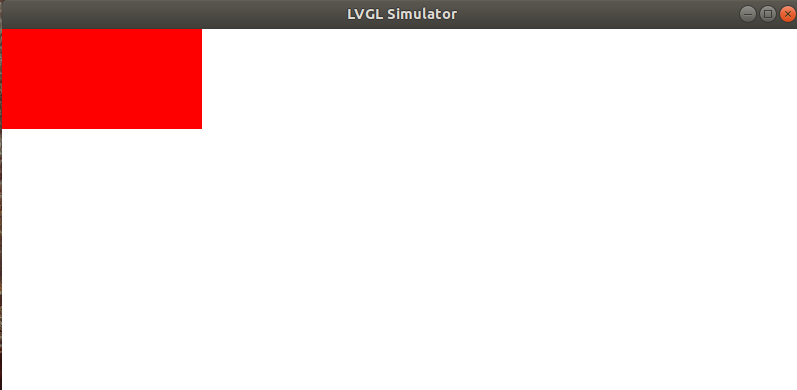

# 十四、动画

控件出现的动画的效果参考lv_port_linux_success\lvgl\examples\anim

eg:

```
在main.c添加头文件
#include "lvgl/examples/lv_examples.h"

在main函数添加里面的函数
lv_example_anim_1();
```

# 十五、定时器

参考：[LVGL——（3）定时器_lvgl 定时器-CSDN博客](https://blog.csdn.net/2301_78772787/article/details/141000119)

# 十六、**Flex**（弹性）布局的⽤法

在 LVGL（Light and Versatile Graphics Library）中，**Flex** 布局用于动态排列和对齐对象，类似于 CSS 的 Flexbox。LVGL 的 Flex 布局适用于 C 语言开发，主要通过 `lv_obj_set_flex_flow()` 和 `lv_obj_set_flex_align()` 等 API 进行配置。

## **1. 启用 Flex 布局**

首先，将父对象（容器）设置为 Flex 布局：

```c
lv_obj_t *container = lv_obj_create(lv_scr_act());
lv_obj_set_layout(container, LV_LAYOUT_FLEX);
```

或者使用更详细的 Flex 设置：

```c
lv_obj_set_flex_flow(container, LV_FLEX_FLOW_ROW); // 默认横向排列
```

------

## **2. Flex 容器属性**

### **（1）排列方向 `lv_obj_set_flex_flow()`**

控制子元素的排列方向和是否换行：

```c
lv_obj_set_flex_flow(container, LV_FLEX_FLOW_ROW);            // 横向排列（不换行）
lv_obj_set_flex_flow(container, LV_FLEX_FLOW_ROW_WRAP);       // 横向排列（自动换行）
lv_obj_set_flex_flow(container, LV_FLEX_FLOW_COLUMN);         // 纵向排列（不换行）
lv_obj_set_flex_flow(container, LV_FLEX_FLOW_COLUMN_WRAP);    // 纵向排列（自动换行）
lv_obj_set_flex_flow(container, LV_FLEX_FLOW_ROW_REVERSE);    // 横向反向排列
lv_obj_set_flex_flow(container, LV_FLEX_FLOW_COLUMN_REVERSE); // 纵向反向排列
```

### **（2）对齐方式 `lv_obj_set_flex_align()`**

设置主轴和交叉轴的对齐方式：

```c
lv_obj_set_flex_align(
    container,
    LV_FLEX_ALIGN_START,   // 主轴对齐方式（START|CENTER|END|SPACE_BETWEEN|SPACE_AROUND）
    LV_FLEX_ALIGN_CENTER,  // 交叉轴对齐方式（START|CENTER|END）
    LV_FLEX_ALIGN_CENTER   // 交叉轴多行对齐方式（仅当换行时生效）
);
```

**示例**：

```c
lv_obj_set_flex_align(container, LV_FLEX_ALIGN_SPACE_BETWEEN, LV_FLEX_ALIGN_CENTER, LV_FLEX_ALIGN_CENTER);
```

在 LVGL 中，`lv_obj_set_flex_align()` 是用于设置 **Flex 布局容器** 中子元素（items）的对齐方式的核心函数。它控制 **主轴（main axis）**、**交叉轴（cross axis）** 以及 **多行换行时的对齐方式**。

------

#### **函数原型**

```
void lv_obj_set_flex_align(
    lv_obj_t *obj,                     // Flex 容器对象
    lv_flex_align_t main_place,        // 主轴对齐方式
    lv_flex_align_t cross_place,       // 交叉轴对齐方式
    lv_flex_align_t track_place        // 多行换行时的交叉轴对齐方式（仅当 `flex_flow` 包含 `_WRAP` 时生效）
);
```

#### **参数详解**

##### **1. `main_place`（主轴对齐方式）**

控制子元素在 **主轴方向（`flex_flow` 决定的方向）** 上的分布方式。
可选值（`lv_flex_align_t` 枚举）：

| 值                            | 说明                         |
| :---------------------------- | :--------------------------- |
| `LV_FLEX_ALIGN_START`         | 向主轴起点对齐（默认）       |
| `LV_FLEX_ALIGN_END`           | 向主轴终点对齐               |
| `LV_FLEX_ALIGN_CENTER`        | 居中对齐                     |
| `LV_FLEX_ALIGN_SPACE_BETWEEN` | 两端对齐，子元素之间等距     |
| `LV_FLEX_ALIGN_SPACE_AROUND`  | 子元素周围等距（包括两端）   |
| `LV_FLEX_ALIGN_SPACE_EVENLY`  | 所有间距（包括两端）完全均等 |

**示例**：

```
lv_obj_set_flex_align(container, LV_FLEX_ALIGN_SPACE_BETWEEN, ...);
```

------

##### **2. `cross_place`（交叉轴对齐方式）**

控制子元素在 **交叉轴方向（与主轴垂直的方向）** 上的对齐方式。
可选值：

| 值                      | 说明                                         |
| :---------------------- | :------------------------------------------- |
| `LV_FLEX_ALIGN_START`   | 向交叉轴起点对齐                             |
| `LV_FLEX_ALIGN_END`     | 向交叉轴终点对齐                             |
| `LV_FLEX_ALIGN_CENTER`  | 居中对齐                                     |
| `LV_FLEX_ALIGN_STRETCH` | 拉伸子元素以填满交叉轴（需子元素未固定尺寸） |

**示例**：

```
lv_obj_set_flex_align(container, ..., LV_FLEX_ALIGN_CENTER, ...);
```

------

##### **3. `track_place`（多行换行时的交叉轴对齐方式）**

仅当 `flex_flow` 设置为 `_WRAP`（如 `LV_FLEX_FLOW_ROW_WRAP`）时生效，控制 **多行子元素** 在交叉轴上的分布方式。
可选值：

| 值                            | 说明                 |
| :---------------------------- | :------------------- |
| `LV_FLEX_ALIGN_START`         | 多行向交叉轴起点对齐 |
| `LV_FLEX_ALIGN_END`           | 多行向交叉轴终点对齐 |
| `LV_FLEX_ALIGN_CENTER`        | 多行居中对齐         |
| `LV_FLEX_ALIGN_SPACE_BETWEEN` | 多行等间距分布       |
| `LV_FLEX_ALIGN_SPACE_AROUND`  | 多行周围等距         |

**示例**：

```
lv_obj_set_flex_flow(container, LV_FLEX_FLOW_ROW_WRAP); // 启用换行
lv_obj_set_flex_align(container, ..., ..., LV_FLEX_ALIGN_SPACE_BETWEEN);
```

##### **完整示例**

```
lv_obj_t *cont = lv_obj_create(lv_scr_act());
lv_obj_set_size(cont, 300, 200);
lv_obj_center(cont);

// 启用 Flex 布局并设置横向换行
lv_obj_set_flex_flow(cont, LV_FLEX_FLOW_ROW_WRAP);

// 设置对齐方式：
// - 主轴：子元素等间距分布
// - 交叉轴：居中对齐
// - 多行：等间距分布
lv_obj_set_flex_align(
    cont,
    LV_FLEX_ALIGN_SPACE_BETWEEN, // 主轴
    LV_FLEX_ALIGN_CENTER,        // 交叉轴
    LV_FLEX_ALIGN_SPACE_BETWEEN  // 多行
);

// 添加 4 个子元素
for (int i = 0; i < 4; i++) {
    lv_obj_t *item = lv_obj_create(cont);
    lv_obj_set_size(item, 70, 50);
    lv_obj_set_style_bg_color(item, lv_palette_main(LV_PALETTE_RED + i), 0);
}
```

## **3. Flex 子项（Item）属性**

### **（1）调整子项顺序 `lv_obj_set_style_order()`**

```
lv_obj_set_style_order(child_obj, 2, 0); // 设置子项显示顺序（数值越小越靠前）
```

### **（2）子项伸缩比例 `lv_obj_set_style_flex_grow()`**

```c
lv_obj_set_style_flex_grow(child_obj, 1, 0); // **让子元素自动拉伸以占据 Flex 容器中的剩余空间
```

**1. `flex_grow` 的作用**

- **功能**：定义子元素在 Flex 容器中的 **伸展能力**，决定如何分配容器中 **未被其他子元素占用的剩余空间**。

- `0`（默认）：不扩展（不伸展，子元素保持初始尺寸）
- `1` 或更大：按比例分配剩余空间。

**2. 示例场景**

假设有一个横向 Flex 容器（宽度 `300px`），包含 3 个子元素：

- `child1`：固定宽度 `80px`（未设置 `flex_grow`）。
- `child2`：固定宽度 `80px`，但设置了 `flex_grow: 1`。
- `child3`：固定宽度 `80px`（未设置 `flex_grow`）。

**计算过程**

1. **固定尺寸占用**：
   `child1` + `child3` = `80px + 80px` = `160px`。
2. **剩余空间**：
   `300px - 160px` = `140px`。
3. **分配剩余空间**：
   由于只有 `child2` 设置了 `flex_grow: 1`，它会独占全部剩余空间 `140px`，最终宽度 = `80px + 140px` = `220px`。

**效果**

```
| child1 (80px) | child2 (220px) | child3 (80px) |
```

------

**3. 多子元素按比例分配**

如果多个子元素设置了 `flex_grow`，剩余空间会按比例分配：

```
lv_obj_set_style_flex_grow(child1, 1, 0); // 比例 1
lv_obj_set_style_flex_grow(child2, 2, 0); // 比例 2
```

- **剩余空间分配**：
  `child1` 占 `1/3`，`child2` 占 `2/3`。

**4. 关键点**

- **仅当容器有剩余空间时生效**：如果子元素总宽度已填满容器，`flex_grow` 不生效。
- **与 `flex_basis` 配合使用**：
  `flex_basis` 设置子元素的初始尺寸，`flex_grow` 在此基础上拉伸。
- **类似 CSS Flexbox**：行为与 CSS 的 `flex-grow` 属性一致。

------

**5. 完整代码示例**

```
lv_obj_t *cont = lv_obj_create(lv_scr_act());
lv_obj_set_size(cont, 300, 100);
lv_obj_set_flex_flow(cont, LV_FLEX_FLOW_ROW);

// 子元素1：固定宽度
lv_obj_t *child1 = lv_obj_create(cont);
lv_obj_set_size(child1, 80, 50);

// 子元素2：初始宽度80px，但会拉伸以填充剩余空间
lv_obj_t *child2 = lv_obj_create(cont);
lv_obj_set_size(child2, 80, 50);
lv_obj_set_style_flex_grow(child2, 1, 0); // 关键代码

// 子元素3：固定宽度
lv_obj_t *child3 = lv_obj_create(cont);
lv_obj_set_size(child3, 80, 50);
```

------

**6. 常见用途**

- **导航栏**：左侧图标固定，中间标题自动填充剩余空间。
- **动态布局**：适配不同屏幕尺寸时，让关键组件自动扩展。

通过 `flex_grow` 可以轻松实现灵活的弹性布局，无需手动计算尺寸！

### **（3）子项基准大小 `lv_obj_set_style_flex_basis()`**

```
lv_obj_set_style_flex_basis(child_obj, 100, 0); // 设置子项初始大小（像素或百分比）
```

### **（4）子项对齐方式 `lv_obj_set_style_align_self()`**

```
lv_obj_set_style_align_self(child_obj, LV_ALIGN_CENTER, 0); // 单独设置子项对齐方式
```

## **4. 完整示例**

```c
lv_obj_t *container = lv_obj_create(lv_scr_act());
lv_obj_set_size(container, 300, 200);
lv_obj_center(container);
lv_obj_set_layout(container, LV_LAYOUT_FLEX);
lv_obj_set_flex_flow(container, LV_FLEX_FLOW_ROW_WRAP);
lv_obj_set_flex_align(container, LV_FLEX_ALIGN_SPACE_BETWEEN, LV_FLEX_ALIGN_CENTER, LV_FLEX_ALIGN_CENTER);

// 创建 3 个子项
lv_obj_t *child1 = lv_obj_create(container);
lv_obj_set_size(child1, 80, 50);
lv_obj_set_style_bg_color(child1, lv_palette_main(LV_PALETTE_RED), 0);

lv_obj_t *child2 = lv_obj_create(container);
lv_obj_set_size(child2, 80, 50);
lv_obj_set_style_bg_color(child2, lv_palette_main(LV_PALETTE_GREEN), 0);
lv_obj_set_style_flex_grow(child2, 1, 0); // 占据剩余空间

lv_obj_t *child3 = lv_obj_create(container);
lv_obj_set_size(child3, 80, 50);
lv_obj_set_style_bg_color(child3, lv_palette_main(LV_PALETTE_BLUE), 0);
```

## **5. 常见布局模式**

| 布局需求         | 代码示例                                                     |
| :--------------- | :----------------------------------------------------------- |
| **横向居中排列** | `lv_obj_set_flex_flow(cont, LV_FLEX_FLOW_ROW);` `lv_obj_set_flex_align(cont, LV_FLEX_ALIGN_CENTER, LV_FLEX_ALIGN_CENTER, LV_FLEX_ALIGN_CENTER);` |
| **纵向等分布局** | `lv_obj_set_flex_flow(cont, LV_FLEX_FLOW_COLUMN);` `lv_obj_set_flex_align(cont, LV_FLEX_ALIGN_SPACE_BETWEEN, LV_FLEX_ALIGN_START, LV_FLEX_ALIGN_START);` |
| **横向换行布局** | `lv_obj_set_flex_flow(cont, LV_FLEX_FLOW_ROW_WRAP);`         |

# 十七、动画控件 (Animation) 

## 1. 动画基础概念

LVGL 的动画系统允许您平滑地改变对象的属性值，如位置、大小、透明度等。动画系统基于以下核心概念：

- **动画变量 (lv_anim_t)**: 存储动画的配置信息
- **动画时间**: 动画持续时间（毫秒）
- **动画路径**: 值变化的路径（线性、缓入缓出等）
- **动画回调**: 动画执行时调用的函数

## 2. 动画基本使用步骤

### 2.1 初始化动画

```
lv_anim_t a;
lv_anim_init(&a);
```

### 2.2 设置动画参数

```
lv_anim_set_var(&a, obj);                  // 设置动画对象
lv_anim_set_values(&a, start_val, end_val);// 设置起始和结束值
lv_anim_set_time(&a, duration);            // 设置持续时间(ms)
lv_anim_set_exec_cb(&a, setter_func);      // 设置属性设置函数
```

### 2.3 启动动画

```
lv_anim_start(&a);
```

### 2.4 停止动画

```
lv_anim_del(obj, anim_exec_cb) 停止特定动画
```

## 3. 动画回调函数类型

LVGL 提供了几种常用的动画回调类型：

1. **位置动画**:

```
lv_anim_set_exec_cb(&a, (lv_anim_exec_xcb_t)lv_obj_set_x);
lv_anim_set_exec_cb(&a, (lv_anim_exec_xcb_t)lv_obj_set_y);
```

2. **大小动画**:

```
lv_anim_set_exec_cb(&a, (lv_anim_exec_xcb_t)lv_obj_set_width);
lv_anim_set_exec_cb(&a, (lv_anim_exec_xcb_t)lv_obj_set_height);
```

3. **透明度动画**:

```
lv_anim_set_exec_cb(&a, (lv_anim_exec_xcb_t)lv_obj_set_style_opa);
```

## 4. 实际应用示例

### 4.1 键盘弹出时移动容器（如示例代码）

```
// 创建动画：主容器上移
lv_anim_t a;
lv_anim_init(&a);
lv_anim_set_var(&a, main_cont);
lv_anim_set_values(&a, 0, -offset);  // 从当前位置上移offset像素
lv_anim_set_time(&a, 300);           // 300毫秒完成
lv_anim_set_exec_cb(&a, (lv_anim_exec_xcb_t)lv_obj_set_y);
lv_anim_start(&a);
```

### 4.2 元素淡入效果

```
lv_anim_t fade_in;
lv_anim_init(&fade_in);
lv_anim_set_var(&fade_in, obj);
lv_anim_set_values(&fade_in, LV_OPA_TRANSP, LV_OPA_COVER);
lv_anim_set_time(&fade_in, 500);
lv_anim_set_exec_cb(&fade_in, (lv_anim_exec_xcb_t)lv_obj_set_style_opa);
lv_anim_start(&fade_in);
```

### 4.3 按钮点击缩放效果

```
lv_anim_t scale;
lv_anim_init(&scale);
lv_anim_set_var(&scale, btn);
lv_anim_set_values(&scale, 100, 120);  // 宽度从100放大到120
lv_anim_set_time(&scale, 200);
lv_anim_set_playback_time(&scale, 200);  // 添加回弹效果
lv_anim_set_exec_cb(&scale, (lv_anim_exec_xcb_t)lv_obj_set_width);
lv_anim_start(&scale);
```

## 5. 高级动画特性

### 5.1 动画路径 (Easing)

```
lv_anim_set_path_cb(&a, lv_anim_path_ease_out);  // 缓出效果
```

常用路径函数：

- `lv_anim_path_linear`: 线性变化（默认）
- `lv_anim_path_ease_in`: 缓入
- `lv_anim_path_ease_out`: 缓出
- `lv_anim_path_ease_in_out`: 缓入缓出
- `lv_anim_path_overshoot`: 过冲效果
- `lv_anim_path_bounce`: 弹跳效果

### 5.2 动画时序控制

```c
lv_anim_set_delay(&a, 500);         // 延迟500ms后开始
lv_anim_set_playback_time(&a, 300); // 添加300ms的回放动画
lv_anim_set_repeat_count(&a, 3);    // 重复3次(LV_ANIM_REPEAT_INFINITE无限循环)
```

### 5.3 动画事件回调

```
lv_anim_set_ready_cb(&a, anim_ready_cb);  // 动画完成时调用
```

# 十八、滚动(Scroll)

## 1. 滚动基础概念

LVGL 的滚动系统允许用户在内容超出容器可视区域时通过触摸或按键滚动查看内容。主要特点包括：

- 支持水平和垂直滚动
- 支持触摸拖动、鼠标滚轮、按键控制
- 可配置滚动条样式和行为
- 提供动画滚动效果

## 2. 启用滚动功能

### 2.1 基本滚动设置

```c
// 创建可滚动容器
lv_obj_t * scroll_cont = lv_obj_create(lv_scr_act());
lv_obj_set_size(scroll_cont, 200, 200);

// 启用垂直滚动
lv_obj_set_scroll_dir(scroll_cont, LV_DIR_VER);

// 设置滚动条模式
lv_obj_set_scrollbar_mode(scroll_cont, LV_SCROLLBAR_MODE_AUTO);
```

### 2.2 滚动方向选项

```
lv_obj_set_scroll_dir(obj, direction);
```

方向参数：

- `LV_DIR_NONE`：禁用滚动
- `LV_DIR_LEFT`：向左滚动
- `LV_DIR_RIGHT`：向右滚动
- `LV_DIR_TOP`：向上滚动
- `LV_DIR_BOTTOM`：向下滚动
- `LV_DIR_HOR`：水平滚动(左右)
- `LV_DIR_VER`：垂直滚动(上下)
- `LV_DIR_ALL`：所有方向滚动

可以使用位或操作组合方向，如 `LV_DIR_LEFT | LV_DIR_TOP`

## 3. 滚动条设置

### 3.1 滚动条模式

```
lv_obj_set_scrollbar_mode(obj, mode);
```

模式选项：

- `LV_SCROLLBAR_MODE_OFF`：始终不显示滚动条
- `LV_SCROLLBAR_MODE_ON`：始终显示滚动条
- `LV_SCROLLBAR_MODE_AUTO`：仅在需要滚动时显示
- `LV_SCROLLBAR_MODE_ACTIVE`：触摸/拖动时显示
- `LV_SCROLLBAR_MODE_UNHIDE`：临时显示后淡出

### 3.2 滚动条样式

```
// 设置滚动条宽度
lv_obj_set_style_scrollbar_width(obj, 10, 0);

// 设置滚动条颜色
lv_obj_set_style_scrollbar_color(obj, lv_color_hex(0x888888), 0);
lv_obj_set_style_scrollbar_bg_color(obj, lv_color_hex(0xeeeeee), 0);
```

## 4. 滚动控制方法

### 4.1 手动滚动到指定位置

```
// 滚动到指定坐标(无动画)
lv_obj_scroll_to(obj, x, y, LV_ANIM_OFF);

// 滚动到指定坐标(带动画)
lv_obj_scroll_to(obj, x, y, LV_ANIM_ON);

// 滚动到视图底部(参考代码)
lv_obj_scroll_to_y(msg_cont, lv_obj_get_scroll_bottom(msg_cont), LV_ANIM_ON);
```

### 4.2 相对当前位置滚动

```
// 相对当前滚动位置滚动
lv_obj_scroll_by(obj, x_diff, y_diff, LV_ANIM_ON);
```

### 4.3 获取滚动信息

```
// 获取当前滚动位置
lv_coord_t scroll_x = lv_obj_get_scroll_x(obj);
lv_coord_t scroll_y = lv_obj_get_scroll_y(obj);

// 获取最大可滚动范围
lv_coord_t scroll_top = lv_obj_get_scroll_top(obj);
lv_coord_t scroll_bottom = lv_obj_get_scroll_bottom(obj);
lv_coord_t scroll_left = lv_obj_get_scroll_left(obj);
lv_coord_t scroll_right = lv_obj_get_scroll_right(obj);

// 检查是否正在滚动
bool is_scrolling = lv_obj_is_scrolling(obj);
```

## 5. 滚动事件处理

### 5.1 滚动事件类型

```
lv_obj_add_event_cb(obj, scroll_event_cb, LV_EVENT_SCROLL, NULL);
```

相关事件：

- `LV_EVENT_SCROLL_BEGIN`：滚动开始时触发
- `LV_EVENT_SCROLL_END`：滚动结束时触发
- `LV_EVENT_SCROLL`：滚动过程中持续触发

### 5.2 示例事件回调

```
static void scroll_event_cb(lv_event_t * e) {
    lv_event_code_t code = lv_event_get_code(e);
    lv_obj_t * obj = lv_event_get_target(e);
    
    if(code == LV_EVENT_SCROLL_BEGIN) {
        printf("Scroll started\n");
    }
    else if(code == LV_EVENT_SCROLL_END) {
        printf("Scroll ended\n");
    }
    else if(code == LV_EVENT_SCROLL) {
        printf("Scrolling: x=%d, y=%d\n", 
               lv_obj_get_scroll_x(obj),
               lv_obj_get_scroll_y(obj));
    }
}
```

## 6. 高级滚动功能

### 6.1 分页滚动(Snap)

```
// 启用分页滚动
lv_obj_set_scroll_snap_x(obj, LV_SCROLL_SNAP_CENTER);  // 水平居中吸附
lv_obj_set_scroll_snap_y(obj, LV_SCROLL_SNAP_END);     // 垂直底部吸附
```

吸附选项：

- `LV_SCROLL_SNAP_NONE`：无吸附
- `LV_SCROLL_SNAP_START`：吸附到开始位置
- `LV_SCROLL_SNAP_END`：吸附到结束位置
- `LV_SCROLL_SNAP_CENTER`：吸附到中心

### 6.2 弹性滚动效果

```
// 启用弹性滚动(超过边界时有回弹效果)
lv_obj_set_scroll_elastic(obj, LV_SCROLL_ELASTIC_ON);
```

### 6.3 滚动传播

```
// 设置当滚动到边界时是否传播到父对象
lv_obj_set_scroll_propagation(obj, true);
```

# 2048

```
//计算棋盘中0的个数
int get_arr_zero_count()
{

}

//产生一个随机数
void rand_num()
{
	//计算棋盘中0的个数
	//随机生成1-count之间的随机数k k表示生成2或4是第几个0的位置
	//找k的位置 放置2或4
}

//初始化2048游戏棋盘数字的值
void init_2048_game()
{
	//设置随机种子
	//把游戏棋盘数字的值变成0
	//生成两个随机数
}

/*
	去二维数组中一行的0 把其他数字放左边，0放右边
	
*/
void rm_zero()
{
	
}

/*
	把二维数组中一行的数组，相邻且相同进行合并
*/
void hebing()
{
	
}
```

