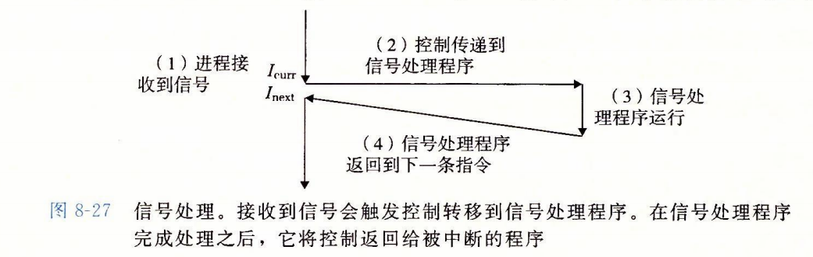
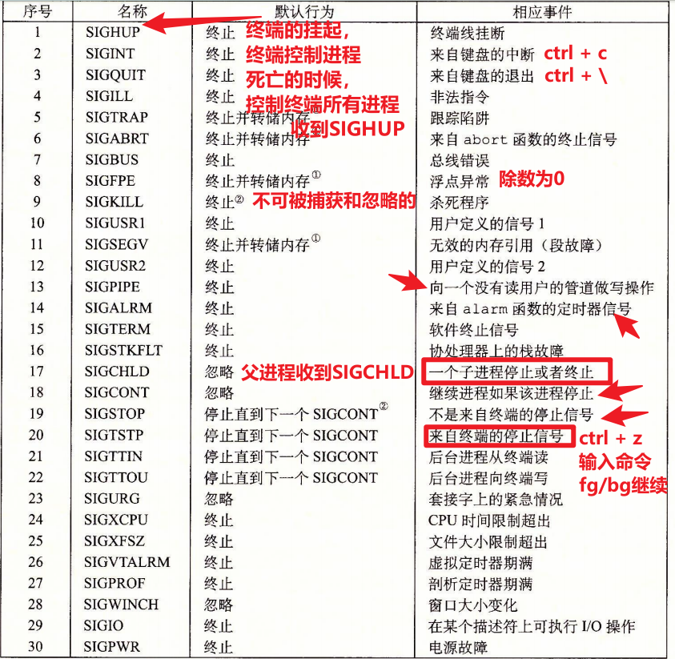

# 1)信号的概念

-   信号是进程与进程通信的方式之一，这种方式不能传输数据的

    只是在内核中传递一个信号(整数)

-   不同的信号值，所代码的含义是不同的

-   信号本质就是软件中断，同时信号异步(不知道信号什么时候来)

    信号会中断正在执行的程序，转而去执行中断函数，处理完中断后，再继续执行原来的程序代码

    

查看信号的值

```
kill -l
trap -l
```

当一个进程收到一个信号，可能发送5种默认的行为  man 7 signal

```
Term   Default action is to terminate the process.
		默认行为终止进程

Ign    Default action is to ignore the signal.
		忽略信号	

Core   Default action is to terminate the process and  dump  core  (see
core(5)).
		输出信号，然后终止进程

Stop   Default action is to stop the process.
		停止进程

Cont   Default  action  is  to  continue the process if it is currently
stopped.
		如果进程当前停止，则继续该进程

注意：如果用户没有显示的处理信号，系统的默认方式大多数都是终止进程
```



注意：

```
SIGKILL SIGSTOP 不能被捕捉 不能被阻塞 不能被忽略
```

进程在收到一个信号后，通常有3种处理方式

1.捕捉信号

```
把一个信号 与用户自定义的信号处理函数 关联起来
那么在收到信号的时候，就会自动调用自定义的信号处理函数
```

```
#include <signal.h>

typedef void (*sighandler_t)(int);//函数指针，要传函数的名字，规定函数参数的类型为int,返回值为void

sighandler_t signal(int signum, sighandler_t handler);
功能：设置接受到某种信号后的处理方式
@signum:要捕捉到的那个信号的值
@handler：指定信号的处理方式
		1)自定义的处理函数名
		2)默认行为
			SIG_DEF
		3)忽略
			SIG_IGN
返回值：
	返回该信号上一次的处理方式(第一次返回NULL)
```

eg:

```
void handler(int signum)//参数就是信号的值
{
	
}

int main()
{
	signal(SIGINT,handler);
	while(1);
}
```

练习：收到ctrl c和ctrl \ 信号，改变默认行为，变成打印收到了%d信号(%d为信号的值)

2.默认行为

```
收到一个信号时，采用操作系统的默认行为
大部分信号的默认行为，会把进程终止
只有一个信号SIGCHLD，收到时会忽略行为
```

3.忽略该信号

```
相当于没有收到
```

