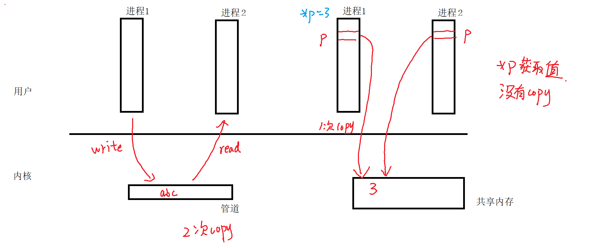

SYSTEM V是一些unix系统特性的标准，也就是早期就常出现的一些通信标准

提供了成套的IPC通信接口，包含

>   消息队列 message queue
>
>   共享内存share memory
>
>   信号量semaphore

system V设计理念：在所有进程都能访问的内核空间中，开辟并维护一个相关的结构体空间，用来服务应用程序之间的数据的传递

只不过对于它的访问不需要借助文件IO->系统调用，还是需要时间!!!

主张是让上层应用程序 直接 访问 具备内核空间权限的东西，要怎么实现>

=>应用程序是没有权限访问内核空间的

=>许可证key

# 1.IPC_key

进程间通信许可证是由内核向应用程序颁布的，用于证明应用程序之间拥有借助内核空间进行数据传输资格的一种许可证

```c
#include <sys/types.h>
#include <sys/ipc.h>

key_t ftok(const char *pathname, int proj_id);
@pathname:一个文件系统的路径名(必须要是存在的而且有读的权限，在linux文件夹下)
	"/home/china"
@proj_id:整数，这个参数存在的意义是让一个路径也能生成多个key
	ftok只取proj_id的低八位
	eg:
		1
返回值：
	成功，返回一个唯一的system V ipc的key
	失败，-1
eg:
	key_t key = ftok("/home/china",1);
	if(key == -1)
	{
		
	}
```

# 2.共享内存



**a.ftok生成许可证**

**b.shmget创建或打开system V共享内存**

```c
#include <sys/ipc.h>
#include <sys/shm.h>

int shmget(key_t key, size_t size, int shmflg);
@key：由ftok获取
@size：以字节为单位指定共享内存的大小(如果是打开，可以给0)，一般给1024的整数倍
@shmflg：标志位，指定创建或打开共享内存的方式
	如果是创建共享内存:IPC_CREAT |  权限位(0666)
		eg:
			IPC_CREAT | 0777
		IPC_EXCL:测试标志，通常和IPC_CREAT一起用
			IPC_CREAT | IPC_EXCL 如果key对应的共享内存不存在，则创建
								  如果key对应的共享内存存在，则失败
返回值：
	成功，返回共享内存的id,这个id就唯一表示这个共享内存
	失败,-1
eg:
	int shm_id = shmget(key,4096,IPC_CREAT | IPC_EXCL | 0777);
	if(shm_id == -1)
	{
		//如果是因为共享内存存在而失败，则直接打开
		if(errno == EEXIST)
		{
			shm_id = shmget(key,0,0);
		}
		else 
		{
			perror("shmget failed");
			return -1;
		}
	}
```

**c.shmat映射到通信进程的各自的进程地址空间中去**

```c
#include <sys/types.h>
#include <sys/shm.h>

void *shmat(int shmid, const void *shmaddr, int shmflg);
@shmid:要映射的共享内存的id(shmget)
@shmaddr:指向要银蛇到进程的哪个地址上去
	一般填NULL，有系统分配
@shmflg：
	SHM_RDONLY 只读
	0 可读可写
返回值：
	成功 返回映射后的地址
	失败 (void *) -1 
eg:
	int *p = shmat(shm_id,NULL,0);
	if((void*)p == (void*)-1)
	{
		
	}
```

**d.通信**

```c
int *p = shmat(shm_id,NULL,0);
*p = 3;//(一个程序写入)
printf("%d\n",*p);//(另外一个程序读取)

char *p = shmat(shm_id,NULL,0);
strcpy(p,"nihao");//(一个程序写入)
printf("%s\n",p);//(另外一个程序读取)
```

**e.shmdt解映射**

```
#include <sys/types.h>
#include <sys/shm.h>

int shmdt(const void *shmaddr);
@shmaddr:需要接触映射的地址

eg:
	shmdt(p);	
```

**f.shmctl删除共享内存**

```c
#include <sys/ipc.h>
#include <sys/shm.h>

int shmctl(int shmid, int cmd, struct shmid_ds *buf);
@shmid：要删除的共享内存的id(shmget)
@cmd:控制命令，不同的命令对应的第三个参数的值会不一行
	IPC_RMID
@buf 保存 第二个参数相关的数据 struct shmid_ds *
	如果cmd == IPC_RMID buf填NULL
返回值
	成功 0
	失败 -1
eg:
	//删除共享内存
	shmctl(shm_id,IPC_RMID,NULL)
```

练习：使用共享内存，在01-shm_write.c中写入你好，在02-shm_read.c中读取

```
01-shm_write.c
	//ftok获取许可证
	//shmget打开或创建共享内存
	//shmat映射 建立你的指针和共享内存的关系
	//写数据
	//shmdt断开映射关系
02-shm_read.c
	//ftok获取许可证
	//shmget打开或创建共享内存
	//shmat映射 建立你的指针和共享内存的关系
	//读取数据
	//shmdt断开映射关系
	//shmctl删除共享内存
```

write

```c
#include <sys/types.h>
#include <sys/ipc.h>
#include <sys/shm.h>
#include <errno.h>
#include <stdio.h>
#include <string.h>
int main()
{
	//ftok获取许可证
	key_t key = ftok("/home/china",1);
	if(key == -1)
	{
		perror("ftok failed");
        return -1;
	}
	//shmget打开或创建共享内存
	int shm_id = shmget(key,4096,IPC_CREAT | IPC_EXCL | 0777);
	if(shm_id == -1)
	{
		//如果是因为共享内存存在而失败，则直接打开
		if(errno == EEXIST)
		{
			shm_id = shmget(key,0,0);
		}
		else 
		{
			perror("shmget failed");
			return -1;
		}
	}
	//shmat映射 建立你的指针和共享内存的关系
    char *p = shmat(shm_id,NULL,0);
	if((void*)p == (void*)-1)//失败
	{
		perror("shmat failed");
        return -1;
	}    
	//写数据
    strcpy(p,"nihao");
	//shmdt断开映射关系   
    shmdt(p);	
}
```

read

```c
#include <sys/types.h>
#include <sys/ipc.h>
#include <sys/shm.h>
#include <errno.h>
#include <stdio.h>
#include <string.h>
int main()
{
	//ftok获取许可证
	key_t key = ftok("/home/china",1);
	if(key == -1)
	{
		perror("ftok failed");
        return -1;
	}
	//shmget打开或创建共享内存
	int shm_id = shmget(key,4096,IPC_CREAT | IPC_EXCL | 0777);
	if(shm_id == -1)
	{
		//如果是因为共享内存存在而失败，则直接打开
		if(errno == EEXIST)
		{
			shm_id = shmget(key,0,0);
		}
		else 
		{
			perror("shmget failed");
			return -1;
		}
	}
	//shmat映射 建立你的指针和共享内存的关系
    char *p = shmat(shm_id,NULL,0);
	if((void*)p == (void*)-1)//失败
	{
		perror("shmat failed");
        return -1;
	}    
	//读取数据
    printf("%s\n",p);
	//shmdt断开映射关系   
    shmdt(p);	
    //删除共享内存
    shmctl(shm_id,IPC_RMID,NULL);
}
```

练习：在内核中创建一个共享内存，把这块共享内存的前4个字节当成是一个int对待，利用父子进程实现并发，具体如下

```
int *p = shmat(...);
*p = 0;
fork();
父
	while()
	{
		//执行10万次
		(*p)++;
		/*
			存在刚好两个进程同时读取数据的情况
			汇编指令 i++分成三条指令
			1.取i的值放到寄存器
			2.将寄存器的值+1
			3.将寄存器的值存回到i
			=>不是原子操作
			原子操作(不可以被打断)
		*/
	}
	//wait子进程结束
	printf("%d\n",*p);
子
	while()
	{
		//执行10万次
		(*p)++;		
	}
```

# 3.信号量

在并发执行多个进程的时候，由于系统资源存在公共资源，并且由些公共资源对访问的数量有限制，因为当多个进程同时访问一个 有限制的共享资源的时候，避免不了竞争

信号量本质：数字，在访问受限制的共享资源之前，必须先访问并获得信号量，如果无法获取信号量，只能进入等待或放弃对共享资源的访问

信号量->厕所门的锁

一个进程或一个线程可以在某个信号量上执行三个操作

-   创建信号量，要求创建者立马指定信号量的初值

-   等待一个信号量(lock) p上锁

    ```c
    该操作需要测试这个信号量是否被别人获取了
    	如果信号量已经被别人获取，则进入等待
    	如果信号量没有被别人获取，则获取信号量 =>
    		你就可以访问这个资源
    		访问资源的代码
    
    p 
    操作资源(*p)++   ->临界区
    V
    ```

-   释放一个信号量(unlock) v解锁

    ```
    当你获取信号量之后，并访问完共享资源后，需要立即释放信号量
    =>因为别人可能在等待信号量
    ```

p操作作为可访问资源减操作，v操作作为可访问资源增加操作

## 3.1 信号量相关的API函数

**a.ftok：获取system V ipc对象的key**

**b.semget:用来创建或打开一个system V信号量集**

```c
#include <sys/types.h>
#include <sys/ipc.h>
#include <sys/sem.h>

int semget(key_t key, int nsems, int semflg);
@key:ftok获取
@nsems：你要创建的信号量集合中信号量的个数
@semflg：标志位
	创建：IPC_CREAT|权限位(0777)
		IPC_EXCL
		有两种情况
		1.成功
			信号量集合不存在，创建一个信号量集合
		2.失败
			失败的原因errno == EEXIST
			已经创建过了
			之后打开信号量集合
	打开 0
返回值：
	成功 返回一个信号量集合的id
	失败 -1
eg:
	int sem_id = semget(key,5,IPC_CREAT | IPC_EXCL | 0777);
	if(sem_id == -1)
	{
		//如果是因为信号量集合存在而失败，则直接打开
		if(errno == EEXIST)
		{
			sem_id = semget(key,5,0);//如果是打开会自动忽略第二个参数
		}
		else 
		{
			perror("semget failed");
			return -1;
		}
	}
```

**c.semctl：控制操作(设置或获取信号量集中某个或某些信号量的值)**

```c
#include <sys/types.h>
#include <sys/ipc.h>
#include <sys/sem.h>

int semctl(int semid, int semnum, int cmd, ...);
@semid:要操作的信号量集合的id(semget)
@semnum:要操作的信号量集中的哪个信号量的下标[0,nsems-1]
@cmd:命令
	IPC_STAT 	获取属性
	IPC_SET		设置属性
	IPC_RMID	删除信号量集
	GETALL		获取信号量集中所有信号量的值
	SETALL		设置信号量集中所有信号量的值
	GETVAL 		获取下标semnum的信号量的值
	SETVAL 		设置下标semnum的信号量的值
	....
@...:根据不同的命令，第四个参数也会不一样
    union semun {
        int              val;    /* Value for SETVAL */
        struct semid_ds *buf;    /* Buffer for IPC_STAT, IPC_SET */
        unsigned short  *array;  /* Array for GETALL, SETALL */
        struct seminfo  *__buf;  /* Buffer for IPC_INFO
        (Linux-specific) */
    };
	cmd == IPC_RMID 不需要第四个参数
    	semctl(sem_id,0,IPC_RMID);
    cmd == SETVAL
    	int val = 1;
    	semctl(sem_id,0,SETVAL,val);
    	//设置sem_id所表示的信号量集合中下标为0的信号量的值为val
    cmd == GETVAL
    	int val = semctl(sem_id,0,GETVAL);
    	//val就表示semid所表示的信号量集合中下标为0的哪个信号量的值
    cmd == SETALL
    	unsigned short array[5] = {1,0, 0 ,0 ,0};
    	int val = semctl(sem_id,0,SETALL,array);
    cmd == GETALL
    	unsigned short array[5];//准备空间，用来保存信号量集的值
    	int val = semctl(sem_id,0,GETALL,array);
返回值：
    根据命令的不同，返回的结果的含义也不一样
    0  成功
    -1 失败
```

练习：创建一个system v信号量集合(5个信号量)，给所有的信号量设置初值，并且获取第三个信号量的值，并打印

**d.semop:PV操作**

```c
#include <sys/types.h>
#include <sys/ipc.h>
#include <sys/sem.h>

int semop(int semid, struct sembuf *sops, size_t nsops);
@semid:semget的返回值
@sops：指定信号量操作信息的结构体数组
	struct sembuf
	{
        unsigned short sem_num;  /* semaphore number */
        	//要进行操作的信号量在信号量集合中的下标
        short          sem_op;   /* semaphore operation */
        	/*
        		>0  v操作	unlock
        		==0 看是否阻塞 自己试一下
        		<0	p操作 lock
        	*/
        short          sem_flg;  /* operation flags */
        	/*
        		0	表示默认，如果p操作失败,就会阻塞
        		IPC_NOWAIT	非阻塞等待，不等待
        		SEM_UNDO	撤销，为了防止进程带锁退出
        					用于父子进程(没有血缘关系别用)
        	*/
    };
@nsops：指定第二个参数sops数组中元素的个数
返回值：成功0 失败-1

int semtimedop(int semid, struct sembuf *sops, size_t nsops,
const struct timespec *timeout);
限时等待：如果指定的时间内还没有p操作成功，直接返回
@timeout：指定限时的时间
    	struct timespec
        {
            time_t tv_sec;//秒
            long tv_nsec;//纳秒
        }
eg:显示等待5.2s
    struct sembuf buf;
	buf.sem_num = index;//要操作的信号量的下标
	buf.sem_op = -1;//资源数量-1
	buf.sem_flg = 0;//阻塞等待，直到拿到信号量为止
	
	struct timespec tv;
	tv.tv_sec = 5;
	tv.tv_nsec = 200000000;//1s = 1000ms = 1000 000us = 1000 000 000ns
    semtimedop(semid,&buf,1,&tv);
```

eg:

```c
/*
	p
	sem_id:semget获取的	
	index:要操作的信号量集中的哪个信号量的下标
*/
void sem_p(int sem_id,int index)
{
	struct sembuf buf;
	buf.sem_num = index;//要操作的信号量的下标
	buf.sem_op = -1;//资源数-1
	buf.sem_flg = 0;//阻塞等待，直到拿到信号量
	semop(sem_id, &buf, 1);
}

/*
	v
	sem_id:semget获取的	
	index:要操作的信号量集中的哪个信号量的下标
*/
void sem_v(int sem_id,int index)
{
	struct sembuf buf;
	buf.sem_num = index;//要操作的信号量的下标
	buf.sem_op = +1;//资源数+1
	buf.sem_flg = 0;//阻塞等待，直到拿到信号量
	semop(sem_id, &buf, 1);
}

使用
    //p 上锁
    sem_p(sem_id,0);
    //临界区->操作共享资源(*p)++
    //v 解锁
    sem_v(sem_id,0);
```

练习：把共享内存的最后一个练习，加锁，让最后的结果为20W

查看IPC

```
ipcs		#查看所有IPC对象
ipcs -a 	#查看所有IPC对象
ipcs -m		#查看共享内存对象
ipcs -s		#查看信号量对象
```

删除IPC对象

```
ipcrm -M key	#根据指定键值key,删除指定的共享内存
ipcrm -m id		#根据id,删除指定的共享内存

ipcrm -S key	#根据指定键值key,删除指定的信号量
ipcrm -s id		#根据id,删除指定的信号量
```

思考题：

1.在遇到共享内存在不同的进程或线程中访问的时候，考虑避免竞争，用什么方式访问

```c
1.使用顺序执行(不会并发)
2.信号量
	(1)明确共享资源是谁
	(2)确定临界区
	(3)一个要保护的对象，就需要用信号量
```

2.现在有5个共享资源ABCDE，需要被保护，决定用一个信号量来保护5个共享资源，这样设计有什么问题

```
p(m)
ABCDE资源
V(m)
```

3.现在有5个共享资源ABCDE，需要被保护，决定用五个信号量来保护5个共享资源，这样设计有什么问题

```
m1->A
m2->B
...

p(m1)
A资源
v(m1)
p(m2)
B资源
v(m2)
....
```

```c
假设需要同时使用A和B
	进程1		进程2
    p(m1)	p(m2)
    A资源	   B资源
    v(m1)	v(m2)
    p(m2)	p(m1)
    B资源	   A资源
    v(m2)	v(m1)
    
	进程1		进程2
    p(m1)	p(m2)
    p(m2)	p(m1)
    A资源	   B资源
    B资源	   A资源
    v(m2)	v(m1)
    v(m1)	v(m2)
=>死锁：所谓死锁是指多个进程因竞争资源而相互等待，若无外力作用，这些进程都无法向前推进。
	产生死锁的原因：
		1.因为系统资源的不足
		2.程序运行推进的顺序不合理
		3.资源分配不当
	产生死锁的四个必要条件：
        1.互斥条件 ：  一个资源只能被一个进程所占用，此时若其它进程请求该资源，则请求进程必须等待（比如一个男人只可以和一个女人结婚，不可能同时跟七八个女的一起结）
    	2.不剥得条件 ：  进程使用的资源在未完成使用之前，不能被其它进程强行得走。（在一个人未离婚之前不能再跟其他人结婚）
    	3.请求和保持条件 ：  一个进程因为请求资源而阻塞时，对已获资源保持不放（妥妥海王，还没追到另一个女生之前，还是不把已经撩到的七八个女生放手，硬要接着养鱼）
    	4.循环等待条件 ：   若干进程形成了一种头尾相接环状等待资源的关系（三角恋，我等你，你等他，他又等我）
	避免死锁：上面四个必要条件，只要有一条不满足，就不会导致死锁(银行家算法:课后去了解)
```

4.若系统有一个资源，资源数为7，有多个进程均需要使用2个资源，规定每个进程一次仅允许使用1个资源，则最多允许多个进程参与竞争，而不会发生死锁(哲学家就餐)

作业：利用共享内存实现父子进程通信

```
char *s = "123456789";
子进程 循环把s中的字符一个一个的写入到共享内存(每次只能写入一个字符)
父进程 不断的去接收每一个字符 并打印

什么时候循环结束
	当输入ctrl c结束(SIGINT)
	需要使用信号量

使用信号量保护共享资源(保存子进程先写，父进程后读)
	unsigned short arr[5] = {0,1,0,0,0};//注意最开始不能读arr[0] = 0,只能写arr[1] = 1

信号量集semid
	|----------------|		一开始子进程是能使用写资源，所以它看到的写信号量的值为1
	|        |       |			 父进程不能使用读资源，所以它看到的读信号量的值为0
	|----------------|		=> 信号量的初始化，读信号量为0 写信号量为1
下标	   0    	1				arr[0]=0;//读信号量		arr[1]=1;//写信号量
	 读信号量   写信号量   

父进程执行
	看到的读信号量的值为1,则需要将读的信号量的资源减1	arr[0]:1->0
	临界区//打印操作
	做完后子进程才能继续做写的操作
	那么是不是写的资源+1，那么写之前的资源的资源是不是0 arr[1]:0->1
子进程执行
	看到的写信号量的值为1,则需要将写的信号量的资源减1	arr[1]:1->0
	临界区//写入字符到共享内存
	做完后父进程才能继续做读的操作
	那么是不是读的资源+1，那么读之前的资源的是不是1 arr[0]:0->1
        
```

