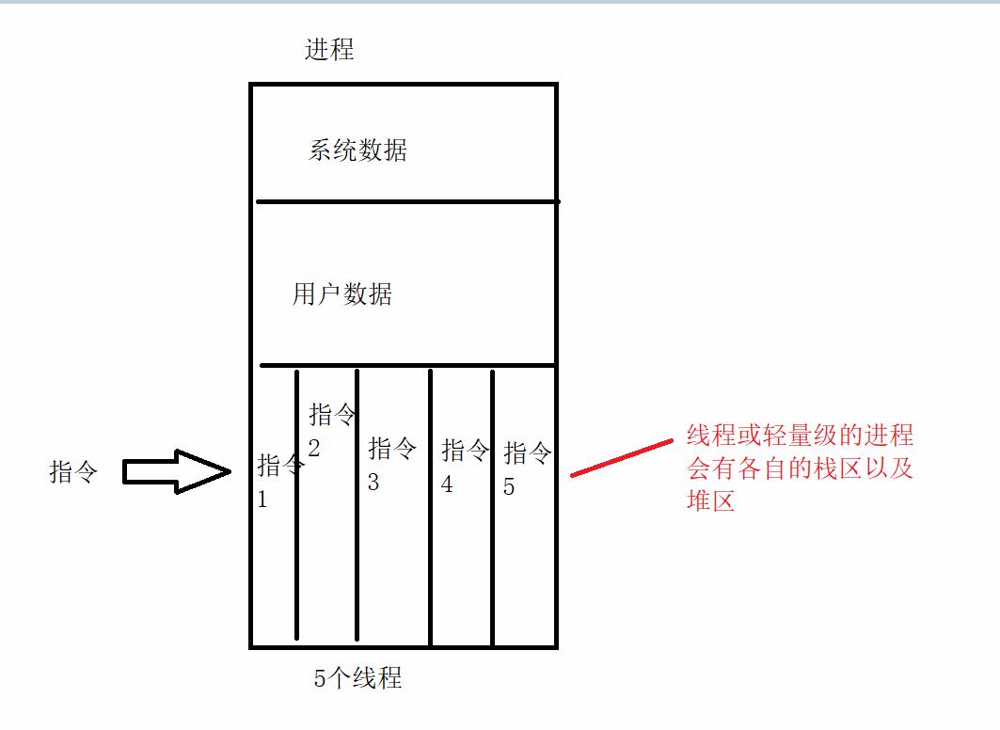
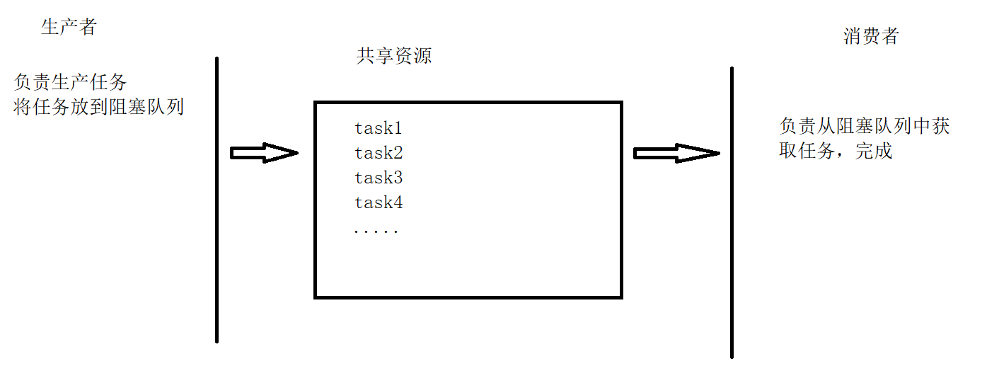
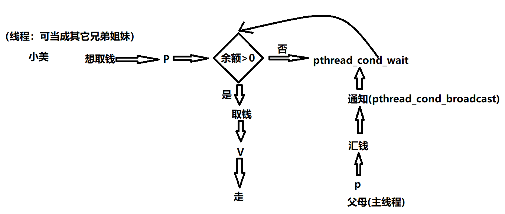

在linux，所有的调度的实体叫做任务。它们的区别：有些任务各自拥有一套资源(进程)，而有些任务共享一套资源(线程)

分析：

```
进程的地址空间是相互独立的
	进行通信，必须用到第三方，比较麻烦，通信的代码比较大
	ipc(管道，共享内存，信号，信号量)
	创建一个进程的系统开销比较大，子进程拷贝父进程所有的数据
```

线程是比进程更小的活动单位，它是进程的执行分支

进程内部可以有多个线程，它们并发执行，但是进程内部所有的线程共享整个进程的地址空间

main函数进程就是主线程，也就是说我们会有一个线程负责执行main函数，其他的线程就可以去执行其他的函数

==当主线程也就是main函数执行完毕后，不管其他的线程有没有结束，进程退出==



特点：

```
1.创建一个线程 比 创建一个进程开销要小很多
2.实现线程间的通信比较简单
3.线程是动态的概念
	线程状态图
	就绪 运行态 阻塞态(等待 睡眠)
4.资源分配的最小单位是进程，调度的最小单位是线程
```

# 2.linux下线程的API接口

## 2.1创建线程

```c
#include <pthread.h>

int pthread_create(pthread_t *thread, const pthread_attr_t *attr,
void *(*start_routine) (void *), void *arg);
功能：创建一个线程
@thread：指针，指向的变量用来保存新创建线程的信息，就是用来保存线程id的
@attr：线程属性，一般填NULL，默认属性
@start_routine：函数指针，指针对于的线程函数，开创线程的目的就是为了指向线程函数
@arg:线程函数的实际参数，函数不需要传参，填NULL
返回值：
	成功0
	失败-1
Compile and link with -pthread.
eg:
#include <unistd.h>
void *abc(void*arg)
{
	while(1)
	{
		printf("hello\n");
		sleep(1);
	}
}
int main()
{
	//创建一个线程
	pthread_t thread;
	pthread_create(&thread,NULL,abc,NULL);
	while(1);
}
```

练习：

```
一个任务 死循环打印hello sleep(1) 让线程执行这个任务
一个任务 死循环打印world sleep(1) 让main线程执行这个任务
```

```c
#include <unistd.h>
#include <stdio.h>
#include <pthread.h>
void *abc(void*arg)
{
	while(1)
	{
		printf("hello\n");
		sleep(1);
	}
}
int main()
{
	//创建一个线程
	pthread_t thread;
	pthread_create(&thread,NULL,abc,NULL);
	while(1)
	{
		printf("world\n");
		sleep(1);
	}
	
}
```

## 2.2线程的退出

1.线程调用return

2.在程序执行的任意时刻，调用pthread_exit

```c
#include <pthread.h>

void pthread_exit(void *retval);

Compile and link with -pthread.
eg:
	pthread_exit((void*)-1);
eg:
	int *a = malloc(sizeof(int));
	*a = -1;
	pthread_exit((void*)a);
```

3.被别的线程取消，别的线程调用pthread_cancel

```c
#include <pthread.h>
//取消线程
int pthread_cancel(pthread_t thread);

Compile and link with -pthread.
===========================================
//设置线程  能否被取消
#include <pthread.h>

int pthread_setcancelstate(int state, int *oldstate);
@state:指定要设置的属性
	PTHREAD_CANCEL_ENABLE	能被取消(默认属性)
	PTHREAD_CANCEL_DISABLE	不能被取消
@oldstate：指向的空间保存上一次 取消属性的状态，不想保存(NULL)
int pthread_setcanceltype(int type, int *oldtype);
@type:取消类型
	PTHREAD_CANCEL_DEFERRED  立即取消(默认)
	PTHREAD_CANCEL_ASYNCHRONOUS   延时取消
@oldstate：指向的空间保存上一次 取消属性的类型，不想保存(NULL)
```

练习：把之前的线程创建的代码修改一下，修改abc函数，在函数内部添加pthread_exit退出的函数，在main函数中，设置打印5次world之后，取消abc这个线程，自己测试能否被取消，若被取消，接着再在abc函数中设置自己的属性为不能被取消，再测试代码

## 2.3等待一个线程的释放

```c

#include <pthread.h>

int pthread_join(pthread_t thread, void **retval);
@thread:需要等待的那个线程id
@retval：可以用来获取线程函数的返回值，不需要获取添NULL
Compile and link with -pthread.
	线程：
		int *a = malloc(sizeof(int));//0x3000
		*a = 1;
		pthread_exit((void*)a);//只能放在线程中(函数)使用
	main
		int *exit_code;
		pthread_join(thread, (void **)&exit_code);
		printf("exit code = %d\n",*exit_code);
		
	//pthread_join函数的内部
	pthread_join(pthread_t thread, void **retval)//retval = &exit_code
	{
		*retval = a;//*retval = *&exit_code = exit_code = a  => exit_code = 0x3000
	}
pthread_join作用：
	1.等待线程的退出
	2.回收被等待的线程的资源
    
线程退出不代表所有的资源被释放，这取决于线程的属性(detach state分离属性)
    分离属性：
    	在线程退出后，资源会自动释放
    	其他的去调用pthread_join的函数，只会有等待线程退出的作用
    非分离属性(默认属性)
     	在线程退出后，资源不会退出后就完全释放
    	其他的去调用pthread_join的函数，还会有回收资源  	
```

```c
#include <pthread.h>

int pthread_detach(pthread_t thread);
thread:指定要设置分离属性的那个线程
Compile and link with -pthread.

pthread_self:获取自己的线程id
eg:
	设置自己为分离属性，那么在退出线程后，自动释放资源
	pthread_detach(pthread_self());
```

练习：写一个线程，让线程num++,当num==10000进行退出，在main函数接收线程的退出码，并打印

```c
#include <stdio.h>
#include <stdlib.h>
#include <pthread.h>
void *abc(void *arg)
{
    int num = 0;
    while(1)
    {
        num++;
        if(num == 10000)
        {
            //退出线程
            // int *a = malloc(sizeof(int));
            // *a = 10000;
            // pthread_exit((void*)a);
            pthread_exit((void*)-1);
        }
    }
}

int main()
{
    pthread_t id;//保存线程的id
    pthread_create(&id,NULL,abc,NULL);

    //等待线程退出
    int *exit_code;
    pthread_join(id,(void **)&exit_code);
    //printf("exit_code = %d\n",*exit_code);
    printf("exit_code = %d\n",exit_code);
}
```

练习：让两个线程同时使用打印机的资源，线程1打印“hello”,线程2打印“world”,注意一定要一个字符一个字符打印，main只负责创建线程，以及等待线程结束

```
//打印机资源
void printer(char *str)
{
	//打印str中的每一个字符
	//想要一个字符一个字符显示的效果，可以一秒钟打印一个字符
	/*
		eg：
			putchar('a');
			fflush(stdout);//冲刷流
			sleep(1);
	*/
}

//自己写两个线程hanshu 
void *thread1(void *arg)
{
	printer("hello");
}
```


# 3.线程同步/互斥

多任务：

-   都需要访问或使用同一种资源(互斥)
-   多个任务之间依赖关系，某个任务运行依赖于另外一个任务(同步)

**1.信号量**

```
sytem V信号量
posix 信号量
	有名
	无名
```

**2.线程互斥锁**

```
pthread_mutex_t描述一个线程互斥锁
安装posix开发人员手册
	sudo apt-get install manpages-posix-dev
```

初始化线程互斥锁

```c
#include <pthread.h>

int pthread_mutex_init(pthread_mutex_t *restrict mutex,const pthread_mutexattr_t *restrict attr);
@mutex：待初始化的那个线程互斥锁指针
@attr:属性，默认属性NULL
返回值：
    	成功 0
    	失败 -1
eg:
	1.pthread_mutex_t mutex;
		pthread_mutex_init(&mutex,NULL);
	2.pthread_mutex_t *mutex = (pthread_mutex_t*)malloc(sizeof(pthread_mutex_t));
		pthread_mutex_init(mutex,NULL);
	3.pthread_mutex_t mutex = PTHREAD_MUTEX_INITIALIZER;//定义的时候直接赋值
		静态初始化，不需要pthread_mutex_init这个函数了，最后不用销毁
		注意：
			pthread_mutex_t mutex;
			mutex = PTHREAD_MUTEX_INITIALIZER;//会报错
```

p操作(上锁)

```
#include <pthread.h>

int pthread_mutex_lock(pthread_mutex_t *mutex);//阻塞
如果锁不可用，则会一直阻塞到锁可用为止
返回值：
	0 获得了该互斥锁->可以访问共享资源
	返回其他的值表示出错了，没有获得该互斥锁->不可以访问共享资源

int pthread_mutex_trylock(pthread_mutex_t *mutex);//不阻塞
能获取则获取，不能获取则立马返回结果
返回值：
	0 获得了该互斥锁->可以访问共享资源
	返回其他的值表示出错了，没有获得该互斥锁->不可以访问共享资源
```

v操作(解锁)

```
#include <pthread.h>
int pthread_mutex_unlock(pthread_mutex_t *mutex);
```

销毁互斥锁

```
#include <pthread.h>
int pthread_mutex_destroy(pthread_mutex_t *mutex);
```

练习：把打印机的代码，改成能获取到正确的结果

```c
#include <stdio.h>
#include <pthread.h>
#include <unistd.h>
pthread_mutex_t mutex = PTHREAD_MUTEX_INITIALIZER;
//打印机资源
void printer(char *str)
{
	//打印str中的每一个字符
	//想要一个字符一个字符显示的效果，可以一秒钟打印一个字符
    int i = 0;
    while(str[i])
    {
        putchar(str[i]);
        fflush(stdout);//冲刷流
        sleep(1);   
        i++;     
    }
    printf("\n");
	/*
		eg：
			putchar('a');
			fflush(stdout);//冲刷流
			sleep(1);
	*/
}

#if 1
//自己写两个线程hanshu 
void *thread1(void *arg)//void *arg=&mutex2  => arg=&mutex2
{
    while(1)
    {
        pthread_mutex_lock((pthread_mutex_t *)arg);
        printer("hello");
        pthread_mutex_unlock((pthread_mutex_t *)arg);
    }
}
void *thread2(void *arg)
{
    while(1)
    {
        pthread_mutex_lock((pthread_mutex_t *)arg);
        printer("world");
        pthread_mutex_unlock((pthread_mutex_t *)arg);
    }
}

int main()
{
    //线程互斥锁初始化
    pthread_mutex_t mutex2;
    pthread_mutex_init(&mutex2,NULL);

    //创建线程
    pthread_t id1,id2;
    pthread_create(&id1,NULL,thread1,(void*)&mutex2);
    pthread_create(&id2,NULL,thread2,(void*)&mutex2);

    //等待线程
    pthread_join(id1,NULL);
    pthread_join(id2,NULL);

    //销毁互斥锁
    pthread_mutex_destroy(&mutex2);
}
#else

void *thread(void *arg)
{
    pthread_mutex_lock(&mutex);
	printer((char*)arg);
    pthread_mutex_unlock(&mutex);
}

int main()
{

    //创建线程
    pthread_t id1,id2;
    pthread_create(&id1,NULL,thread,(char*)"hello");
    pthread_create(&id2,NULL,thread,(void*)"world");

    //等待线程
    pthread_join(id1,NULL);
    pthread_join(id2,NULL);

    
}

#endif
```

# 4.条件变量(同步)

线程互斥锁只能用户互斥：即使多个线程同时循环获取互斥锁，其中的一个线程由于自身事件片足够允许多次循环，就意味着这个线程可以反复获取互斥锁并访问共享资源->不能实现同步

因此，若要求线程并发是同步执行的，就还需要用到条件(condition)变量

线程同步是指==线程A要在线程B执行到满足特定条件之后才执行==

在posix，线程的条件变量的类型pthread_cond_t

## 1.生产者和消费者模型



涉及到的问题

>   -   共享资源互斥访问的问题
>   -   当共享资源队列满的时候，生产不能往队列中放任务
>   -   当共享资源队列空的时候，消费者不能从队列中获取任务
>
>   怎么解决？
>
>   解决办法：
>
>   -   轮询：不断的询问，看共享资源队列有没有满或有没有空
>
>       轮询缺点：浪费cpu资源，有时间差，响应不及时
>
>   -   条件变量：
>
>       当共享资源队列为空，消费者让出cpu,陷入休眠，当共享资源队列不为空的时候，将消费者唤醒
>
>       当共享资源队列为满，生产者让出cpu,陷入休眠，当共享资源队列不为满的时候，将生产者唤醒
>
>       当共享资源队列不为空/共享资源队列不为满,通知休眠的人(唤醒)->条件变量
>
>   

## 2.条件变量

用条件变量表示一个特定的条件或事件

在条件变量上有三种操作

-   初始化/销毁一个条件变量

    ```c
    #include <pthread.h>
    
    int pthread_cond_destroy(pthread_cond_t *cond);
    int pthread_cond_init(pthread_cond_t *restrict cond,
    const pthread_condattr_t *restrict attr);
    @cond:指定要初始化的条件变量
    @attr：默认属性添NULL
    返回值：
    	成功0
    	失败其他
    
    eg:
    	1.pthread_cond_t cond;
    		pthread_cond_init(&cond,NULL);
    	2.pthread_cond_t *cond = (pthread_cond_t*)malloc(sizeof(pthread_cond_t));
    		pthread_cond_init(cond,NULL);
    	3.pthread_cond_t cond = PTHREAD_COND_INITIALIZER;
    ```

-   等待一个条件变量

    ```
    条件变量本身也是一个共享资源，为了避免竞争，需要线程互斥锁保护
    在调用pthread_cond_wait之前必须上锁
    在内部实现的时候，此时没有条件成立，进入等待状态(让线程休眠，让出cpu)，接受到另外一个线程的唤醒(条件成立),当前的线程立马上锁，再去执行后面的代码
    pthread_cond_wait内部做的事情
    1.释放互斥锁，等待(让出cpu)
    2.被唤醒，立马上锁
    ```

    ```c
    #include <pthread.h>
    int pthread_cond_wait(pthread_cond_t *restrict cond,
    pthread_mutex_t *restrict mutex);
    
    int pthread_cond_timedwait(pthread_cond_t *restrict cond,
    pthread_mutex_t *restrict mutex,
    const struct timespec *restrict abstime);
    @cond：等待的那个条件变量的指针
    @mutex:执行互斥锁的那个指针
    @abstime：绝对时间
    	获取当前的绝对时间(1970.1.1)+愿意等待的时间
    返回值：
    	成功 0
    	失败 其他值
    
    eg：
    	pthread_cond_wait(cond,mutex);
    ```

-   唤醒条件变量

    ```
    #include <pthread.h>
    
    //广播，唤醒所有愿意等待的那个线程
    int pthread_cond_broadcast(pthread_cond_t *cond);
    //只唤醒1个
    int pthread_cond_signal(pthread_cond_t *cond);
    @cond：需要唤醒的条件变量
    返回值：
    	成功 0
    	失败 其他值
    ```

eg:

```c
int data = 0;//玩具的数量
消费者
	while(1)
    {
    	//上锁
    	if(data<100000000)
    		pthread_cond_wait(....);//如果条件不成立先解锁，让出cpu,等待别人的唤醒，立马上锁
    	data = 0;
    	//通知生产者生产玩具
    	pthread_cond_signal(....);
    	//解锁
    }
生产者
	while(1)
	{
		//上锁
		if(data >=100000000)
			pthread_cond_wait(....);//如果条件不成立先解锁，让出cpu,等待别人的唤醒，立马上锁
		data++;
		if(data >= 100000000)//发送唤醒信号
			pthread_cond_signal(....);
			
		//解锁
	}
```

练习：

1.

```
定义一个全局变量 int data=0;
在main里面data++，当data>=100000000时
在子线程 打印提示“完成小目标”，让data=0
```

2.利用条件变量，让小美成功取到钱

```
小美是一个学生，每个月都会从父母哪里得到一笔生活费(1000元)。但是钱花完了，想取钱，但是卡里的余额为0，所以它只能等爸妈汇了钱打电话通知他
但是即使它爸妈汇了钱打电话通知它也不能保证能取到钱，因为她的兄弟姐妹很可能抢先把钱取完了，因此小美收到爸妈的电话后，需要再次确认是否有钱，才能取钱
```



作业：利用线程的方式实现一个目录的完整(这个目录有目录和普通文件)拷贝

思路

```c
struct cp_file
{
    char src[1024];//要拷贝的文件的路径名
    char dest[1024];//目标文件名
};

void *cp(void *arg)
{
    struct cp_file  = *(struct cp_file*)arg;
    
    //用只读的方式打开源文件
    //用只写的方式打开目的文件
    
    //循环读取源文件的数据写入到目的文件
    while(1)
    {
        int ret = read(fd_src,....);
        if(ret == 0)
            break;
        write(fd_dest,....);
    }
    
    //关闭两个文件
}

/*
	把src_dir拷贝到dest_dir目录下
	src_dir:源目录路径
	dest_dir：目的目录路径
*/
void cp_dir(char *src_dir ,char *dest_dir)
{
    /*打开源目录(从哪个目录拷贝)*/
    
    /*分别获取源目录和目的目录的绝对路径(后面接你需要拼接带路径的文件名)*/
    //保存当前目录的工作路径
    //保存要拷贝的源目录的工作路径
    //保存要拷贝的目的目录的工作路径
  	
  	/*让源目录成为目的目录的子目录名，获取这个子目录的名字*/
  	
  	/*获取这个子目录的名字与目的目录进行拼接，并创建这个目录*/
  	
  	/*更新目的目录*/
  	
    /*读取源目录的目录项*/
    struct dirent *p;
	while(p = readdir())
    {
        //先跳过两个隐藏目录. ..
        
        //拼接源路径
        
        //获取文件属性
        
        //如果是目录
        cp_dir(....);
        
        //如果是普通文件
        if(S_ISREG(st.st_mode))
        {
        	//拼接目标路径
        	
        	//保存源路径与目标路径
            struct cp_file cp_filename;
            strcpy(cp_filename.src,"/xxxxx/xx.c");
            strcpy(cp_filename.dest,"./xx.c");
            //创建一个线程，让线程执行一个cp函数->拷贝文件的内容
            pthread_t id;
            pthread_create(&id,NULL,cp,(void *)cp_filename);
            
            //等待线程结束
            pthread_join(id,NULL);
        }
        
    }
}

int main(int argc,char **argv)
{
	if(argc != 3)
	{
		printf("Usage:%s <src_dir> <dest_dir>\n",argv[0]);
		return -1;
	}
	cp_dir(argv[1],argv[2]);
}

//去掉路径文件中的路径，保留文件名
char *basename(char *path)
@path:文件路径
返回值：返回去掉路径后的文件名或路径名
eg:
	char *name = basename("../code");
	printf("%s\n",name);//code

//创建目录mkdir
#include <sys/stat.h>
#include <sys/types.h>
int mkdir(char *pathname,mode_t mode);
@pathname：你要创建的文件夹名(带路径)
@mode：权限
	1.宏
	2.八进制 0777
返回值
	成功 0
	失败 -1
```

