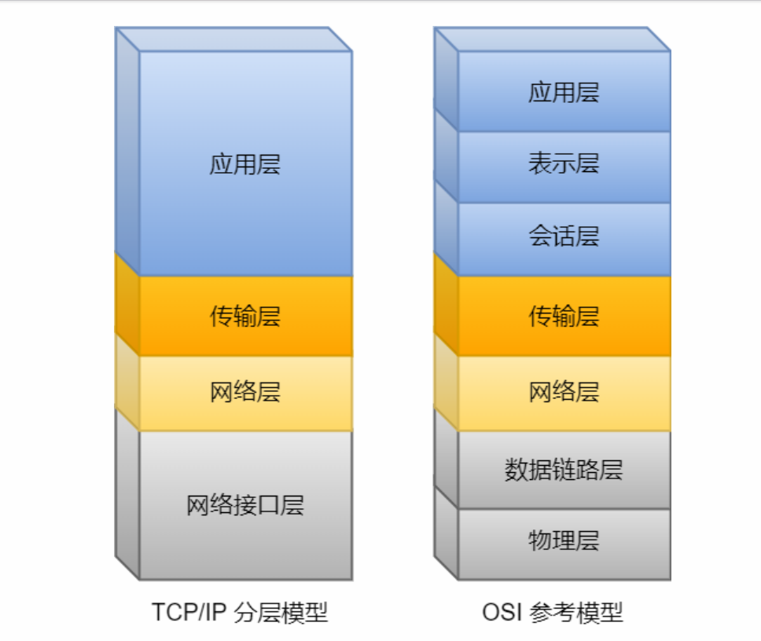

# 1.网络通信

通信双方，需要满足两个必须的条件，才能通信

1.  介质/物理媒介(物理层面)

    eg:空气，网线，光纤，电磁波

2.  协议(软件层面)

    物理媒介只保证网络数据正常的接收，但是只是接收还不行，还必须理解其中的含义

    通信双方需要实现约定好通信的协议

    -   协议

        从应用的角度，协议可以理解为规则，是数据传输和解释的规则

        假设 A B双方传输文件，可以约定以下规则

        ```
        第一次，传输文件名
        第二次，发送文件大小
        第三次，传输文件内容
        ```

    -   典型协议

        -   传输层

            ```c
            TCP：传输控制协议，是一种面向连接的，可靠的，基于字节流的传输层通信协议
            UDP：用户数据报，无连接的，不可靠的
            ```

        -   应用层

            ```
            微信，qq,feiq,ftp(文件传输协议),http(超文本传输协议),DNS域名解析协议.....
            ```

        -   网络层

            ```
            ip:因特网互联协议
            ICMP:因特网控制报文协议(TCP/IP)协议簇的子协议，用于ip主机和路由器之间传递控制消息
            IGMP:因特网组管理协议，是一个组播协议，运行在主机和组播路由器之间
            ```

        -   网络接口层

            ```
            arp 正向地址解析解析 ip->mac
            arap 反向地址解析解析  mac->ip
            ```

# 2.网络协议层次模型

层次：把不同的功能封装成不同的模块

-   为什么要分层？

    大多数的网络采用分层的体系结果，每一层都建立与它的下层之上，向上一层提供一定的服务，而且把怎么实现这个服务的过程的细节对上一层屏蔽




# 3.OSI(open system interconnection)参考模型

开放式系统互联模型

1.  应用层：为程序提供服务

    让你的系统知道你的数据包 是==从哪个应用==发送出去的

2.  表示层： ==数据格式的转化以及数据的加密和解密==

    确保一个系统的应用程序发送的数据 能够 被另外一个系统的应用程序识别

3.  会话层

    ==建立、管理或断开==与应用程序之间的通信，组织和协调两个会话之间的管理和通信

    ```c
    快递公司的调度员，管理者需要管理快递信息(快递何时发送过去，需要多少时间)
    也需要做同步的工作，就好比我把东西运过去了，但是那边没有接收
    ```

4.  传输层(单位：数据报文)

    负责提供 端到端 的传输(同一台设备一般会有多个网络应用程序，用端口号去区号)

    这一层目的确保数据可靠的，有序的传输

    ```
    tcp:提供高可靠的通信：数据无误，数据无丢失，数据无时序，数据无重复到达！！！
    	面向连接：再传输之前先建立连接，确保通信双方都"在线"
    	高可靠通信：建立连接(三次握手) 断开连接(四次挥手) 重发机制 ...
    	
    	对传输质量要求较高，以及传输大量通信数据的时候
    	qq等即使通信软件的用户登录账户相关的功能
    	
    udp
    	不面向连接，不可靠
    	直播，实时应用....
    	包(占的字节会更小)，通信效率更高
    ```

5.  网络层(单位：组)

    ```
    WAN广域网
    LAN局域网
    
    一般通信的主机不是直接连接的，但是在物理方面能够连通，而是通过多个个中间节点(路由器)连接
    ```

    负责将数据传输到目标地址，这一层主要 负责寻址和路由选择(路由器)

    

    P106

5.  数据链路层(单位：帧)

    负责数据包的封帧即mac寻址

    公网到达局域网之后需要转化为mac地址

    交换机解析判断数据要发送给mac地址对应的哪台电脑

    ```
    arp ip转化mac地址
    arap mac转化ip地址
    ```

    

7.  物理层(单位：bit)

    负责数据在物理网络中的实际传输

    通过光信号和电信号传输

    网卡(每个网卡在出厂的时候，就会设定好一个世界上唯一的mac地址，48bits的数据)，光纤，网线

# 4.常见的网络设备

交换机(swicth),网桥:可以提供大量的网络接口将多个网络连接成局域网

```
工作在数据链路层
通过mac地址来识别网络中的设备，并且根据mac地址转发数据

提高网络效率，减少冲突域，提供网络性能

冲突域：
在同一个网络中，所有的设备共享同一个传输介质，如果有两台或更多的设备同时发送数据，它们的信号就会相互碰撞，产生冲突，导致数据有损坏，所有的设备都需要重新发送
你可以把他想象成一条单车道的小桥
如果只有一辆车通过，很通畅
如果两台车同时从两头开，就会在中间碰撞(冲突)
```

集线器

```
工作在物理层，只是电信号的放大
对接受的信号进行整体放大，扩大网络传输的距离
不识别mac地址和ip地址，会产生冲突域

集线器广播数据，效率低，交换机定向转发数据，效率高
```

路由器

```
工作在网络层，实现路由先择和数据包的转发和交换
```

网关

```
连接两个或两个以上的网络，就是一个网络链接另外一个网络的关口
充当了网络间不同协议之间的转换和翻译的功能
```

调制解调器

```c
信号的转换：将数字信号转化模拟信号(调制)，将模拟信号转化为数字信号(解调)
光猫
```

# 5.网络数据的传输过程


# 6.互联网ip

ip：网际协议地址

常见的ip地址：

-   IPv4->32bits   2^32个
-   ipv6->128bits  2^128个

公网ip和私有ip有什么区别？

>   公网ip一般由运营商分配的，只有公网ip才能上网

ipv4地址有32bits,分成两个部分：网段号，主机号

>   网段号：用来表示某一个网段，在ip地址是连续的高位
>
>   主机号：用来标识特定网段的特定的主机，再ip地址中是连续的低位
>
>   ipv4
>
>   ```
>   采用的方式 点分十进制->ip字符串
>   
>   eg:
>   	ipv4点分二进制	11000000	10101000	00000001	00000001
>   	ipv4点分十进制	192			168			1			1
>   		"192.168.1.1"
>   网段号 + 主机号 = 32位
>   ```
>
>   

在设置ip的时候，一般需要设置子网掩码netmask

>   ip地址的网段号和主机号是根据子网掩码划分
>
>   子网掩码和ip地址位数是一致，子网掩码中为1的bit数表示网络号的位数，子网掩码中为0的bit数表示主机号的位数，
>
>   ```c
>   eg:
>   	ipv4 :	172.50.0.1         10101100 00110010 00000000 00000001
>   	netmask: 255.255.254.0  => 11111111 11111111 11111110 00000000
>   	
>   	网段号(高23位) 主机号(低9位)
>   	理论上 可以分配多少台主机的ip  2^9
>   	
>   	广播地址：10101100 00110010 00000001 11111111
>   			 172	  50       1        255  
>   	网段号：  10101100 00110010 00000000 00000000
>   			 172	  50       0        0
>   	默认网关: 10101100 00110010 00000001 00000001
>   			 172	  50       1        1
>   ```
>
>   广播地址：ip地址中主机号每个bit都为1的
>
>   网段号：ip地址，主机号全为 0 指定某个网络
>
>   默认网关：一般是路由器的默认网关，ip地址主机号为1

同一网络中子网掩码是相同的，网段号也是一样

>   练习：
>
>   1.子网掩码为255.255.254.0，请问192.168.0.4和192.168.0.3是不是在同一网段？
>
>   ```
>   11111111 11111111 11111110 00000000
>   看ip的前23位是否一样
>   是在同一个网段
>   ```
>
>   2.子网掩码为255.255.254.0，请问192.168.0.4和192.168.1.5是不是在同一网段？
>
>   ```
>   11111111 11111111 11111110 00000000
>   看ip的前23位是否一样
>   是在同一个网段
>   ```
>
>   3.已知当前网络中的某一台主机ip:192.168.31.156,子网掩码为255.255.255.0，求该网络的默认网关和广播地址，以及实际能分配ip给多少台主机
>
>   ```c
>   11111111 11111111 11111111 00000000
>   默认网关：
>   	192.168.31.1
>   广播地址：
>   	192.168.31.255
>   实际上
>   	2^8-3 = 253
>   	默认网关
>   	广播地址
>   	网段号
>   ```
>
>   192.168.31.156/24  表示网络号占24位
>
>   并不是所有的掩码都是合法的
>
>   ```
>   netmask:255.255.114.0<-不合法	
>   netmask:255.255.192.0<-合法的
>   合法的子网掩码，必须左边是连续的1 右边必须是连续0
>   ```
>
>   

ip地址的分类(公有ip地址)

>   ```
>   A	政府机构
>   B 	公司单位
>   C	个人
>   D	用于组播(多播) -> 直播
>   E	各种实验(以待后续使用)
>   ```
>
>   
>
>   ```
>   ip地址分类		ip地址范围						私有地址范围
>   A			0.0.0.0~127.255.255.255			10.0.0.0~10.255.255.255
>   B			128.0.0.0~191.255.255.255		172.16.0.0~172.31.255.255
>   C			192.0.0.0~223.255.255.255		192.168.0.0~192.168.255.255
>   D			224.0.0.0~239.255.255.255
>   E			240.0.0.0~247.255.255.255
>   ```
>
>   

有mac地址和ip地址还是不能通信，还需要端口号(标识是哪一个应用程序)

# 7.端口号

tcp和udp采用的端口用16bits存储

网络传输的角度：tcp应用 udp应用

一台主机上的网络应用程序的地址：mac+ip+传输层协议(tcp/udp)+端口号

总所周知的端口1~1023

```
21：ftp文件传输
22：ssh远程连接
69：tftp
53：DNS
80：http
....
```

测试代码分配端口1024之后的(1024~65535) 

# 8.网络字节序

网络上传输数据字节流，对于一个多字节的数据，在进行网络传输的时候，是先传输高字节还是低字节？

>   大端模式:低地址放高字节
>
>   小端模式：低地址放低字节

如果一台小端设备A通过网络传输data给大端设备B，会有什么问题？

会产生误会，A发送的是0x1234，B接收接收到0x3412

网络字节序(大端模式)

主机字节序(你的电脑是什么模式就是模式)

```
发送方：主机字节序->网络字节序
接受方：网络字节序->主机字节序
```

ip地址转换

```c
#include <sys/socket.h>
#include <netinet/in.h>
#include <arpa/inet.h>

a:点分十进制字符串
n:网络地址

int inet_aton(const char *cp, struct in_addr *inp);
cp:你要转化的点分十进制字符串 -> "192.168.31.32"
inp:指向一个ip的结构体，用来保存转换后的ip地址的

in_addr_t inet_addr(const char *cp);
cp:你要转化的点分十进制字符串 -> "192.168.31.32"
返回值：返回一个ip的网络地址

in_addr_t inet_network(const char *cp);
cp:你要转化的点分十进制字符串 -> "192.168.31.32"
返回值：返回一个ip的网络地址

char *inet_ntoa(struct in_addr in);
```

端口号转换

```c
#include <arpa/inet.h>

h:host 主机
n:network:网络
s:short 16位
l:long 32位

uint32_t htonl(uint32_t hostlong);
uint16_t htons(uint16_t hostshort);
uint32_t ntohl(uint32_t netlong);
uint16_t ntohs(uint16_t netshort);
```

```
(1)网络协议层次模型
	OSI七层模型
		应用
		表示层
		会话层
		传输(tcp/udp)端到端的传输 数据报文或数据
		网络层(ip协议)寻址和路由寻址   组  ->路由器
		数据链路层(ip->mac mac->ip)  帧  ->交换机
		物理层(传输bit流) bit ->集线器
	TCP/IP四层模型
		应用
		传输
		网络层
		网络接口层(数据链路层/物理层)
(2)ip地址mac
	ipv4:32位
		网段号+主机号
		广播地址
		网段地址
		默认网关
	子网掩码
(3)网络数据传输过程
	封包和拆包
(4)端口号
	用来识别一台主机上的多个网络应用程序
	16位的数据
	
	网络应用程序地址
		mac+ip+传输层协议(tcp/udp)+端口号
(5)网络字节序
	大端模式
	主机字节序 -> 网络字节序 发送
	网络字节序 -> 主机字节序 接收
```

