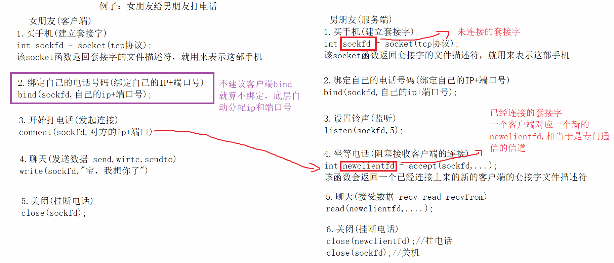
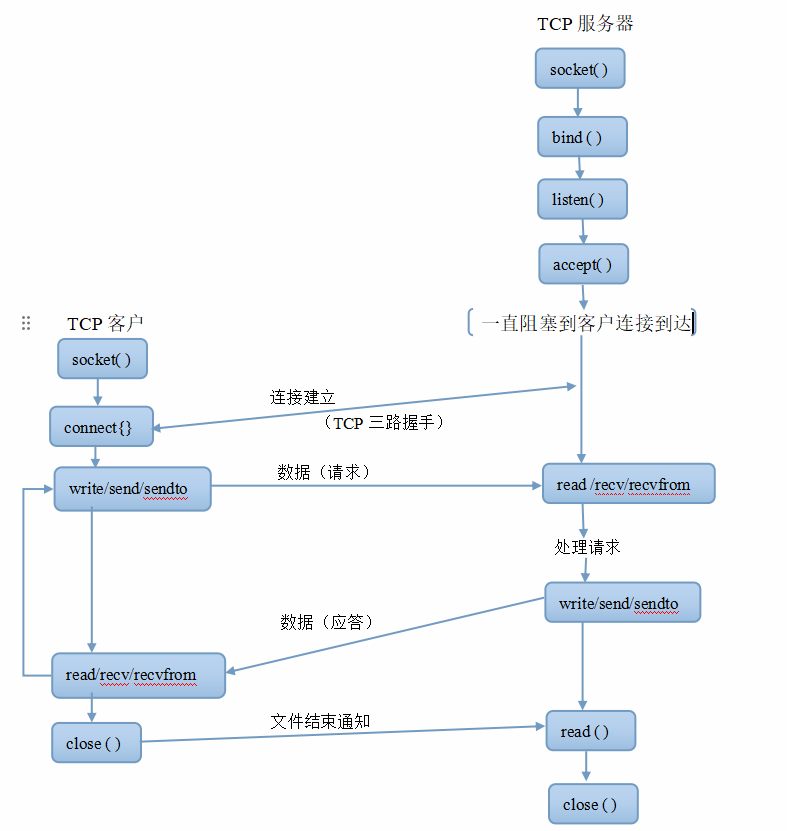
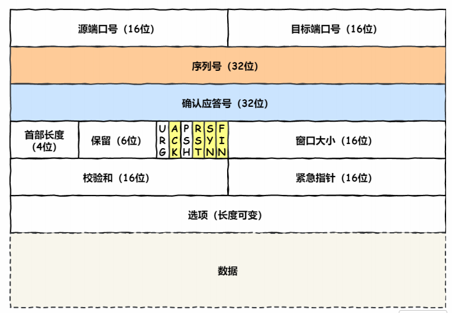
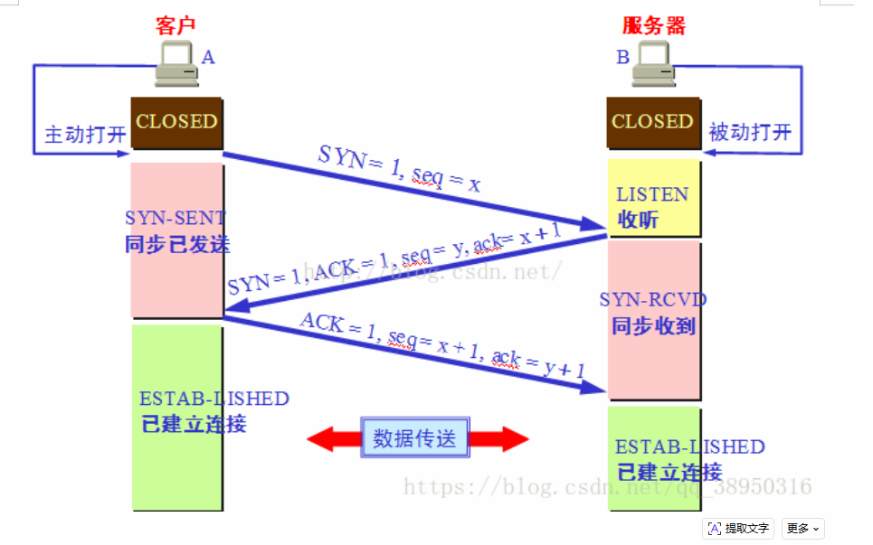
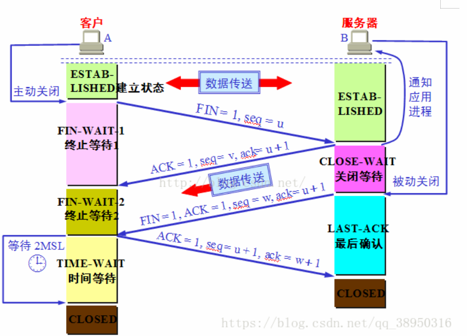
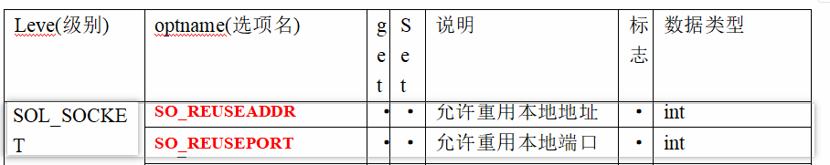

socket是一个编程接口，作用就是实现网络上不同主机的应用程序进程双向通信

套接字当成是一种特殊的文件描述符，也就意味者我们使用套接字实现网络通信使用read/write

socket的类型

1.  流式套接字(SOCK_STREAM)

    ```
    流式套接字用于提供面向连接，可靠的数据传输服务
    主要针对传输层协议为TCP协议的应用
    ```

2.  数据报套接字(SOCK_DGRAM)

    ```
    数据报套接字用于提供一种无连接的服务(不能保证数据传输的可靠性)
    主要针对传输层协议为UDP协议的应用
    ```

客户端和服务器模型

>   任何网络应用都有通信双方
>
>   -   客户端或用户端(client),是为服务端提供本地服务的程序或硬件设备
>   -   服务端(server)就是指在网络中为客户端提供某些服务的计算机系统
>
>   服务器与客户端一对多的关系

# 1.tcp套接字编程流程





# 2.具体的API接口函数

1.socket:创建一个套接字

```c
#include <sys/types.h>          /* See NOTES */
#include <sys/socket.h>

int socket(int domain, int type, int protocol);
@domain：指定域或协议簇
	socket接口不仅仅局限于TCP/IP,它还有蓝牙协议，本地通信协议...
	AF_INET  ->IPV4
	AF_INET6 ->IPV6
	AF_UNIX/AF_LOCAL  ->unix域协议 本地进程通信
@type:套接字类型
	SOCK_STREAM -> TCP
	SOCK_DGRAM	-> UDP
@protocol:指定应用层协议，一般指定为0(不知名的私有协议)
返回值：
	成功 返回一个套接字的文件描述符
	失败 -1
eg：
    int sockfd = socket(AF_INET, SOCK_STREAM, 0);
```

2.bind：绑定一个主机的网络地址(服务器)

```c
#include <sys/types.h>          /* See NOTES */
#include <sys/socket.h>

int bind(int sockfd, const struct sockaddr *addr,
socklen_t addrlen);
@sockfd：要绑定地址的套接字描述符
@addr:通用的网络地址结构体的指针
@addrlen:第二个参数执行的地址结构体长度
返回值：
	成功 0
	失败 -1
eg:
	#include <arpa/inet.h>
    #include <sys/socket.h>
    #include <netinet/in.h>
    #include <arpa/inet.h>

	struct sockaddr_in sa;
	sa.sin_family = AF_INET;//ipv4
	sa.sin_port = htons(8888);//指定端口号，把端口号主机字节序转成网络字节序
	inet_aton("172.50.1.11", &sa.sin_addr);//指定ip 将点分十进制的ip地址转成二进制网络ip
	/*
		监听发送给172.50.1.11的数据包
		还可以写127.0.0.1 -> 同一台主机通信
		还可写0.0.0.0  -> 服务器绑定ip更推荐用这个
		表示监听服务器主机上所有的ipv4的地址，也就是说
		无论是从哪个ip地址发送和过来，只要是目的端口和监听的端口相匹配的
		服务器都可以处理数据包
	*/
	if(bind(sockfd, (struct sockaddr *)&sa,sizeof(sa)) == -1)
	{
		perror("bind failed");
		return -1;
	}
```

网络地址结构体

>   socket接口不仅用于ipv4,IPv6...蓝牙，本地协议....不同的协议的地址的类型是不一样的
>
>   通用的网络地址结构体
>
>   ```c
>   struct sockaddr {
>       sa_family_t sa_family;
>       	//指定协议簇 eg:ipv4
>       char        sa_data[14];
>       	//包含套接字中的目的地址和端口地址
>   }
>   这个结构体的缺陷就是把ip地址和端口混在一起保存到sa_data里面
>   ```
>
>   ipv4专用结构体:man 7 ip
>
>   ```c
>   #include <sys/socket.h>
>   #include <netinet/in.h>
>   #include <netinet/ip.h> /* superset of previous */
>   
>   struct sockaddr_in {
>       sa_family_t    sin_family; /* address family: AF_INET */
>       	//指定协议簇 eg:ipv4
>       in_port_t      sin_port;   /* port in network byte order */
>       	//指定端口号 eg:8888 9999   需要把主机字节序转化为网络字节序
>       struct in_addr sin_addr;   /* internet address */
>       	//指定ip地址 eg:172.50.1.11  还需要将点分十进制ip地址 转换 二进制网络字节序的ip
>   };
>   
>   /* Internet address. */
>   struct in_addr {
>       uint32_t       s_addr;     /* address in network byte order */
>   };
>   ```
>
>   

3.listen:让套接字进入监听模式

```c
#include <sys/types.h>          /* See NOTES */
#include <sys/socket.h>

int listen(int sockfd, int backlog);
@sockfd:要监听的套接字
@backlog：同时能够处理连接请求
	eg:5,10....
返回值：
	成功 0
	失败 -1

eg:
    //监听
    if(listen(sockfd,5) == -1)
    {
        perror("listen failed");
        return -1;
    }
```

4.accept：用于server接收一个来自客户端的连接请求

```c
#include <sys/types.h>          /* See NOTES */
#include <sys/socket.h>

int accept(int sockfd, struct sockaddr *addr, socklen_t *addrlen);
@sockfd:要监听的套接字
@addr:用来保存客户端的网络通信地址
	如果不需要可以填NULL
	如果需要
		struct sockaddr_in client_addr;//使用(struct sockaddr *)&client_addr
@addrlen：用来保存客户端网络通信地址字节长度
	如果不需要可以填NULL
	如果需要
		socklen_t client_addrlen = sizeof(struct sockaddr_in);//使用&client_addrlen
返回值：
	成功返回与该客户端连接的套接字描述符，后续与该客户端通信都是用这个套接字描述符
    失败 -1
eg:不想知道对方的网络地址
	int newclientfd = accept(sockfd, NULL, NULL);
eg：想知道对方的网络地址
	struct sockaddr_in client_addr;//保存对方的网络地址
	socklen_t client_addrlen = sizeof(struct sockaddr_in);//保存对方网络地址大小
	int newclientfd = accept(sockfd, (struct sockaddr *)&client_addr, &client_addrlen);
	//打印对象的ip地址和端口号
	printf("%s[%d]已成功连接\n",inet_ntoa(client_addr.sin_addr),ntohs(client_addr.sin_port));
```

5.connect:客户端连接服务器

```c
#include <sys/types.h>          /* See NOTES */
#include <sys/socket.h>

int connect(int sockfd, const struct sockaddr *addr,
socklen_t addrlen);
@sockfd：要绑定地址的套接字描述符
@addr:通用的网络地址结构体的指针
@addrlen:第二个参数执行的地址结构体长度
返回值：
	成功 0
	失败 -1
类比于bind函数
```

练习：

```
server.c
	socket
	bind
	listen
	accept
	
	read(newclientfd,buf,sizeof(buf));
	close
client.c
	socket
	connect
	write(sockfd,"xxxx",strlen("xxxx"));
	close
```

6.往套接字上面发送数据

write/send/sendto  tcp三个都可以用 但是udp只能用sendto

```c
#include <sys/types.h>
#include <sys/socket.h>

ssize_t send(int sockfd, const void *buf, size_t len, int flags);
前面三个参数跟write一模一样的，你write写什么你的send就写什么
@flags:标记，一般填0(阻塞)
		MSG_DONTWAIT非阻塞

ssize_t sendto(int sockfd, const void *buf, size_t len, int flags,
const struct sockaddr *dest_addr, socklen_t addrlen);
前面四个参数跟send一模一样的，你send写什么你的sendto就写什么
@dest_addr:指定接收放的网络通信地址
	如果是tcp通信，这个参数可以省略，填NULL
	如果是udp通信,需要指定
@addrlen:对方地址的长度
	如果是tcp通信，addrlen=0
	如果是udp通信,需要指定

对于第5个参数和第6个参数，connect最后两个参数怎么写你就怎么写
返回值：
	返回实际发送的字节数
	失败 -1
	
eg:
	struct sockaddr_in sa;
	sa.sin_family = AF_INET;//ipv4
	sa.sin_port = htons(8888);//指定端口号，把端口号主机字节序转成网络字节序
	inet_aton("172.50.1.11", &sa.sin_addr);//指定ip 将点分十进制的ip地址转成二进制网络ip
	sendto(sockfd,"xxxxx",strlen("xxxxx"),0,(struct sockaddr *)&sa,sizeof(sa));
```

7.接收套接字上面的数据

read/recv/recvfrom  tcp三个都可以用 但是udp只能用recvfrom

```c
#include <sys/types.h>
#include <sys/socket.h>

ssize_t recv(int sockfd, void *buf, size_t len, int flags);
前面三个参数跟read一模一样的，你read写什么你的recv就写什么
@flags:标记，一般填0(阻塞)
		MSG_DONTWAIT非阻塞
		
ssize_t recvfrom(int sockfd, void *buf, size_t len, int flags,
struct sockaddr *src_addr, socklen_t *addrlen);
前面四个参数跟recv一模一样的，你recv写什么你的recvfrom就写什么
@src_addr:指定保存发送方的网络通信地址
	如果是tcp通信，这个参数可以省略，填NULL
	如果是udp通信,需要指定
@addrlen:发送方地址的长度
	如果是tcp通信，addrlen=0
	如果是udp通信,需要指定

对于第5个参数和第6个参数，accept最后两个参数怎么写你就怎么写
返回值：
	返回实际接收的字节数
	失败 -1
	
eg:
	char buf[100] = {0};
	struct sockaddr_in client_addr;//保存对方的网络地址
	socklen_t client_addrlen = sizeof(struct sockaddr_in);//保存对方网络地址大小
	recvfrom(sockfd,buf,sizeof(buf)-1,0,(struct sockaddr *)&client_addr, &client_addrlen);
```

练习：利用tcp写一个网络应用程序
		服务器：用来循环接受(recv)数据
		客户端：用来循环发送(send)数据(从键盘获取数据再发送)，如果发送的数据为q,退出循环，服务器也退出

思考：怎么实现一对多通信，客户端(循环发送数据)代码不用改，只改服务器代码(循环接受数据)，写线程版代码，思考哪个位置开线程合适，那么线程函数中该做什么事情

```
主线程
	socket
	bind
	listen
	while(1)
	{
		accept返回一个专门跟客户端通信的fd,就开辟一个线程，专门用于与这个客户端通信
		//创建线程
	}
子线程
	接收数据(思考怎么拿到newclientfd)
```

```
socket
bind
listen
while(1)
{
    accept
    fork();
    //子进程循环接收数据 
}
```

作业：利用tcp写一个网络传输文件的程序

```
客户端:发送文件
服务器:接收文件

file_tcp_client.c
int send_file()
{
	//发送文件名的长度大小
	//发送文件名
	
	//发送文件大小
	
	//发送文件内容
	打开文件
	while(1)//循环到什么时候结束，读到文件末尾结束
	{
		读取文件内容
		再把读到的内容发送给服务器
	}
	关闭文件
}

file_tcp_server.c
int recv_file()
{
	//切换工作路径，不能与传输的文件在同一路径下
	
	//接收文件名的长度大小
	//接收文件名
	
	//接收文件大小
	
	//接收文件内容
	打开文件
	while(1)//循环到什么时候结束，接收的总字节数 等于 接收的文件大小
	{
		读取来自客户端的数据
		写入到文件
	}
	关闭文件
}
```

# 3.三次握手

建立连接

三次握手情景模拟

```
客户端						服务端
你好，我希望建立连接
						好的，我已经准备好了，可以建立连接
好的，马上连接
=>建立连接成功
```

为什么需要三次握手？

```
双方能够连接到一起的条件是什么？
	必须满足双方都能收和发
	第一次 客户端能不能发送
	第二次 服务器能不能接收和发送
	第三次 客户端能不能接收
```

三次握手具体过程

>   tcp数据包的结构
>
>   
>
>   1.序列号：seq占32位，用来表示从计算机A发送到计算机B的数据包的编号
>
>   2.确认序列号：ack占32位，客户端和服务器可以发送 ack = seq + 1 （我收到了你发的seq这个包，我期待下一次收到seq+1的包）
>
>   3.标志位：每个标志位占1bit,共有6个分别为：URG,ACK,PSH,RST,SYN,FIN
>
>   -   ACK:确认序列号有效
>   -   RST:重置连接
>   -   SYN：建立一个新的连接
>   -   FIN：断开连接
>
>   
>
>   ```c
>   第一次握手：
>   	客户端随机生成一个序列号x,同时把SYN置1，标识这是SYN报文(同步报文)
>   	接着把同步报文发送给服务端，表示向服务器发起连接请求，该报文中不包含应用层数据
>   	之后，客户端处于SYN_SENT
>   
>   第二次握手：
>   	服务器收到客户端syn包，也随机生成一个序列号y,设置确认应答号为x+1
>   	然后把SYN和ACK的标志置1
>   	最后把报文发送给客户端，该报文中不含应用层数据
>   	服务器处于SYN_REVD
>   
>   第三次握手：客户端收到服务端的报文后，回一个应答的报文
>   	应答的报文中，序列号x+1,确认应答号设置y+1,然后把ACK标志置1
>   	之后，客户端和服务器进入ESTAB-LISHED
>   	建立连接成功
>   ```
>
>   

# 4.四次挥手

断开连接，它让计算机释放不再使用的资源

```
客户端					服务器
下班了，走，打球去
					好的，我换个鞋子，稍等下一个
					....
					换好了，走
好
=>断开连接成功了
```



```c
一开始 双方处于ESTAB-LISHED
通信过程中，双方都可以主动断开连接，多数是客户端主动关闭，以客户端断开为例子：
1.客户端希望断开连接，就给服务器发送一个标志FIN为1的报文，客户端进入FIN-WAIT-1
2.服务器收到FIN的报文，回一个ACK标志为1的应答报文，服务端进入到CLOSE-WAIT,客户端收到ACK的报文，进入到FIN-WAIT-2
3.如果服务端也希望断开连接，就给客户端发送一个标志为FIN和ACK标志为1的报文，之后服务端进入LAST-ACK
4.客户端收到服务端的FIN的报文，回一个ACK标志为1的报文，之后客户端进入TIME-WAIT
```

```
注意：
	主动断开的一方，四次挥手之后，会进入到TIME-WAIT
	TIME-WAIT 持续2MSL
	MSL:表示一个报文最大的生存时间，在linux下，一个MSL默认30s
```

解决bind failed: Address already in use的问题:设置套接字选项


```
#include <sys/types.h>          /* See NOTES */
#include <sys/socket.h>

int setsockopt(int sockfd, int level, int optname,
const void *optval, socklen_t optlen);
@sockfd
@level：要设置的选项的那个级别 -> 查表
@optname:要设置的那个选项的名字(宏) -> 查表
@optval：要设置的选项的值
@optlen：选项值的长度

int n = 1;
setsockopt(sockfd, SOL_SOCKET,SO_REUSEPORT,(void *)&n, (socklen_t)sizeof(n));//允许端口复用
setsockopt(sockfd, SOL_SOCKET,SO_REUSEADDR,(void *)&n, (socklen_t)sizeof(n));//允许地址复用

放在bind之前
```

# 5.UDP

<img src="socket网络套接字.assets/image-20260428113546564.png" alt="image-20260428113546564" style="zoom: 67%;" /