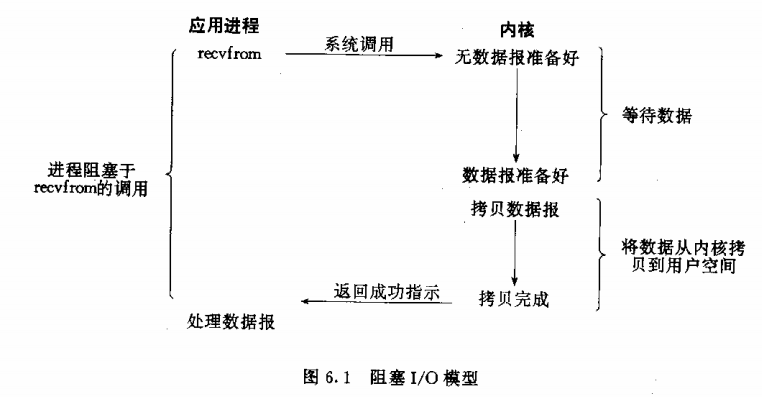
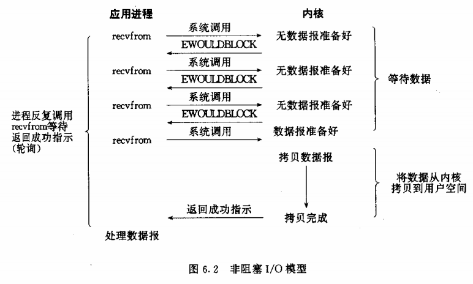
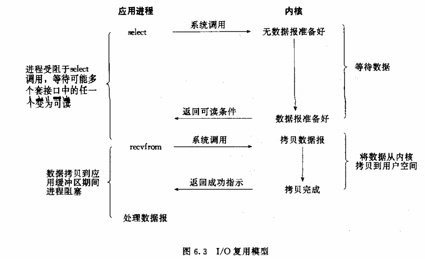
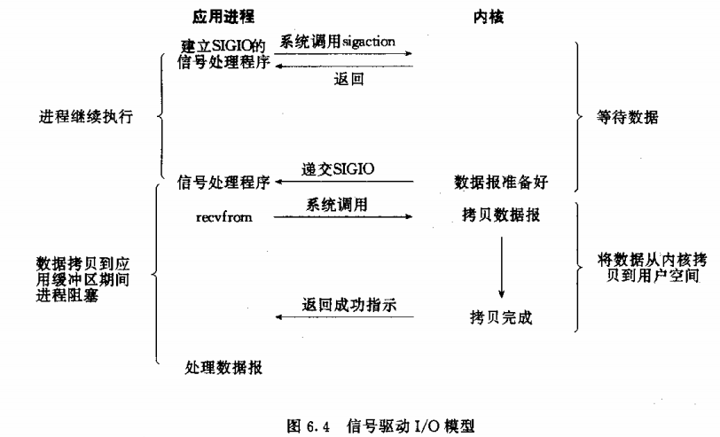
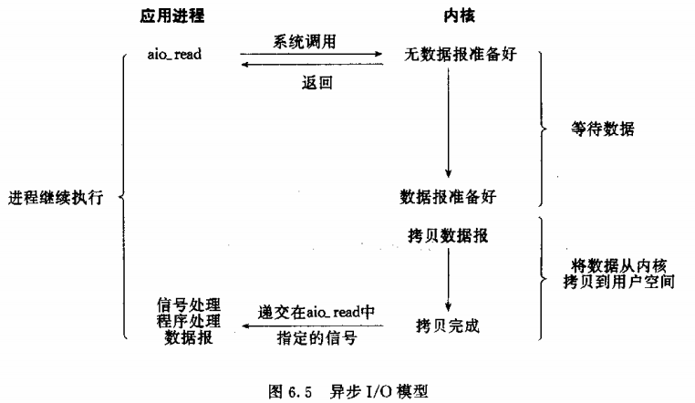
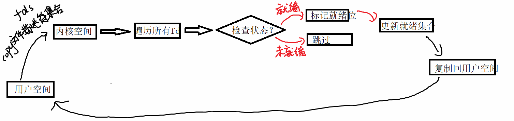

IO模型：输入输出模型

我们知道linux中输入输出不是直接从键盘获取数据，也不是直接往终端输出(缓冲区)

那么我们可以把IO理解为两个步骤：

1.  等待IO事件的就绪。比如：读，我们要等待缓冲区有数据可读  写，需要等待缓冲区有空间可写
2.  真正意义上的数据的迁移(涉及到用户态和内核态的切换) 

# 1.linux中五种IO模型

1.  阻塞模型

    

    缺点：如果是在单线程环境下，由于是阻塞地获取结果，只能有一个客户端连接。如果是多线程环境下，需要不断地新建线程来接收客户端。这样会浪费大量的空间和资源。

2.  非阻塞模型：意味着程序无需等待结果，持续运行

    -   读：如果有数据，则读取数据

        ​		如果没有数据，就立即返回

    -   写：如果有空间，则直接写入

        ​		如果没有空间，即立即返回

    

    缺点：采用轮询，占用cpu, 不及时

    虽然这种方式不会阻塞，但是有一个缺点，这种方式相对于阻塞IO来说，效率更低，会浪费大量的cpu的时间

3.  IO多路复用

    -   允许同时对多个IO事件进行控制，同时在监控多个"文件描述符"

        同时监听多个文件描述符是否就绪(是否可写/可读/出错)

    -   IO多路复用实现的机制是通过select/poll/epoll函数来实现

        先有select,再有了poll/epoll,由两个不同的组织写的，但是作用是类似

        

4.  信号驱动IO

    如果有IO事件就绪，就可以发送一个信号给应用程序，进行数据的处理

    就相当于注册一个信号处理函数，当数据准备好了，就给我发送一个信号，我捕捉这个信号之后，就可以直接去信号处理函数里面去获取数据即可

5.  异步IO

    相当于E去钓鱼，但是E还有其他的事情要做，所有它打电话叫来了它的好朋友F帮他看钩子，一旦鱼上钩了，F就会起钩， 然后打电话告诉E鱼钓上来了

    进程E仅仅就是对数据的请求，而数据的监控和数据的迁移都是由F完成的



# 2.IO多路复用的实现方式

什么是多路复用？

就是预先把要监听的文件描述符加入到集合，然后在规定的时间内或无限时间内进行等待。如果在规定的时间内，集合中文件描述符没有数据的变化，则说明超时接收，并且进行下一次规定时间再等待。一旦集合中文件描述符有数据变化，则其他的没有数据变化的文件描述符就会被剔除到集合外，并且再次进入下一次等待状态

select原理如图所示：



特点：可以实现多个文件描述符进行监听。一般在网络服务器中，可以并发的处理多个客户端的连接和请求

并发：创建进程/线程/多路复用

1.  select

    ```c
    #include <sys/select.h>
    #include <sys/time.h>
    #include <sys/types.h>
    #include <unistd.h>
    
    typedef /* ... */ fd_set;
    
    int select(int nfds, fd_set *readfds,
    fd_set *writefds,
    fd_set *exceptfds,
    struct timeval *timeout);
    @nfds:三个集中中最大的文件描述符+1,因为这个参数会告诉内核检测前多少个文件描述符
    @readfds：可读文件描述符集合
    @writefds：可写文件描述符集合
    @exceptfds：错误文件描述符集合
    @timeout：设置阻塞等待的时间，有3种情况
    		1.设置NULL，永远等待，这个函数阻塞的(无限等待，直到有文件描述符发送变化)
    		2.设置timeout,等待一个固定的时间
    			struct timeval
    			{
    				long tv_sec;//秒
    				long tv_usec;//微妙
    			};
    			eg：等待5s
    				struct timeval tv;
    				tv.tv_sec = 5;
    				tv.tv_usec = 0;
    			在这段时间中，若select正常返回，timeout的值，被设置成剩余的秒数
    			若想每次调用select都等待固定的时间，那么需要再调用前重新设置timeout
    		3.设置0 非阻塞
    返回值：
    	>0 表示已经就绪的文件描述符的个数
    		FD_ISSET去判断到底是哪个文件描述符就绪
    	=0	超时
    	<0  出错
    
    void FD_CLR(int fd, fd_set *set);//把fd指定的文件从set指定的集合中移除
    int  FD_ISSET(int fd, fd_set *set);//判断fd是否就绪
    void FD_SET(int fd, fd_set *set);//把fd加入到指定的集合中
    void FD_ZERO(fd_set *set);//把set指定的集合清空
    ```

    eg：tcp服务器代码步骤

    ```c
    //创建套接字  sockfd
    //绑定
    //监听
    int clientfds[50] = {0};//保存所有的客户端的fd
    int client_count = 0;//客户端的数量
    int maxfd = sockfd;//初始化最大的文件描述符
    while(1)
    {
    	//1.定义一个集合
    	fd_set readfds;//可读文件描述符集合
        //2.清空集合
        FD_ZERO(&readfds);
        //3.把你需要要监听的fd加入到可读集合
        FD_SET(sockfd, &readfds);//添加服务器的fd
        for(int i = 0;i<client_count;i++)
        {
        	FD_SET(clientfds[i], &readfds);//添加全部客户端的fd
        }
        //4.设置超时时间 5s
        struct timeval tv;
        tv.tv_sec = 5;
        tv.tv_usec = 0;
        //5.select
        int ret = select(maxfd+1,&readfds,NULL,NULL,&tv);
        //6.处理结果
        if(ret > 0)//检查具体的fd
        {
        	if(FD_ISSET(sockfd,&readfds))//sockfd是socket的返回值 sockfd就绪
        	{
        		//代表有客户端想你发起连接
        		int newclientfd = accept(.....);
        		clientfds[client_count] = newclientfd;
        		client_count++;//客户端的数量+1
        		if(maxfd < newclientfd)
        		{
        			//更新maxfd
        		}
        	}
        	for(int i = 0;i<client_count;i++)
        	{
        		if(FD_ISSET(clientfds[i],&readfds))//判断clientfds[i]是否就绪
        		{
        			//有客户端给你发送数据 read/recv/recvfrom
        			//read/recv/recvfrom 返回值0 代表有客户端退出 把clientfds[i]在clientfds数组中删除
        		}
        	}
        }
        else if(ret == 0)
        {
        	printf("超时\n");
        }
        
    }
    ```

    练习：利用select实现tcp一对多的通信(只改服务器的代码)

2.  poll

    ```c
    #include <poll.h>
    
    int poll(struct pollfd *fds, nfds_t nfds, int timeout);
    @fds：结构体指针，指向要监听的结构体数组
        struct pollfd {
            int   fd;         /* file descriptor */
            short events;     /* requested events */要监听的事件
            	/*
            		POLLIN	可读
            		POLLOUT	可写
            		POLLERR	出错
            		...
            	*/
            	eg:
            		可读可写：POLLIN|POLLOUT
            short revents;    /* returned events */返回已经就绪的事件
            	eg:判断是否可读
            		struct pollfd fd;
            		if(fd.revents & POLLIN)
            		{
            			//fd的读就绪
            		}
        };
    @nfds:表示上面的那个数组的元素的个数
    @timeout:超时时间 ms为单位
    返回值：
    	>0 就绪文件的个数
    		由于你监听了多个文件描述符，到底是哪一个文件描述符就绪，使用revents一个一个判断
    	=0 超时
    	<0 出错
    ```

    ```C
    //创建套接字  sockfd
    //绑定
    //监听
    int clientfds[50] = {0};//保存所有的客户端的fd
    int client_count = 0;//客户端的数量
    while(1)
    {
    	//1.定义一个struct pollfd类型的数组，相当于是监听集合
    	struct pollfd fds[10];
        //2.把你需要监听的fd加入到监听集合
        //添加服务器的fd
        fds[0].fd = sockfd;
        fds[0].events = POLLIN;//可读
        fds[0].revents = 0;//初始还没有就绪
        //添加全部客户端的fd
        for(int i = 0;i<client_count;i++)
        {
        	fds[i+1].fd = clientfds[i];
            fds[i+1].events = POLLIN;//可读
            fds[i+1].revents = 0;//初始还没有就绪
        }
        //3.poll
        int ret = poll(fds,client_count+1,5000);
        //6.处理结果
        if(ret > 0)//检查具体的fd
        {
        	if(fds[0].revents & POLLIN)//sockfd是socket的返回值 sockfd就绪
        	{
        		//代表有客户端想你发起连接
        		int newclientfd = accept(.....);
        		clientfds[client_count] = newclientfd;
        		client_count++;//客户端的数量+1
        	}
        	for(int i = 0;i<client_count;i++)
        	{
        		if(fds[i+1].revents & POLLIN)//判断clientfds[i]是否就绪
        		{
        			//有客户端给你发送数据 read/recv/recvfrom
        			//read/recv/recvfrom 返回值0 代表有客户端退出 把clientfds[i]在clientfds数组中删除
        		}
        	}
        }
        else if(ret == 0)
        {
        	printf("超时\n");
        }
        
    }
    ```

    练习：利用poll实现tcp一对多的通信(只改服务器的代码)

3.  epoll

    epoll = 红黑树维护监听集合 + 回调通知机制 + 就绪队列直接读取

    => 避免了线性扫描，实现O(1)

    映射机制(核心)

    ```
    用户态fd
    	↓红黑树快速查找
    内核 strct file*(socket的结构体)
    	↓事件发生
    回调ep_poll_callback
    	↓
    把对应的结点插入到就绪队列中
    ```

    1.  epoll_create

        创建一个epoll对象(返回一个epfd,当成是监听集合)

        ```
        1.申请eventpoll结构体(epoll集合)
        2.epfd包含 红黑树的根+就绪队列的对头
        ```

        ```
        #include <sys/epoll.h>
        
        int epoll_create(int size);
        @size:填大于0的数即可，该参数已经被忽略掉了
        返回值：
        	成功 返回一个epoll的对象 对象就是一个文件描述符(监听集合)
        ```

    2.  epoll_ctl

        添加/修改/删除

        ```
        1.把fd对应的结点插入到红黑树
        2.把ep_poll_callback注册到socket的等待队列当中
        ```

        ```C
        #include <sys/epoll.h>
        
        int epoll_ctl(int epfd, int op, int fd, struct epoll_event *event);
        @epfd:填上面epoll_create的返回值
        @op：你的操作
        	EPOLL_CTL_ADD
        	EPOLL_CTL_MOD
        	EPOLL_CTL_DEL
        @fd：你要操作的文件描述符
        @event：要监听的时间的结构指针
            typedef union epoll_data {
                void        *ptr;
                int          fd;
                uint32_t     u32;
                uint64_t     u64;
            } epoll_data_t;
        
            struct epoll_event {
                uint32_t     events;      /* Epoll events */
                	/*
                		EPOLLIN
                		EPOLLOUT
                		EPOLLERR
                		EPOLLET 边沿触发 -> 优势
                			ET 边沿触发
                			LT 水平触发/级别 默认
                	*/
                epoll_data_t data;        /* User data variable */
            };
        返回值：
        	成功 0
        	失败 -1
        1.LT水平触发模式下，只要这个fd还有数据可读，每次epoll_wait都会返回它的事件，提醒用户程序去操作
        2.ET边沿触发模式下，它只会提示一次，直到下次再有数据流入之前都不会提示
        	eg:
        		1.读缓冲区开始时候是空的
        		2.读缓冲区写入2kb的数据
        		3.水平触发和边沿触发此时收到可读的信号
        		4.收到信号通知后，读取1kb的数据，读缓冲区剩下1kb的数据
        		5.水平触发会再次通知，而边沿触发不会再次进行通知
        		
        eg:
        	//添加
        	struct epoll_event ev;
            ev.events = EPOLLIN|EPOLLET;
            ev.data.fd = sockfd;
        	epoll_ctl(epfd,EPOLL_CTL_ADD,sockfd,&ev);
        	
        	//删除
        	epoll_ctl(epfd,EPOLL_CTL_DEL,sockfd,NULL);
        ```

        

    3.  epoll_wait

        ```
        1.检查就绪队列
        2.把就绪事件拷贝到用户空间
        3.清空就绪队列
        ```

        ```c
        #include <sys/epoll.h>
        
        int epoll_wait(int epfd, struct epoll_event *events,
        int maxevents, int timeout);
        @epfd:epoll_create的返回值
        @events：用来放就绪事件的数组
        @maxevents：就绪事件的最大值
        @timeout：超时时间
        返回值：
        	>0 返回就绪事件的个数
        eg:
        	struct epoll_event events[10];
        	int ret = epoll_wait(epfd, events,10,5000);
        	if(events[0].events & EPOLLIN)//就绪
        	{
        		if(events[0].data.fd == sockfd)//sockfd就绪
        		{
        			//accetp
        		}
        	}
        ```

        eg:服务器使用epoll的步骤

        ```
        //创建套接字 sockfd
        //绑定
        //监听
        //(1)创建一个epoll对象(集合) epfd
        
        //(2)要把监听的文件描述符添加到epoll对象
        //添加服务器的文件描述符
        struct epoll_event ev;
        ev.events = EPOLLIN|EPOLLET;
        ev.data.fd = sockfd;
        epoll_ctl(epfd,EPOLL_CTL_ADD,sockfd,&ev);
        
        //(3)等待监听事件的产生
        struct epoll_event events[10];//用来保存就绪事件的数据
        int ret = epoll_wait(epfd, events,10,5000);
        if(ret > 0)
        {
        	for(int i = 0;i<ret;i++)
        	{
                if(events[i].events & EPOLLIN)//就绪
                {
                    if(events[i].data.fd == sockfd)//sockfd就绪
                    {
                        //accept
                        int newclientfd = accept(...);
                        //添加客户端的文件描述符到监听结合
                        struct epoll_event ev;
                        ev.events = EPOLLIN|EPOLLET;
                        ev.data.fd = newclientfd;
                        epoll_ctl(epfd,EPOLL_CTL_ADD,newclientfd,&ev);
                    }
                    else
                    {
                    	//接收客户端的数据 read/recv/recvfrom 
                    }
                }
            }
        }
        ```

        练习：利用epoll实现tcp的一对多通信

    

    