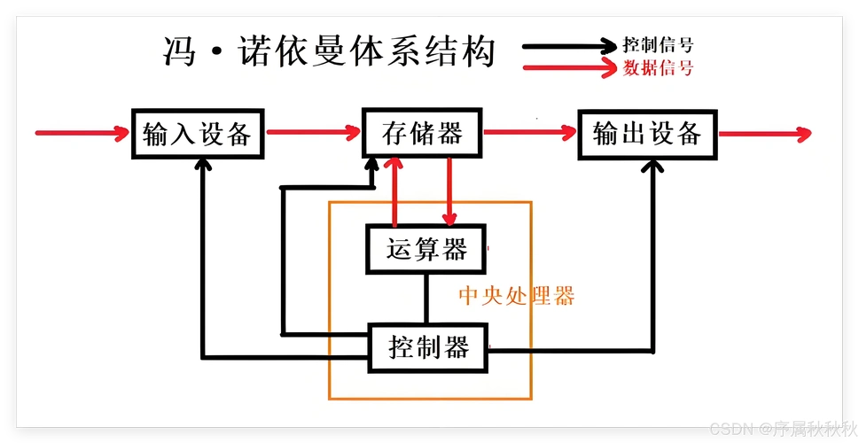
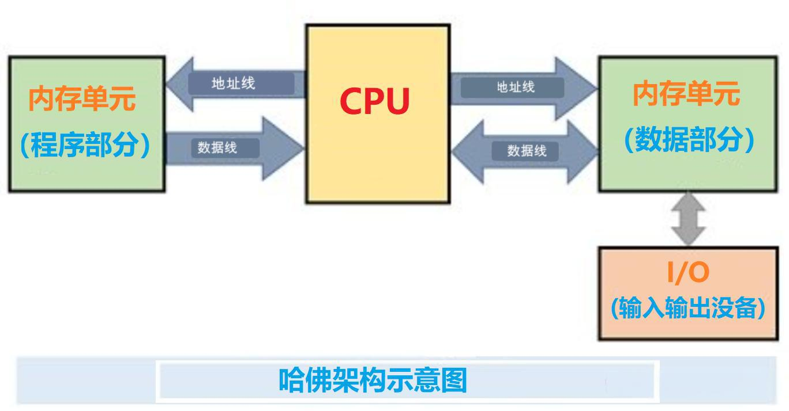
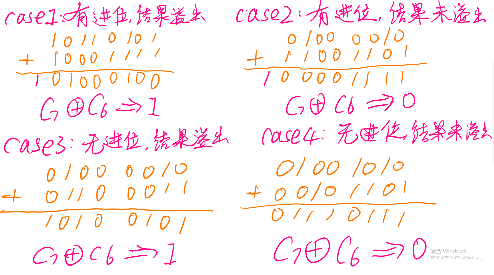

# 计算机组成与M4体系结构笔记

## 1，计算机组成

### 1.1 嵌入式系统

​	嵌入式系统是以应用为中心，以计算机技术为基础，并且软硬件可裁剪，适用于应用系统对功能、成本、可靠性、体积、功耗等有严格要求的专用计算机系统。

​	计算机：

​			专用计算机系统：软硬件可裁剪  ==> 嵌入式

​			通用计算机系统：PC、服务器

​	嵌入式系统：

​			硬件：电路、芯片。。。

​			软件：

​						bootloader

​						OS

​						应用程序

### 1.2 什么是计算机系统？

​	探讨一下计算机组成。

**1）冯·诺依曼结构(存储程序型电脑)**

​	最早的计算机仅内含固定用途的程序。例如一个计算器仅有固定的数学计算机程序，它不能拿来当文字处理软件，更不能拿来玩游戏。

​	程序 ==> 存储

​	冯·诺伊曼把计算机系统分为如下几个部分：

-   算术逻辑单元(运算器)

-   控制器

-   存储器

-   输入输出设备

    

    

    特点：指令和数据以同等低位存放与存储器内，并可按地址寻访；指令按顺序执行。

    有人提出疑问：指令和数据虽然在本质上都是“数据”，但是属性还是有不一样。

    ​	指令 ==> 只读

    ​	数据 ==> 可读可写

    所以，有些存储器是只读的，有些存储器是可读可写的  ==>   哈佛架构

**2）哈佛架构(Harvard Archiecture)**

​	哈佛架构是一种将程序存储和数据存储分开的存储器结构。但是他并未完全突破冯·诺伊曼结构。

​		ROM:	Read Only Memory  只读存储器/程序存储器

​		RAM:	Random Access Memory 随机读写存储器/数据存储器



### 1.3 各组件如何通信呢？

​	总线：多根“电线”

​	总线有两个特点：

​		(1) 任意时刻只能有一个设备向总线发送信息   ==>  系统瓶颈

​		(2) 多个部件可以同时从总线上接收相同的信息  ==>   广播式通信


​	按功能划分，总线分为：

​		数据总线DB(data bus):  双向通信，传输数据

​		地址总线AB(addree bus): 单向通信，发送地址

​		控制总线CB(controll bus): 双向通信，传输命令和状态

​	按位置划分，总线分为：

​		片内总线：用于CPU内部的运算器、控制器和寄存器之间的通信

​		系统总线：用于CPU与其他部件如RAM、ROM之间的通信

​		通信总线(I/O总线)：用于CPU与芯片外部设备之间的通信

### 1.4 CPU工作原理

​	探讨一下CPU组成：

​		ALU(运算器)：早期的CPU只有加法器

​		Control Unit(控制器)：用来解读指令和控制其他组件

​		Register(寄存器)：

​				寄存器是CPU内部用来存放数据的一些小型的存储区域，用来暂时存放参与运算的数据和运算结果。

​				寄存器实现就是一种常用的时序逻辑电路，只不过这种时序逻辑电路只包含存储电路(锁存器/触发器)

[收藏向！零基础10分钟入门嵌入式！_哔哩哔哩_bilibili](https://www.bilibili.com/video/BV1BV41197rY/?spm_id_from=333.337.search-card.all.click&vd_source=58b9a94e2b1d7e6ab2b1a55eeb39ef53)

### 1.5 几个基础概念

​	机器字长：是指CPU一次能处理数据的位数，通常与CPU的寄存器位数有关。

​				字长越大，数的表示范围就越大，即精度就越高。

​	int 与机器字长的关系：

​		C标准规定 int 类型只是为 16位(即2字节)，但在实际应用中，其大小通常与机器的字长相关。

​	unsigned long 的大小？

​		unsigned long通常跟寻址范围有关，即指针的大小。

​	bit: 最小的存储元件，用来存储一位二进制数据(0/1)

​	Byte: 能直接访问的基本存储单元，一个字节包含 8个Bit。

## 2，ARM Cortex M4 体系结构

### 2.1 ARM简介

​	一个公司 Advanced RISC Meachine 的名字(英国)

​	处理器体系架构，采用精简指令集(RISC)，特点：高性能、低功耗

​	采用ARM架构的处理器

|              ARM系列              |     ARM内核      |    典型芯片    |
| :-------------------------------: | :--------------: | :------------: |
|        Cortex-M(MCU微控制)        |   M0/M1/M3/M4    | STM32F103/F407 |
| Cortex-A(Application应用级处理器) | A5/A7/A8/A53/A55 | S5P6818,RK3568 |
|     Cortex-R(Realtime实时级)      |   R4/R5/R7/R8    |                |

​	STM32是ST(意法半导体)公司基于 Cortex-M3/M4内核推出的系列微控制器，主要应用在控制场合，工控场景。凭借其产品线多样化、极高的性价比、简单易用的库开发方式，STM32在嵌入式领域深受欢迎。


### 2.2 Cortex-M4 总线接口

​	ARM Cortex M4 采用哈佛架构，为系统提供了三套总线

(1) Icode 总线：用于访问代码空间的指令。32bits

​	访问空间为： 0x00000000 ~ 0x1FFFFFFF (512M)。每次取4字节

​	注意：指令为 只读数据

(2) Dcode 总线：用于访问代码空间的数据。32bits

​	访问空间为：0x00000000 ~ 0x1FFFFFFF(512M)。

​	非对齐的访问会被总线分割为几个对齐的访问。

​	"4字节对齐"：数据的首地址必须为 4的倍数

(3) System总线，用于访问其他系统空间。如：硬件控制器

​	访问空间为 0x20000000 ~ 0xDFFFFFFF 和 0xE0100000 ~ 0xFFFFFFFF

​	非对齐的访问会被总线分割为几个对齐的访问。

## 3，Cortex M4 工作状态(也叫处理器状态)

​	ARM公司设计的CPU，可以支持多种指令集:

​		ARM指令集：32bits的，功能强大且通用。

​		Thumb指令集：

​				thumb 16bits，功能也强大

​			    thumb-2 32bits，功能强大，增加了不少专用的DSP指令。

那么，我们把CPU正在执行何种指令集，称为处理器的状态

​		ARM状态：CPU正在执行 ARM指令集

​		Thumb状态：CPU正在执行 Thumb指令集

**注意：**Cortex M4只支持Thumb指令集

## ★4，Cortex M4 寄存器

​	这里的寄存器指的是 CPU内部的寄存器，分为：

### 1）通用寄存器

​	R0~R7: thumb,thumb-2 都可以访问

​	R8~R12: 只有少量的thumb指令可以访问，thumb-2都可以访问。

### 2）专用寄存器：R13, R14, R15, xPSR

**R13(SP):** Stack Pointer 保存堆栈的栈顶地址。

​		"堆栈"（stack）是什么？ ==> 是用“栈的思想”来管理的一段内存空间。

​				"栈的思想"：先进后出

​		为什么需要“堆栈”？为了支持过程调用(函数调用)。

​				"现场保护"：把寄存器里面的数据保存到 栈空间中

​				“现场恢复“：把原先保存在栈空间中的数据还原到相应的寄存器中去。

​				这个过程，正好是 先进后出的。

​		Cortex M4 有两个堆栈(双堆栈机制)

​				MSP 主堆栈指针

​				PSP 进程堆栈指针

​				为什么需要双堆栈呢？

​				==> 为了支持操作系统。把操作系统用的堆栈与用户线程用的堆栈分开。

**R14(LR):** Linked Register 链接寄存器

​		在执行过程(函数)调用指令的时候，我们需要保存该指令的下一条指令的地址，因为这个地址，就是我过程结束后，要返回的地址。

​		有一个专门的寄存器，用来保存过程调用的返回地址 ==>  LR 链接寄存器

eg:

```
	BL	func		;BL 带返回的跳转指令，把这条指令的下一条指令的地址赋值给 LR
					;跳转：到指定的地方去取指令执行。
```

**R15(PC):** Program Counter 程序计数器。该寄存器保存着下一条要执行的指令的地址。

​		所以我们可以通过改变 PC的值来实现跳转。

​		"指令按顺序执行"：每运行一条指令后，PC的值会自动加4 

​	指令流水线：Cortex M4 采用的是 三级流水线(取指、译码、执行)


**xPSR:** Program Status Register 程序状态寄存器

​	程序状态寄存器：保存程序运行过程中的一些状态，这些要保存的状态分为三类：

​			a.  应用状态寄存器 APSR:   用来表示计算结果的标志

​					N   Z  C  V  Q

​			b.  中断状态寄存器 IPSR: 用来保存当前发生的中断编号 Exception Numbers

​			c.  执行状态寄存器 EPSR: 用来保存当前的执行状态，如 Thumb/ARM

===> 组合成一个 32bits 的 xPSR, 请参考《Cortex M3权威指南.pdf》 41页

​	我们每一条执行的指令都可以影响这些状态标志位

```
N: Negative 负数标志
	如果 N==1，表示上一个指令操作的结果为 负数。
		n==0，表示上一个指令操作的结果为 非负数。
```

```
Z: Zero 零标志。
	如果 Z==1，表示上一个指令操作的结果为 0
	如果 Z==0，表示上一个指令操作的结果不为 0
```

```
C: Carry 进位或借位标志位
	C==1, 表示在加法运算时，产生了进位，或者减法运算时没产生借位
	C==0, 表示在加法运算时，没产生进位，或者减法运算时产生了借位
	
		ADC,ADD,CMN 做加法。如果产生了进位，则C=1，否则C=0
		SBC,SUB,CMP 做减法。如果产生了借位，则C=0，否则C=1
```

```
V: overflow 溢出
	反映有符号数做加减运算所得到的结果是否溢出。如果运算结果超出了当前运算位数所能表示的范围，则会溢出，V=1，否则V=0。有符号数发生溢出往往符号会发生出错。
	注意：在有符号数的运算中，进(借)位和溢出是两个完全不同的概念。
```



```
Q: 饱和标志
	饱和计算: 通过将数据强制置为最大或最小允许值，以减少运算结果的畸变。
	当然畸变仍然是存在的，不过若数据没有超过最大范围太多，就在可接受范围内。
	
	8bits 无符号的加法：
	普通计算：
		1111 1111 + 1 ==> 0
	饱和计算：
		1111 1111 + 1 ==> 1111 1111
	ADD	 R0 ,R0 ,R1
	QADD R0 ,R0 ,R1  ;采用饱和计算的加法指令
```

```
T: xPSR[24]
	用来设置处理器当前的执行状态(工作状态/处理器状态)
	xPSR.T == 0, 表示执行 ARM 指令集
	xPSR.T == 1, 表示执行 Thumb 指令集
```

```
IT: xPSR[26:25], xPSR[15:10]
	IF-THEN位，他们是 if-then 指令的执行状态位。
	包含了 if then 模块的指令数目和他们的执行条件。
```

```
ICI: xPSR[15:12]
	Interruptible-Continuable Instrument 可中断-中断继续指令位
	如果执行了 LDM/STM 操作时，产生了一次中断，必须要打断这条指令的执行，那么你的数据有可能只拷贝了一部分，这种请你赶快下该怎么办呢？
	==> 这时就需要记录被打断的寄存器的编号，ICI位保存了该操作中下一个寄存器操作数的编号，在中断响应结束后，处理器返回由该位指向的寄存器，并恢复操作。
```

### 3）特殊寄存器

**中断屏蔽寄存器：**用来管理中断和异常的屏蔽

​	PRIMASK[0]  片上外设的总中断开关

​			1  屏蔽所有片上外设中断

​			0  响应所有片上外设的中断

​	FAULTMASK[0]  系统错误异常的中断总开关

​			1  屏蔽所有异常

​			0  响应所有异常

​	BASEPRI	为使中断屏蔽更加灵活，该寄存器根据中断优先级来屏蔽中断或异常

​			当被设置为一个非0的数值时，它就会屏蔽所有具有相同或更低优先级的异常(中断)，而更高优先级的则还可以继续响应。

**CONTROL 控制寄存器：**用来控制选择哪个堆栈(主堆栈/进程堆栈)以及线程模式的访问等级

​	CONTORL[0]:  设置线程模式的访问等级

​				1  非特权等级(用户级)，只能有限的访问

​				0  特权等级，可以访问所有资源

​	CONTORL[1]: 设置堆栈的选择

​				1  选择进程堆栈 PSP

​				0  选择主堆栈 MSP

## 5, Cortex M4 工作模式

​	ARM Cortex M4 有两种工作模式：

​			Thread Mode: 线程模式

​			Handler Mode: 处理模式(异常中断模式)

​	异常是什么？指的是能打断CPU指令执行顺序的事件。

​	为什么要支持两种模式，而不是只采用一种模式呢？

===> 在线程模式下，一般只有非特权等级，这是防止对敏感资源进行误操作的一种保护。

而一旦出现了异常(中断)，就会进入处理模式，在处理模式下一定是特权等级，可以更方便的处理异常。

​	这两个模式之间是怎么切换的呢？==> 请参考 M3权威指南的44页


**作业：**

1）理解消化 Cortex M4 寄存器相关的内容

2）位操作复习：现定义了一个int变量a并进行了初始化， a为32位[31:0]。写出下面功能的C语句。

​	a. 将变量a的第3位置1，其他位保持不变。

​	b. 将变量a的第3位清0，其他位保持不变。

​	c. 将变了a的第3位取反，其他位保持不变。

​	d. 将变量a的第 3到6位 设置为 1100, 其他位保存不变。

针对32位变量 `a` 的位操作，以下是具体的C语言实现：


a. 将第3位置1

使用**按位或**操作符 `|`。通过将 `1` 左移3位得到掩码 `0000...1000`，与 `a` 进行或运算，可以将目标位置1，而不影响其他位。

```
a |= (1 << 3);
```

b. 将第3位清0

使用**按位与**操作符 `&`。将 `1` 左移3位后**取反** `~`，得到掩码 `1111...0111`，与 `a` 进行与运算。

```
a &= ~(1 << 3);
```

c. 将第3位取反

使用**按位异或**操作符 `^`。异或运算的特性是：与 `1` 异或会翻转，与 `0` 异或保持不变。

```
a ^= (1 << 3);
```

d. 将第3到6位设置为 1100

这一步通常分为两步：**先清零，再置位**。

```
// 1. 清除第3到6位 (掩码 0111 1000 即 0x78)
a &= ~(0xF << 3); 

// 2. 设置新值为 1100 (即 0xC)
a |= (0xC << 3);
```

------

复习要点总结

| **操作功能**      | **核心公式**                     | **说明**                   |
| ----------------- | -------------------------------- | -------------------------- |
| **置1 (Set)**     | `a |= (1 << n)`                  | 任何数与1或均为1           |
| **清0 (Clear)**   | `a &= ~(1 << n)`                 | 任何数与0与均为0           |
| **取反 (Toggle)** | `a ^= (1 << n)`                  | 相同为0，不同为1           |
| **连续位赋值**    | `a = (a & ~mask) | (value << n)` | 先用掩码“挖坑”，再填入新值 |

